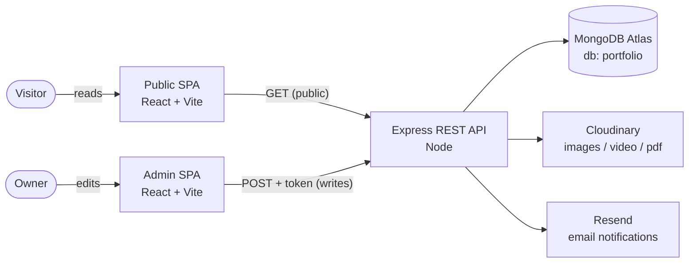

<div align="center">

# Mainak Dasgupta — Portfolio Platform

**A content-managed personal portfolio built on the MERN stack.**
Edit everything from a private admin panel — no redeploys, no hand-edited markup.


</div>

---

## Overview

Instead of a static, hand-edited site, this is a small **content-managed portfolio platform** split into three independent applications that talk over HTTP:

| App | Folder | Audience | Stack | Dev port |
|-----|--------|----------|-------|----------|
| **Backend API** | [`backend/`](./backend) | both SPAs | Node.js + Express (ESM) + Mongoose | `4000` |
| **Public site** | [`frontend/`](./frontend) | visitors | React 18 + Vite (SPA) | `5173` |
| **Admin panel (CMS)** | [`admin/`](./admin) | the owner | React 18 + Vite (SPA) | `5174` |

The owner edits content in the **admin panel**; the **frontend** renders it for visitors; the **backend** persists everything to **MongoDB Atlas**, stores media in **Cloudinary**, and emails contact submissions via **Resend**.

> 📚 **Looking for the deep reference?** Full, role-based documentation (architecture, system design, API, database, security, DevOps, testing, and guides) lives in **[`docs/`](./docs/README.md)**.

---

## Features

**Public site**
- Animated single-page portfolio: Hero (video), About, Experience, Projects, Skills, Achievements, Contact
- Smooth scrolling (Lenis), scroll-spy navigation, framer-motion animations
- Lazy-mounted sections + code splitting for a fast first paint
- Contact form that persists messages and notifies the owner by email

**Admin panel (CMS)**
- Single-admin login (JWT)
- Edit the singleton **Profile** (bio, hero copy, hero media, social links, section subtitles, coursework)
- Full CRUD for **Projects**, **Experience**, **Skills**, **Achievements**, **Education**
- **Media** uploader (images / videos / PDFs → Cloudinary) with copy-able URLs
- **Messages** inbox to read, mark, and delete contact submissions

**Backend API**
- RESTful resource routes with a uniform `{ success, ... }` response envelope
- Stateless admin auth via a custom `token` header
- Cloudinary uploads streamed from memory (serverless-friendly)
- Best-effort transactional email (skipped gracefully if unconfigured)
- Resilient startup: the server stays up even if the database is briefly unreachable

---

## Architecture



- **Public reads, admin writes.** Every `GET /api/<resource>/list` is public; every mutating `POST` requires a JWT in the `token` header.
- **Singleton profile.** One document (`_id: "profile"`) holds all hero/about/contact/branding content.
- **Three independent deploys** (Vercel), wired together only by the `VITE_BACKEND_URL` env var.

Deeper diagrams and rationale: [`docs/02-architecture.md`](./docs/02-architecture.md) and [`docs/03-system-design.md`](./docs/03-system-design.md).

---

## Tech stack

| Layer | Technologies |
|-------|--------------|
| **Backend** | Express 4, Mongoose 8, jsonwebtoken, multer (memory storage), cloudinary, resend, validator, cors, dotenv |
| **Frontend** | React 18, Vite 5, react-router-dom 6, axios, framer-motion, lenis, lucide-react, react-toastify, Tailwind CSS 3 |
| **Admin** | React 18, Vite 5, react-router-dom 6, axios, react-toastify, Tailwind CSS 3 |
| **Services** | MongoDB Atlas, Cloudinary, Resend, Vercel |

---

## Repository structure

```text
portfolio-website/
├── backend/      # Express + Mongoose REST API (the only server)
│   ├── config/         # mongodb + cloudinary connection
│   ├── middleware/     # adminAuth (JWT), multer (memory storage)
│   ├── models/         # 8 Mongoose schemas
│   ├── controllers/    # business logic per resource
│   ├── routes/         # REST routes (public reads / admin writes)
│   ├── utils/          # cloudinary upload, contact email
│   ├── scripts/        # seed + migrations
│   └── seed-data/      # resume.json (canonical content)
├── frontend/     # Public React + Vite SPA
│   └── src/            # components / context / hooks / utils / assets
├── admin/        # Private React + Vite SPA (CMS)
│   └── src/            # components/ui / pages / assets
├── docs/         # 📚 full project documentation (start at docs/README.md)
└── portfolio-data.json
```

Every app is self-contained: its own `package.json`, `.env`, and build. There is no monorepo tooling and no TypeScript — modern ESM JavaScript throughout.

---

## Quick start

### Prerequisites

- **Node.js 18+** (20 LTS recommended) and npm 9+
- A **MongoDB** connection string (Atlas or local)
- A **Cloudinary** account (for uploads)
- *(optional)* a **Resend** API key for contact-form emails

> **Windows/PowerShell:** run the commands one per line (the `&&` chaining shown below works in bash/zsh; use separate lines in older PowerShell).

### 1. Backend (terminal 1)

```bash
cd backend
cp .env.example .env       # fill in real values (see below)
npm install
npm run seed               # populate the DB from seed-data/resume.json
npm run server             # → http://localhost:4000  ("DB Connected")
```

### 2. Frontend (terminal 2)

```bash
cd frontend
cp .env.example .env       # defaults to http://localhost:4000
npm install
npm run dev                # → http://localhost:5173
```

### 3. Admin (terminal 3)

```bash
cd admin
cp .env.example .env       # defaults to http://localhost:4000
npm install
npm run dev                # → http://localhost:5174
```

Sign into the admin with the `ADMIN_EMAIL` / `ADMIN_PASSWORD` you set in `backend/.env`.

Full annotated setup, debugging tips, and a failure→cause map: [`docs/12-development-guide.md`](./docs/12-development-guide.md).

---

## Environment variables

### `backend/.env`

| Key | Required | Purpose |
|-----|----------|---------|
| `PORT` | no (default `4000`) | Express port |
| `MONGODB_URI` | **yes** | Atlas URI **without** a trailing slash (code appends `/portfolio`) |
| `JWT_SECRET` | **yes** | secret used to sign/verify the admin JWT |
| `ADMIN_EMAIL` / `ADMIN_PASSWORD` | **yes** | single admin credentials |
| `CLOUDINARY_NAME` / `CLOUDINARY_API_KEY` / `CLOUDINARY_SECRET_KEY` | **yes** (for uploads) | Cloudinary credentials |
| `RESEND_API_KEY` | optional | enables contact emails (skipped if unset) |
| `CONTACT_NOTIFY_TO` / `CONTACT_NOTIFY_FROM` | optional | email recipient / sender overrides |

### `frontend/.env` and `admin/.env`

| Key | Required | Purpose |
|-----|----------|---------|
| `VITE_BACKEND_URL` | **yes** | base URL of the backend, no trailing slash (e.g. `http://localhost:4000`) |

> ⚠️ `MONGODB_URI` must **not** end with `/` (the code appends `/portfolio`). `VITE_*` values are baked in at build time — rebuild after changing them.

---

## Scripts

| App | Command | Description |
|-----|---------|-------------|
| backend | `npm run server` | dev server with auto-reload (nodemon) |
| backend | `npm start` | run once with plain `node` |
| backend | `npm run seed` | seed content collections from `seed-data/resume.json` |
| frontend / admin | `npm run dev` | Vite dev server |
| frontend / admin | `npm run build` | production build → `dist/` |
| frontend / admin | `npm run preview` | serve the built `dist/` |
| frontend / admin | `npm run lint` | ESLint |
| frontend | `npm run optimize:media` | ffmpeg-based media optimizer |

---

## Deployment (Vercel)

Three independent Vercel projects point at the same repo, each with a different **Root Directory**:

| Project | Root Directory | Framework | Key setting |
|---------|----------------|-----------|-------------|
| Backend | `backend/` | Other | env vars + `vercel.json` (serverless function) |
| Frontend | `frontend/` | Vite | `VITE_BACKEND_URL` → deployed backend URL |
| Admin | `admin/` | Vite | `VITE_BACKEND_URL` → backend; add `X-Robots-Tag: noindex` |

The backend is serverless-ready: it only calls `app.listen()` outside Vercel, uploads stream from memory, and SPA rewrites are handled by each app's `vercel.json`. Full deployment, monitoring, and disaster-recovery details: [`docs/10-devops-infrastructure.md`](./docs/10-devops-infrastructure.md).

---

## Documentation

The complete, role-based documentation set lives in [`docs/`](./docs/README.md):

| # | Document | Covers |
|---|----------|--------|
| 01 | [Project Overview](./docs/01-project-overview.md) | Purpose, goals, use cases, features |
| 02 | [Architecture](./docs/02-architecture.md) | Patterns, diagrams, flows, scalability, reliability |
| 03 | [System Design](./docs/03-system-design.md) | HLD/LLD, domain model, design patterns, trade-offs |
| 04 | [Backend](./docs/04-backend.md) | File-by-file walkthrough, error handling, dependencies |
| 05 | [Database](./docs/05-database.md) | Schemas, ER model, indexing, migrations, lifecycle |
| 06 | [API Reference](./docs/06-api-reference.md) | Every endpoint, auth, validation, examples |
| 07 | [Frontend](./docs/07-frontend.md) | UI architecture, state, routing, styling, user flows |
| 08 | [Admin Panel](./docs/08-admin-panel.md) | CMS architecture, UI system, page-by-page guide |
| 09 | [Security](./docs/09-security.md) | Auth/authz, data protection, threat model |
| 10 | [DevOps & Infrastructure](./docs/10-devops-infrastructure.md) | Deployment, CI/CD, monitoring, DR |
| 11 | [Testing](./docs/11-testing.md) | Strategy, manual test plans, recommended suite |
| 12 | [Development Guide](./docs/12-development-guide.md) | Setup, env, debugging, contribution |
| 13 | [Maintenance Guide](./docs/13-maintenance-guide.md) | Troubleshooting, limitations, tech debt, roadmap |
| 14 | [Glossary](./docs/14-glossary.md) | Definitions of every term and library |

---

## Security notes

This is a single-owner CMS with deliberate trade-offs (full analysis in [`docs/09-security.md`](./docs/09-security.md)):

- Admin auth is a stateless JWT sent in a custom `token` header; the token is stored in `localStorage`.
- Admin credentials are compared directly against env vars (not yet hashed — `bcrypt` is available for hardening).
- CORS is open and there is **no rate limiting** — recommended hardening before heavy public exposure.

---

## Author & license

- **Author:** Mainak Dasgupta — [GitHub @MainakDasgupta21](https://github.com/MainakDasgupta21)
- **License:** ISC

---

<div align="center">

If anything here disagrees with the running code, the code wins — and please open an issue or PR. ⭐

</div>
