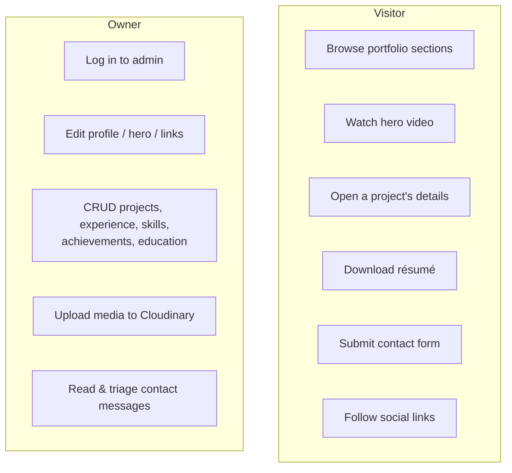
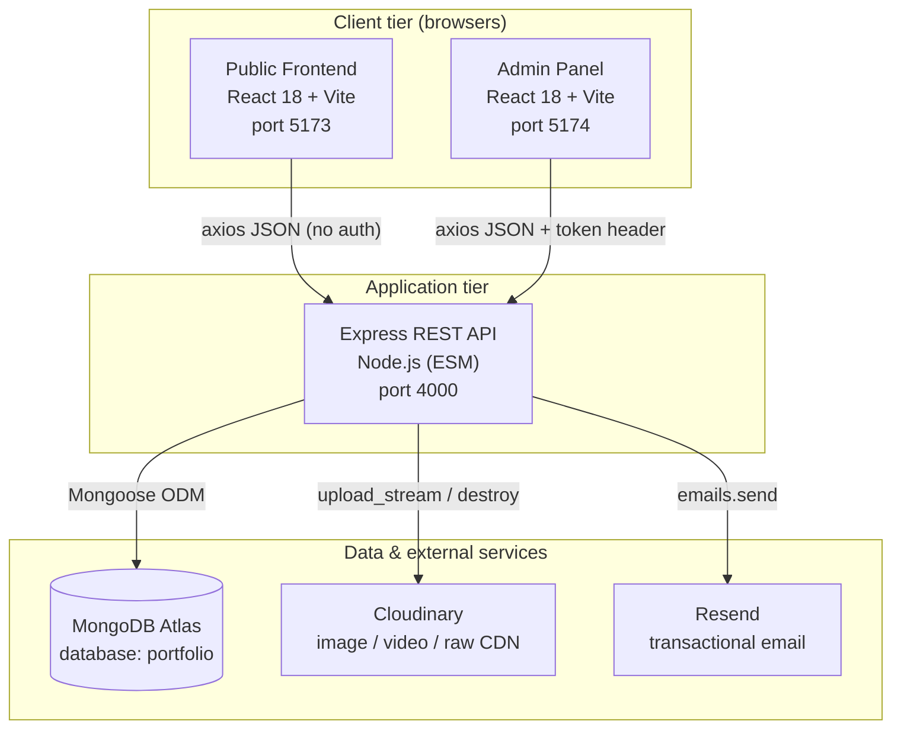

# 01 — Project Overview

[← Back to docs index](./README.md) · Next: [Architecture →](./02-architecture.md)

---

## 1.1 Purpose

This project is a **personal portfolio platform** for a software developer (Mainak Dasgupta). Its purpose is to present a professional online presence — biography, work experience, projects, skills, achievements, education, and a contact channel — while letting the owner **edit all of that content through a private admin panel instead of editing code.**

In one sentence:

> *Turn a static personal portfolio into a small, self‑hostable, content‑managed web product with a public site, a private CMS, and a REST API backing both.*

### Why it exists (the problem it solves)

A traditional portfolio is typically a static site where every change (a new project, a corrected grade, a new social link) requires editing source files and redeploying. That is slow, error‑prone, and requires the owner to be a developer at the keyboard every time.

This platform removes that friction:

- Content lives in a **database**, not in source code.
- The owner edits content in a **browser‑based admin UI** with forms, image uploads, and confirmation dialogs.
- Changes appear on the public site on the next page load — **no rebuild, no redeploy.**
- Binary assets (the hero video, profile photos, company logos, résumé PDF) are uploaded to a **CDN** (Cloudinary) and referenced by URL.

---

## 1.2 Business goals & use cases

### Business goals

1. **Always‑current portfolio** — the owner can keep the site accurate (new jobs, projects, grades) in minutes.
2. **Professional first impression** — a polished, animated, responsive, accessible dark‑theme UI that loads fast (optimized hero media, lazy sections, skeleton loaders).
3. **Lead capture** — a working contact form that both **persists** messages and **emails** the owner, so opportunities are not missed.
4. **Low operating cost** — runs on free/low tiers (Vercel hosting, MongoDB Atlas free cluster, Cloudinary free tier, Resend free tier).
5. **Maintainability & reusability** — a clean, conventional MERN architecture that another developer (or the owner later) can understand and extend, and that can be re‑themed for a different person.

### Primary use cases

| Actor | Goal | Entry point |
|-------|------|-------------|
| **Visitor** (recruiter, client, peer) | Evaluate the owner's skills and contact them | Public site `/` |
| **Owner** (single admin) | Keep content fresh, capture leads | Admin site `/`, then `/profile` |
| **Integrator / future dev** | Build on the REST API or re‑theme the SPA | The backend API + this documentation |

---

## 1.3 Core features & functionality

### Public site (visitor‑facing)

- **Hero** — full‑screen autoplaying, muted, looping background video with poster fallback; profile portrait with animated halo; animated call‑to‑action buttons; scroll hint.
- **About** — biography (rendered from paragraphs) plus an **animated education timeline** with status badges (Completed / Pursuing) and normalized grade display (CGPA / %).
- **Experience** — a vertical **timeline** with cards alternating left/right on desktop, company logos, role/period, bullet highlights, and links to company site + certificate.
- **Projects** — a responsive grid of cards; clicking a card opens an **animated modal** (rendered via React portal) with full description, technology tags, key features, and GitHub/Demo buttons. Featured projects are badged.
- **Skills** — category tabs (e.g. *Programming Languages*, *ML & AI*) driving a grid of cards with **animated proficiency bars** (0 → N%).
- **Achievements** — three‑up card grid with floating particles and per‑card icon (`trophy` / `award` / `medal`).
- **Contact** — a validated form posting to the API, contact details, and a grid of social links.
- **Footer** — brand, quick links, and a résumé download button.
- **Cross‑cutting UX** — Lenis smooth scrolling, scroll‑spy navigation, sticky glass header, framer‑motion entrance animations, skeleton loaders during data fetch, a graceful error state with retry, and full `prefers-reduced-motion` support.

### Admin panel (owner‑facing CMS)

- **Single‑admin login** (email + password → JWT stored in `localStorage`).
- **Profile editor** — one long form for every field of the singleton profile (identity, hero copy, media URLs, social links, section subtitles, coursework).
- **CRUD pages** for Projects, Experience, Skills, Achievements, Education — each with a **list view** (table/cards + edit/delete) and an **add/edit form** (shared component, distinguished by route).
- **Media Library** — upload any image/video/PDF to Cloudinary (resource type auto‑detected), browse past uploads, copy URLs, and delete (also removes from Cloudinary).
- **Messages inbox** — read contact submissions, mark them `new`/`read`, and delete them.
- **UX niceties** — confirmation dialogs for destructive actions, toast notifications, a responsive collapsible sidebar, lazy‑loaded route bundles, and a "skip to content" accessibility link.

### Backend (REST API)

- Resource routers for `user`, `profile`, `project`, `experience`, `skill`, `achievement`, `education`, `contact`, `media`.
- **Public reads, admin‑gated writes** enforced by a JWT middleware.
- **Cloudinary streaming uploads** (memory storage → `upload_stream`) for serverless compatibility.
- **Contact email notifications** via Resend (best‑effort, never blocks the form response).
- **Server‑side validation** (email format, URL normalization, length caps, enum coercion).
- A **seed script** that idempotently loads canonical content from `backend/seed-data/resume.json`.

---

## 1.4 High‑level system overview

### The three apps at a glance

| Concern | Backend | Frontend | Admin |
|---------|---------|----------|-------|
| Language | JavaScript (ESM) | JSX | JSX |
| Framework | Express 4 | React 18 + Vite 5 | React 18 + Vite 5 |
| Styling | — | Tailwind CSS 3 (dark, HSL tokens) | Tailwind CSS 3 (light "Outfit" UI) |
| Routing | Express routers | `react-router-dom` (single page) | `react-router-dom` (multi route) |
| HTTP client | — | axios | axios |
| Auth role | issues + verifies JWT | none (read‑only) | holds JWT, sends `token` header |
| State | MongoDB | React Context (`PortfolioContext`) | local component state per page |
| Deploy target | Vercel (`@vercel/node`) | Vercel (static SPA) | Vercel (static SPA) |

### Technology summary

- **Backend:** Express 4, Mongoose 8, jsonwebtoken, validator, multer (memory storage), cloudinary v2, resend, cors, dotenv; `nodemon` for dev.
- **Frontend:** React 18, Vite 5, react‑router‑dom 6, axios, framer‑motion, lenis, lucide‑react, react‑toastify, Tailwind CSS 3; `ffmpeg-static` for the media optimization script.
- **Admin:** React 18, Vite 5, react‑router‑dom 6, axios, react‑toastify, Tailwind CSS 3.
- **External:** MongoDB Atlas, Cloudinary, Resend, Vercel.

For exact versions see each app's `package.json`; for the full dependency rationale see [Backend → Dependencies](./04-backend.md#410-dependency-reference) and [Frontend → Dependencies](./07-frontend.md).

---

## 1.5 What is intentionally *not* in scope

Understanding the non‑goals is as important as the goals — they explain many design trade‑offs documented later.

- **No multi‑user accounts / RBAC.** There is exactly one admin, authenticated against environment variables. (See [Security](./09-security.md).)
- **No TypeScript, no monorepo/workspaces.** Three independent `package.json`s, plain `.jsx`/`.js`, relative imports only. (Deliberate, to mirror the Forever reference and keep the toolchain minimal.)
- **No server‑side rendering.** Both clients are pure client‑side SPAs.
- **No automated test suite (yet).** Testing today is manual + lint; see [Testing](./11-testing.md) for the strategy and recommended additions.
- **No payment, e‑commerce, or comments.** This is a content site, not a transactional app.

---

## 1.6 Glossary pointer

If any term in this document is unfamiliar (JWT, Mongoose, singleton document, Lenis, Cloudinary resource type, ODM, SPA…), see the [Glossary](./14-glossary.md), which defines every concept and library used across the system.

---

Next: [02 — Architecture →](./02-architecture.md)
