# 02 — Architecture

[← Project Overview](./01-project-overview.md) · [Docs index](./README.md) · Next: [System Design →](./03-system-design.md)

---

This document describes the **runtime architecture**: how the pieces are arranged, why, how requests flow through them, how data moves, and how the system scales and stays reliable. Static/code structure is covered in [System Design](./03-system-design.md) and the per‑app docs ([Backend](./04-backend.md), [Frontend](./07-frontend.md), [Admin](./08-admin-panel.md)).

## Table of contents

- [2.1 Overall system architecture](#21-overall-system-architecture)
- [2.2 Architectural patterns used](#22-architectural-patterns-used)
- [2.3 Key design decisions & rationale](#23-key-design-decisions--rationale)
- [2.4 Component diagram](#24-component-diagram)
- [2.5 Service interactions](#25-service-interactions)
- [2.6 Request/response flows](#26-requestresponse-flows)
- [2.7 Data flow diagrams](#27-data-flow-diagrams)
- [2.8 Sequence diagrams](#28-sequence-diagrams)
- [2.9 Scalability considerations](#29-scalability-considerations)
- [2.10 Reliability & fault tolerance](#210-reliability--fault-tolerance)

---

## 2.1 Overall system architecture

The system is a **3‑app, client–server architecture** with a shared REST API and managed external services. There is **no reverse proxy, no API gateway, and no shared backend‑for‑frontend** — the two SPAs call the same Express API directly using a configured base URL (`VITE_BACKEND_URL`).

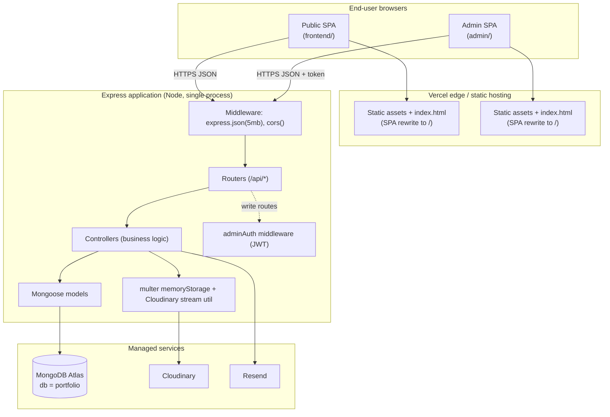

### Tiers

1. **Presentation tier** — two React SPAs. They own all rendering and client‑side routing. The public SPA is read‑only against the API; the admin SPA performs all mutations.
2. **Application tier** — a single Express process exposing a JSON REST API. It owns validation, authorization, persistence orchestration, file upload streaming, and email dispatch. It is **stateless** (no session store; all state is in MongoDB or the JWT).
3. **Data tier** — MongoDB Atlas (structured content), Cloudinary (binary assets/CDN), Resend (email side‑effect). These are external SaaS dependencies.

### Why this shape?

- **Separation of audiences.** Public and admin are different trust levels, different bundles, different deploy URLs. Splitting them keeps the public bundle small and avoids shipping admin code to visitors.
- **Single API, two consumers.** Both SPAs need the same content; one API avoids duplication and keeps a single source of truth.
- **Managed services over self‑hosting.** Atlas/Cloudinary/Resend remove the need to run a database, file server, or mail server — appropriate for a low‑traffic, low‑ops personal product.

---

## 2.2 Architectural patterns used

| Pattern | Where | Why |
|---------|-------|-----|
| **Layered (router → controller → model)** | Backend | Classic Express MVC‑style layering. Routes map URLs to handlers; controllers hold logic; models own persistence. Easy to reason about and test. |
| **REST resource routing** | Backend | Each domain entity gets a router with predictable verbs (`/list`, `/add`, `/update`, `/remove`). |
| **Repository via ODM** | Backend (Mongoose) | Models abstract MongoDB access with schemas, defaults, and validation. |
| **Middleware chain / pipes‑and‑filters** | Backend | `express.json` → `cors` → (`adminAuth`) → (`multer`) → controller. Cross‑cutting concerns are composable. |
| **Stateless token auth** | Backend + Admin | The JWT is the entire auth state; the server stores nothing. |
| **Singleton aggregate** | `profileModel` | One document (`_id:"profile"`) is the single source of truth for page‑level content. |
| **SPA + Context provider (flux‑lite)** | Frontend | `PortfolioContext` fetches once and broadcasts data to all sections; components are presentational consumers. |
| **Container/presentational split** | Frontend & Admin | Context/pages fetch & own state; UI components render props. |
| **Lazy loading / code splitting** | Frontend & Admin | `React.lazy` + Vite `manualChunks` shrink the initial bundle. |
| **Optimistic UX with graceful fallback** | Frontend | Defaults render instantly; skeletons cover fetch latency; an error component offers retry. |
| **Adapter / utility module** | `uploadBufferToCloudinary`, `contactMail`, `normalizeExternalLink` | Encapsulate third‑party SDKs and shared logic behind small functions. |
| **Envelope response contract** | Backend ↔ clients | Every response is `{ success: boolean, ... }`, so clients branch uniformly. |

See [System Design → Design patterns](./03-system-design.md#34-design-patterns-in-detail) for code‑level examples of each.

---

## 2.3 Key design decisions & rationale

These are the load‑bearing decisions. Each lists the decision, the reasoning, and the trade‑off accepted. (Security‑specific decisions are expanded in [Security](./09-security.md).)

### D1 — Three separate apps, not a monorepo

- **Decision:** independent `backend/`, `frontend/`, `admin/` folders, each with its own `package.json`, no workspaces.
- **Why:** mirrors the *Forever* reference; lets each app build/deploy independently; keeps tooling trivial; the public bundle never includes admin code.
- **Trade‑off:** shared logic (e.g. the URL‑normalization regex) is **duplicated** across apps instead of shared via a package. Acceptable at this size; flagged as [technical debt](./13-maintenance-guide.md#known-limitations--technical-debt).

### D2 — Custom `token` header instead of `Authorization: Bearer`

- **Decision:** the JWT is sent in a header literally named `token`.
- **Why:** 1:1 compatibility with the Forever middleware contract.
- **Trade‑off:** non‑standard; some tools/proxies assume `Authorization`. Documented in the [API reference](./06-api-reference.md#authentication).

### D3 — Single admin via environment variables (no user collection)

- **Decision:** `adminLogin` compares `email`/`password` to `ADMIN_EMAIL`/`ADMIN_PASSWORD`; the signed JWT payload is the literal string `email + password`.
- **Why:** there is only ever one admin; avoids a users table, password reset flows, etc.
- **Trade‑off:** credentials are compared in plaintext and the token payload is sensitive; rotating the password invalidates existing tokens. See [Security → Authentication](./09-security.md#92-authentication).

### D4 — Singleton profile document

- **Decision:** all page‑level content (identity, hero copy, media URLs, links, subtitles, coursework) lives in one document with a fixed `_id`.
- **Why:** the public site fetches it in a single round‑trip; the admin edits it in one form; there is never ambiguity about "which profile".
- **Trade‑off:** the document is read/written wholesale; concurrent admin edits would last‑write‑wins. Fine for a single editor.

### D5 — Flat skills collection, grouped on the client

- **Decision:** each skill is its own document with a `category` string; the frontend groups them with `useMemo`.
- **Why:** simple CRUD (add/remove a single skill) without array surgery on a parent document.
- **Trade‑off:** grouping happens at render time; category ordering relies on the `order` field seeding convention.

### D6 — Cloudinary for binaries, memory‑storage multer

- **Decision:** uploads use `multer.memoryStorage()` and stream `file.buffer` to Cloudinary via `upload_stream`.
- **Why:** serverless filesystems (Vercel) are read‑only outside `/tmp`; memory streaming avoids writing temp files and is deploy‑ready.
- **Trade‑off:** whole file is held in memory; very large uploads are bounded by function memory. Acceptable for portfolio media.

### D7 — Wide‑open CORS

- **Decision:** `app.use(cors())` allows all origins.
- **Why:** the two SPA origins differ between local/preview/production; permissive CORS avoids per‑environment config.
- **Trade‑off:** any origin can call the public endpoints. Writes are still token‑gated. Recommended to lock down in production — see [Security](./09-security.md#96-known-risks--recommendations).

### D8 — Best‑effort email, never blocking

- **Decision:** contact email send is wrapped in its own try/catch; failures are logged but the API still returns success once the message is persisted.
- **Why:** the visitor's submission must succeed even if the mail provider is down; the DB row is the durable record.
- **Trade‑off:** a silently failed email could be missed; the row in `contacts` is the backstop.

### D9 — Resilient DB bootstrap

- **Decision:** `connectDB()` resolves a boolean instead of throwing; `server.js` logs a warning and keeps running if Atlas is unreachable.
- **Why:** local dev shouldn't crash when an IP isn't allowlisted; non‑DB routes (like `/`) still respond.
- **Trade‑off:** DB‑backed routes will error until connectivity returns; you must read logs to notice.

---

## 2.4 Component diagram

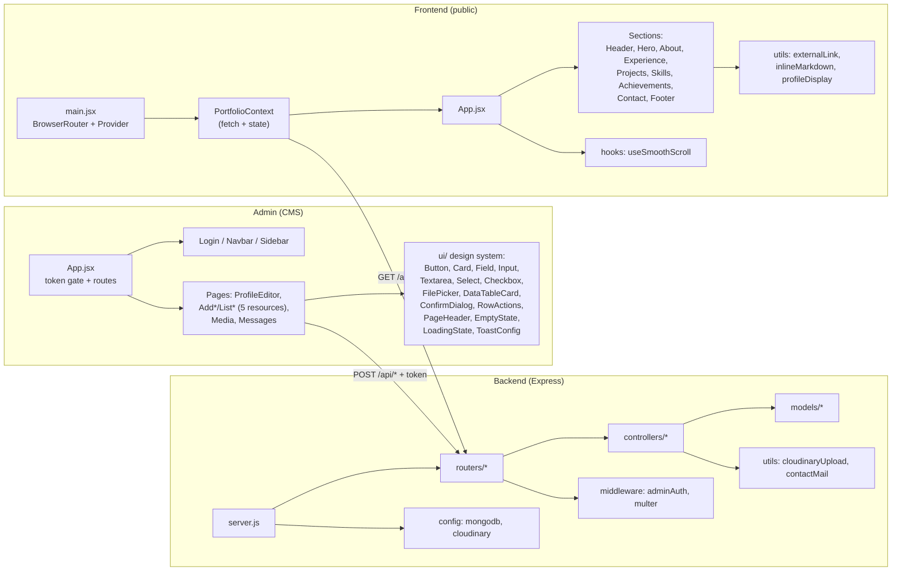

For the full file‑by‑file inventory of each box, see [Backend](./04-backend.md), [Frontend](./07-frontend.md), and [Admin](./08-admin-panel.md).

---

## 2.5 Service interactions

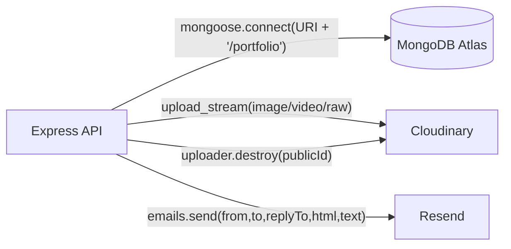

| External service | SDK / mechanism | Used by | Failure behavior |
|------------------|-----------------|---------|------------------|
| **MongoDB Atlas** | `mongoose` (`config/mongodb.js`) | every model | Connection failure → warning logged, process stays up; DB routes return `{success:false}`. |
| **Cloudinary** | `cloudinary` v2 (`config/cloudinary.js`, `utils/cloudinaryUpload.js`) | project/experience/media controllers | Upload error → caught in controller, `{success:false,message}`. `destroy` failure on remove is logged but the DB row is still deleted. |
| **Resend** | `resend` (`utils/contactMail.js`) | `contactController.submitContact` | Missing `RESEND_API_KEY` → skipped with warning. Send error → caught, logged, contact still saved & success returned. |

---

## 2.6 Request/response flows

### Public read (no auth)

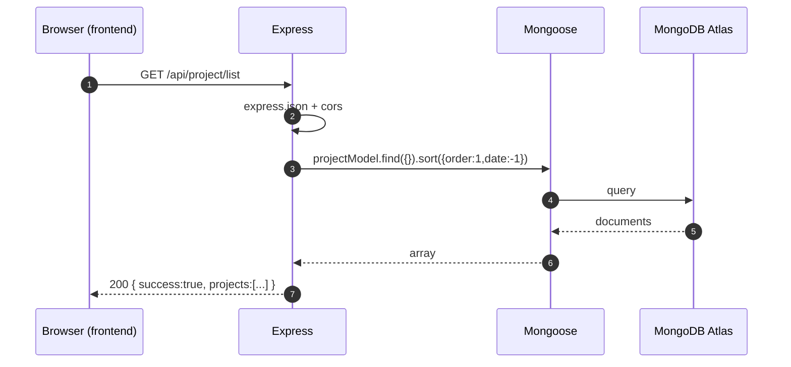

### Admin write (token required, multipart upload)

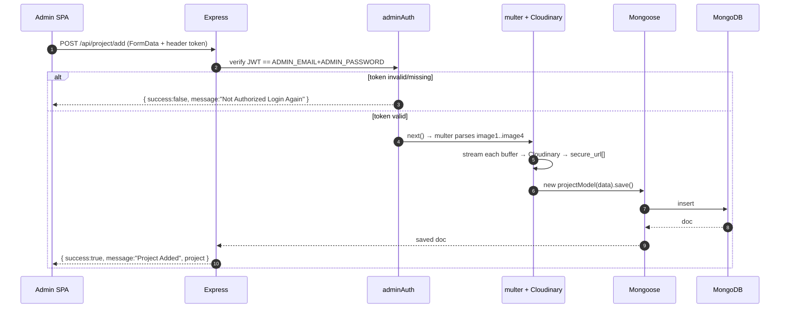

> **Note on status codes.** The API almost always returns **HTTP 200** and signals success/failure in the JSON body's `success` field (a Forever convention). Clients branch on `response.data.success`, not on the HTTP status. See [API reference → Error model](./06-api-reference.md#error-model).

---

## 2.7 Data flow diagrams

### DFD — content lifecycle (level 1)

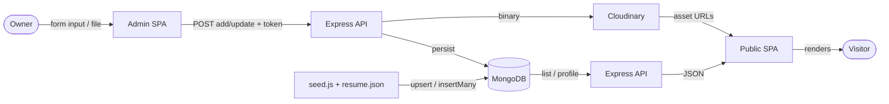

### DFD — contact submission (level 1)

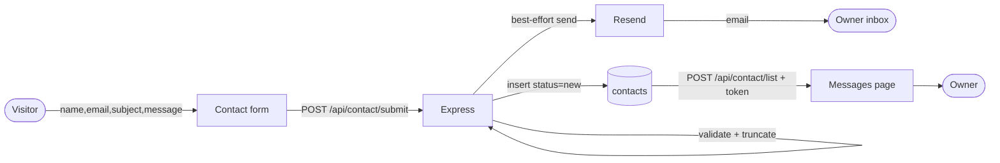

---

## 2.8 Sequence diagrams

### Initial public page load (data hydration)

```mermaid
sequenceDiagram
    autonumber
    participant U as User
    participant FE as Frontend SPA
    participant CTX as PortfolioContext
    participant API as Express API

    U->>FE: GET / (loads JS bundle)
    FE->>FE: Render Header + Hero with DEFAULTS (instant)
    FE->>FE: Render below-fold skeletons
    FE->>CTX: mount effect
    CTX->>API: Promise.all([profile, project, experience, skill, achievement, education])
    API-->>CTX: 6 JSON responses
    CTX->>CTX: merge profile with defaults; group skills by category
    CTX->>CTX: hold skeletons >= 420ms (anti-flicker)
    CTX-->>FE: loading=false, data populated
    FE->>U: Cross-fade real sections into view
```

### Admin login → first edit

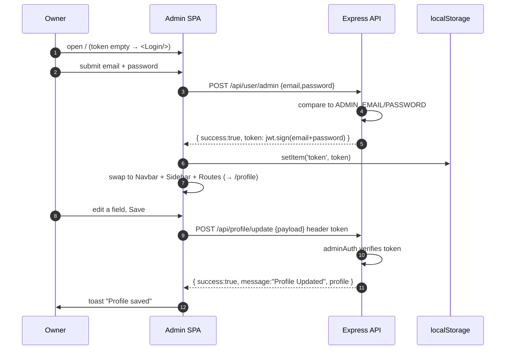

### Media upload → use in profile

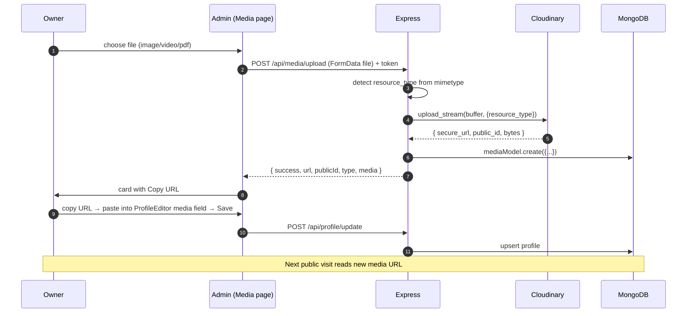

---

## 2.9 Scalability considerations

This is a **low‑traffic personal product**, so the architecture optimizes for cost and simplicity over horizontal scale. Still, the design scales reasonably:

### Where it scales well

- **Stateless API.** Because auth is a stateless JWT and there is no in‑process session, the Express app can run as **multiple instances / serverless functions** behind a load balancer with no sticky sessions. On Vercel each request may hit a fresh function instance — fully supported (`server.js` skips `listen()` when `process.env.VERCEL` is set and exports the app).
- **Read‑heavy & cacheable.** Public traffic is almost entirely `GET .../list`. These responses are pure content and could be cached at the CDN/edge or with HTTP cache headers with minimal change.
- **Binary load offloaded to a CDN.** Cloudinary serves all heavy assets (video, images), so the API never streams large files to visitors.
- **Small client bundles.** Vite `manualChunks` and `React.lazy` keep initial JS small, improving client‑side scale (Time‑to‑Interactive) under load.

### Where it would bottleneck (and the fix)

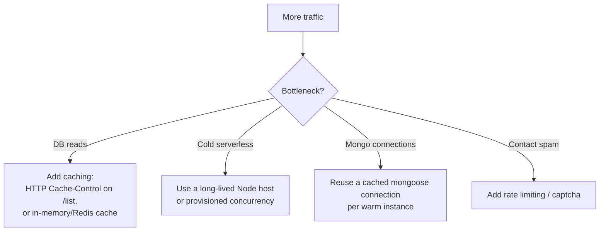

- **MongoDB connection churn** in serverless: each cold start opens a new connection. The mitigation is to cache the mongoose connection across warm invocations (Mongoose does this within a single instance; for many cold starts use Atlas connection limits and a connection‑reuse pattern).
- **No pagination** on `/list` endpoints: fine for a portfolio (dozens of rows), but unbounded growth (e.g. `contacts`) should add pagination. See [Database → Data lifecycle](./05-database.md#57-data-lifecycle-management).
- **No rate limiting:** the public `POST /api/contact/submit` could be flooded. Add `express-rate-limit` or edge protection. See [Security](./09-security.md#96-known-risks--recommendations).

### Capacity expectations

| Resource | Expected size | Scale concern |
|----------|---------------|---------------|
| `profile` | 1 document | none |
| `projects` / `experience` / `education` / `achievements` | tens of docs | none |
| `skills` | tens of docs | none |
| `media` | tens–hundreds | list could grow; add pagination eventually |
| `contacts` | grows unbounded with traffic | add rate limiting + retention/pagination |

---

## 2.10 Reliability & fault tolerance

The system is designed to **degrade gracefully** rather than fail hard, on both ends.

### Backend resilience

- **Non‑fatal DB bootstrap.** `connectDB()` returns `false` on failure; `server.js` logs a warning and keeps serving. The `/` health route always responds. (See [D9](#d9--resilient-db-bootstrap).)
- **Connection event logging.** `mongodb.js` attaches `connected` / `error` listeners once, so transient Atlas errors are observable in logs.
- **Per‑request error isolation.** Every controller wraps its logic in `try/catch` and returns `{ success:false, message }` rather than throwing an unhandled error that could crash the process.
- **Best‑effort side effects.** Email sending and Cloudinary `destroy` are wrapped so their failures never break the primary operation. (See [D8](#d8--best-effort-email-never-blocking).)
- **Idempotent profile.** `getProfile` auto‑creates the singleton if missing, so the public site never sees `null`.

### Frontend resilience

- **Defaults‑first rendering.** `PortfolioContext` seeds every field with defaults, so the hero renders correctly even before (or without) the API.
- **Per‑section merge.** Fetched profile is deep‑merged with defaults so a missing nested key never crashes a section.
- **Error boundary state + retry.** If `Promise.all` rejects, `<ContentError onRetry/>` is shown; the retry bumps a token that re‑runs the fetch effect.
- **No‑backend mode.** If `VITE_BACKEND_URL` is unset, the app skips fetching and renders defaults (useful for static previews).
- **Anti‑flicker.** Skeletons stay for a minimum 420 ms so a fast/cached response doesn't cause a sub‑second flash.

### Reliability diagram

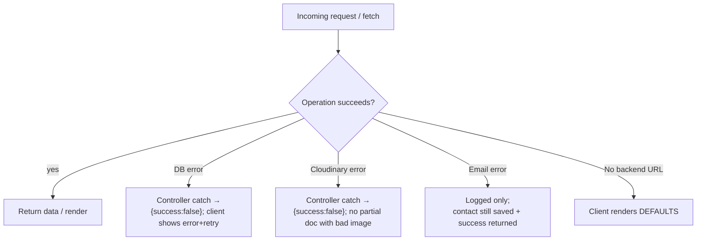

### What is *not* yet covered (gaps)

- No automated health checks/alerting, no uptime monitoring, no structured logging (only `console.*`). See [DevOps → Monitoring & logging](./10-devops-infrastructure.md#107-monitoring--logging).
- No retries/backoff for transient Cloudinary/Resend failures.
- No database backups configured in‑repo (rely on Atlas's managed backups). See [DevOps → Disaster recovery](./10-devops-infrastructure.md#1010-disaster-recovery).

---

Next: [03 — System Design (HLD & LLD) →](./03-system-design.md)
