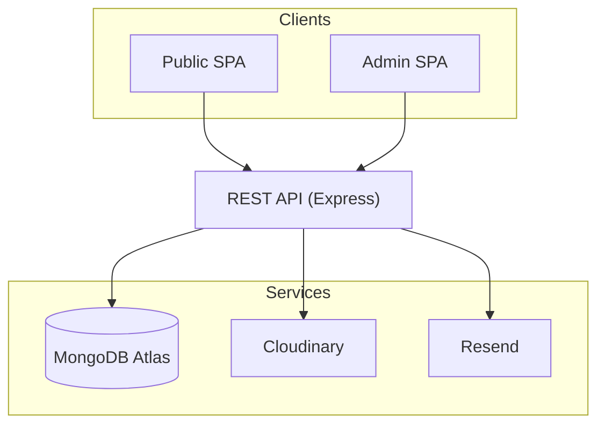
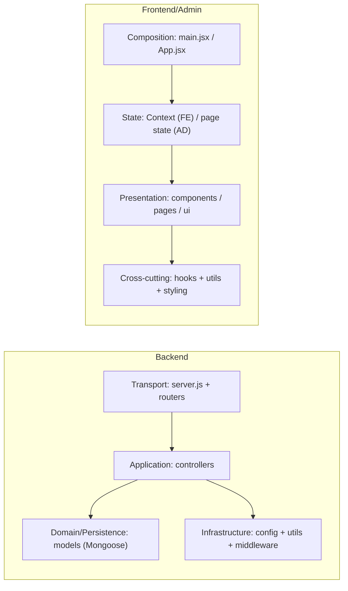
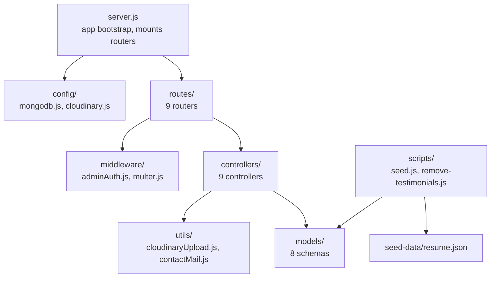
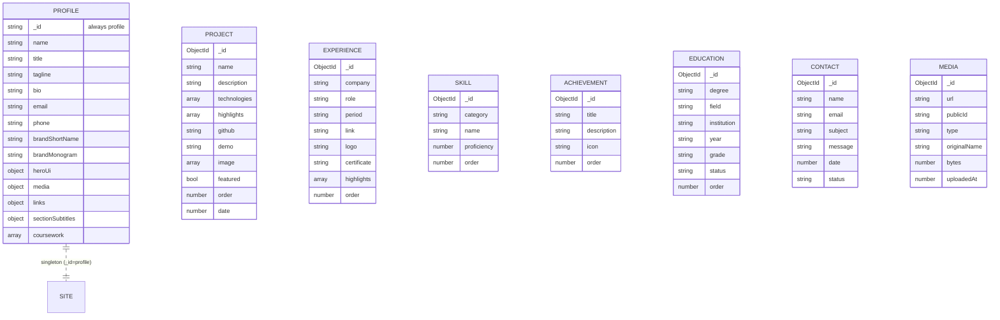
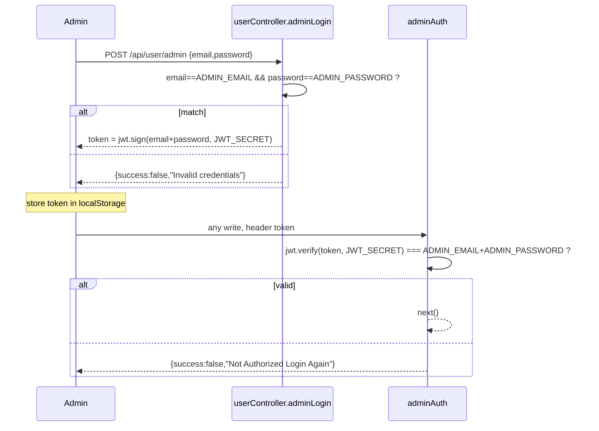
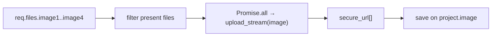
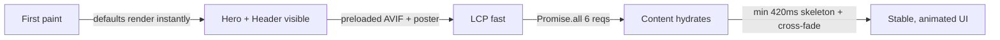

# 03 — System Design (HLD & LLD)

[← Architecture](./02-architecture.md) · [Docs index](./README.md) · Next: [Backend →](./04-backend.md)

---

Where [Architecture](./02-architecture.md) describes the *runtime shape*, this document describes the *design*: the high‑level design (HLD), the low‑level design (LLD) of each module, the domain model, the design patterns in code, and the engineering trade‑offs.

## Table of contents

- [3.1 High-level design (HLD)](#31-high-level-design-hld)
- [3.2 Module decomposition](#32-module-decomposition)
- [3.3 Domain model](#33-domain-model)
- [3.4 Design patterns in detail](#34-design-patterns-in-detail)
- [3.5 Low-level design (LLD)](#35-low-level-design-lld)
- [3.6 Trade-offs & technical decisions](#36-trade-offs--technical-decisions)
- [3.7 Performance considerations](#37-performance-considerations)

---

## 3.1 High-level design (HLD)

At the highest level the system is three cooperating processes plus three SaaS dependencies, wired by configuration:



### HLD responsibilities matrix

| Capability | Owned by | Notes |
|------------|----------|-------|
| Rendering & client routing | SPAs | No SSR; client renders everything. |
| Content authoring | Admin SPA | Forms → API. |
| Authentication/authorization | API (`adminAuth`, `userController`) | Stateless JWT. |
| Validation | API controllers | Email, URL, length, enum coercion. |
| Persistence | API + Mongoose | Schemas + defaults. |
| Binary storage & delivery | Cloudinary | API uploads, browser fetches direct. |
| Email side‑effect | API + Resend | Best effort. |
| Content seeding | `scripts/seed.js` | From `seed-data/resume.json`. |
| Configuration/wiring | `.env` per app | `VITE_BACKEND_URL`, DB/Cloudinary/Resend creds. |

### Logical layers (per app)



---

## 3.2 Module decomposition

### Backend modules



| Module | Responsibility | Detailed in |
|--------|----------------|-------------|
| `config/` | Connect to MongoDB & configure Cloudinary | [Backend §4.3](./04-backend.md#43-config) |
| `middleware/` | JWT auth gate, multipart parsing | [Backend §4.4](./04-backend.md#44-middleware) |
| `models/` | Mongoose schemas (the domain) | [Backend §4.5](./04-backend.md#45-models) & [Database](./05-database.md) |
| `controllers/` | Business logic per resource | [Backend §4.6](./04-backend.md#46-controllers) |
| `routes/` | URL → handler mapping + middleware wiring | [Backend §4.7](./04-backend.md#47-routes) |
| `utils/` | Cloudinary streaming, email | [Backend §4.8](./04-backend.md#48-utilities) |
| `scripts/` | Seeding & one‑off maintenance | [Backend §4.9](./04-backend.md#49-scripts--seed-data) |

### Frontend modules

| Module | Responsibility |
|--------|----------------|
| `context/PortfolioContext.jsx` | Single fetch of all content; defaults; skills grouping; loading/error state. |
| `components/*` | One component per section + shared (`ResponsiveImage`, `SectionSkeleton`, `ContentError`, `AnimatedBackground`). |
| `hooks/useSmoothScroll.js` | Lenis lifecycle, scroll‑lock API, anchor interception. |
| `utils/*` | `externalLink` (URL normalization), `inlineMarkdown` (bold/italic), `profileDisplay` (name composition). |
| `assets/assets.js` | Static public asset paths. |

### Admin modules

| Module | Responsibility |
|--------|----------------|
| `App.jsx` | Token gate, route table, document title, sidebar state. |
| `components/` | `Login`, `Navbar`, `Sidebar` + `ui/` design system. |
| `components/ui/*` | Reusable primitives (Button, Card, Field, Input, Textarea, Select, Checkbox, FilePicker, DataTableCard, ConfirmDialog, RowActions, PageHeader, EmptyState, LoadingState, ToastConfig). |
| `pages/*` | One page per CRUD view + ProfileEditor, Media, Messages. |

---

## 3.3 Domain model

The domain is small and content‑centric. There are **eight collections**, of which one (`profile`) is a singleton and seven are ordinary collections. Two (`contacts`, `media`) are never seeded.



> **There are no foreign keys / references between collections.** Each collection is independent; relationships are *conceptual* (all belong to the same site) rather than enforced. The "grouping" of skills by category and the ordering across collections are application‑level concerns. Full field‑by‑field details, defaults, and validation live in [Database](./05-database.md).

### Domain language

| Term | Meaning |
|------|---------|
| **Profile** | The single editable "site settings + identity" aggregate. |
| **Project** | A portfolio work item with up to 4 images, tech tags, and highlights. |
| **Experience** | A job/internship entry on the timeline. |
| **Skill** | A single named competency with a 0–100 proficiency and a category. |
| **Achievement** | An award/recognition with one of three icons. |
| **Education** | A degree/qualification with a Completed/Pursuing status. |
| **Contact** | An inbound message from the public form. |
| **Media** | A registry row pointing to a Cloudinary asset. |
| **order** | An integer used to sort items within a collection. |

---

## 3.4 Design patterns in detail

### Layered controller pattern (backend)

Every resource follows the same skeleton. Example (skills):

```12:21:backend/controllers/skillController.js
const addSkill = async (req, res) => {
    try {
        const { category, name, proficiency, order } = req.body;
        if (!category || !name) {
            return res.json({ success: false, message: "category and name are required" });
        }
        const skill = new skillModel({
            category,
            name,
            proficiency: Number(proficiency) || 80,
            order: Number(order) || 0,
        });
```

Pattern elements: destructure body → validate → coerce types → persist → return envelope. Errors funnel through a single `catch`.

### Envelope response contract

All handlers return `{ success: true, ... }` or `{ success: false, message }`. This lets every client use one branch:

```40:47:frontend/src/components/Contact.jsx
      const res = await axios.post(backendUrl + "/api/contact/submit", data)
      if (res.data.success) {
        toast.success("Message sent successfully! I'll get back to you soon.")
        e.target.reset()
      } else {
        toast.error(res.data.message || "Failed to send")
      }
```

### Singleton aggregate (profile)

The schema fixes the id and disables auto‑id; `getProfile` lazily creates it:

```4:10:backend/controllers/profileController.js
const getProfile = async (req, res) => {
    try {
        let profile = await profileModel.findById("profile");
        if (!profile) {
            profile = await profileModel.create({ _id: "profile" });
        }
```

### Adapter/util pattern (Cloudinary)

The SDK's stream API is wrapped in a promise so controllers can `await` it:

```6:14:backend/utils/cloudinaryUpload.js
const uploadBufferToCloudinary = (file, options = {}) =>
    new Promise((resolve, reject) => {
        const stream = cloudinary.uploader.upload_stream(options, (error, result) => {
            if (error) return reject(error)
            resolve(result)
        })
        stream.end(file.buffer)
    })
```

### Context provider (frontend state)

One effect fetches everything in parallel and a memo derives grouped skills:

```176:183:frontend/src/context/PortfolioContext.jsx
  const skillsByCategory = useMemo(() => {
    const map = {}
    skills.forEach((s) => {
      if (!map[s.category]) map[s.category] = []
      map[s.category].push(s)
    })
    return map
  }, [skills])
```

### Shared/parameterized form pattern (admin)

`Add*` pages double as edit pages by reading `useParams().id`; the same form posts to `/add` or `/update`:

```58:62:admin/src/pages/AddProject.jsx
const AddProject = ({ token }) => {
  const { id } = useParams()
  const navigate = useNavigate()
  const isEditMode = Boolean(id)
```

### Design‑system / primitive components (admin)

A `ui/` folder provides variant‑driven primitives (e.g. `Button` with `variant`/`size` maps), so pages compose consistent UI without bespoke markup. See [Admin §8.4](./08-admin-panel.md#84-the-ui-design-system).

---

## 3.5 Low-level design (LLD)

This section drills into the most important algorithms and contracts. Each app's full file walkthrough is in its own doc.

### 3.5.1 Authentication LLD



- **Token contents:** the signed payload is the *string* `ADMIN_EMAIL + ADMIN_PASSWORD` (not an object). Verification re‑computes that string and compares.
- **Consequence:** changing either env var invalidates all issued tokens; there is no expiry claim (`exp`) set, so tokens are valid until the secret/credentials change.
- Detailed analysis & hardening in [Security §9.2](./09-security.md#92-authentication).

### 3.5.2 URL normalization LLD (shared logic, duplicated)

Used in `projectController` (server) and `AddProject`/`externalLink` (clients). Algorithm:

1. Trim. If empty → `""`.
2. If starts with `//` → prefix `https:`.
3. Else if no `scheme://` and it *looks like* a host (localhost / IPv4 / domain regex) → prefix `https://`.
4. Parse with `new URL()`. Reject anything whose protocol isn't `http:`/`https:` (blocks `javascript:` etc.). Return canonical string or `""`.

```12:32:backend/controllers/projectController.js
const normalizeExternalUrl = (value) => {
    if (typeof value !== "string") return "";
    const trimmed = value.trim();
    if (!trimmed) return "";

    let candidate = trimmed;
    if (candidate.startsWith("//")) {
        candidate = `https:${candidate}`;
    } else if (!EXTERNAL_PROTOCOL_RE.test(candidate) && looksLikeExternalHost(candidate)) {
        candidate = `https://${candidate}`;
    }

    try {
        const parsed = new URL(candidate);
        const protocol = parsed.protocol.toLowerCase();
        if (protocol !== "http:" && protocol !== "https:") return "";
        return parsed.toString();
    } catch {
        return "";
    }
};
```

This is both a **UX feature** (paste `github.com/x` → becomes `https://github.com/x`) and a **security control** (protocol allow‑list prevents `javascript:`/`data:` link injection on the public site).

### 3.5.3 List‑field parsing LLD

`technologies`/`highlights` arrive as a JSON string (from FormData), a real array (raw JSON), or comma/newline text. `parseListField` handles all three:

```151:160:backend/controllers/projectController.js
function parseListField(value) {
    if (Array.isArray(value)) return value.filter(Boolean);
    if (typeof value !== "string") return [];
    const trimmed = value.trim();
    if (!trimmed) return [];
    if (trimmed.startsWith("[")) {
        try { return JSON.parse(trimmed).filter(Boolean); } catch { /* fall through */ }
    }
    return trimmed.split(/\r?\n|,/).map((s) => s.trim()).filter(Boolean);
}
```

### 3.5.4 Image upload LLD (projects)



- On **add**, images (if any) are uploaded and stored.
- On **update**, new images replace the whole `image` array **only if** at least one file was sent; otherwise the existing array is left untouched (`if (newImages.length) patch.image = newImages`).

### 3.5.5 Media resource‑type detection LLD

```14:21:backend/controllers/mediaController.js
        const mime = file.mimetype || "";
        const resourceType = mime.startsWith("video/")
            ? "video"
            : mime.startsWith("image/")
                ? "image"
                : "raw";
```

The chosen `resource_type` is stored and later reused for `cloudinary.uploader.destroy(publicId, { resource_type })` so deletes target the right asset class.

### 3.5.6 Frontend hydration LLD

- `loading` starts `true` only if a backend URL exists.
- A single effect runs `Promise.all` of 6 requests, merges profile with defaults (deep merge of `heroUi`/`media`/`links`/`sectionSubtitles`), and sets each slice.
- A **minimum skeleton time** (`MIN_SKELETON_MS = 420`) prevents flicker; a `reloadToken` re‑runs the effect for retry; a `cancelled` flag avoids setting state after unmount.

### 3.5.7 Scroll‑spy + smooth scroll LLD

- `useSmoothScroll` initializes Lenis (unless `prefers-reduced-motion`), runs its own `requestAnimationFrame` loop, and intercepts in‑page `a[href^="#"]` clicks to animate to the target honoring `scroll-margin-top`.
- A module‑level **scroll‑lock counter** (`lockLenisScroll`/`unlockLenisScroll`) is shared by the mobile menu and project modal so nested locks compose correctly.
- `Header` runs a rAF‑throttled scroll handler computing the active section by comparing each section's top against a probe line; an "active lock" briefly pins the highlighted item after a nav click so the pill doesn't jump mid‑animation.

Full details in [Frontend §7.6](./07-frontend.md#76-smooth-scrolling--scroll-spy).

---

## 3.6 Trade-offs & technical decisions

This consolidates the engineering trade‑offs (architectural ones are in [Architecture §2.3](./02-architecture.md#23-key-design-decisions--rationale)).

| Decision | Benefit | Cost / risk | Status |
|----------|---------|-------------|--------|
| Plain JS, no TypeScript | Lower toolchain complexity; matches reference | No compile‑time type safety; relies on defaults/coercion | Accepted |
| Duplicated URL‑normalization across 3 places | No shared‑package plumbing | Drift risk if one copy changes | [Tech debt](./13-maintenance-guide.md#known-limitations--technical-debt) |
| HTTP 200 + `success` flag | Uniform client branching | Doesn't use HTTP semantics; harder for generic API tooling | Accepted (Forever convention) |
| `localStorage` JWT | Survives reloads, simple | XSS‑exfiltration risk | Accepted for single admin; see [Security](./09-security.md) |
| Whole‑document profile writes | One simple form | Last‑write‑wins on concurrent edits | Accepted (single editor) |
| Replace‑all image array on update | Simple semantics | Can't add/remove a single image | Accepted; improvement noted |
| No tests | Faster initial delivery | Regressions only caught manually | [Gap](./11-testing.md) |
| `console.*` logging | Zero deps | No log levels/correlation | [Gap](./10-devops-infrastructure.md#107-monitoring--logging) |

---

## 3.7 Performance considerations

### Backend

- **Parallelizable reads.** Endpoints are independent, so the frontend fetches all six concurrently (`Promise.all`).
- **Lean queries.** Each `/list` is a single `find({}).sort(...)`; documents are small. With the current data volume (tens of rows), index pressure is negligible (see [Database → Indexing](./05-database.md#54-indexing-strategy)).
- **Streaming uploads.** `upload_stream` avoids buffering files to disk; memory footprint is one file at a time.
- **JSON body cap.** `express.json({ limit: '5mb' })` bounds request size (note: large binaries go through multipart, not JSON).

### Frontend (the performance‑sensitive app)

- **LCP optimization.** `index.html` preloads the hero portrait (`me.avif`) and poster; `Hero` uses `<ResponsiveImage>` with `fetchPriority="high"` and `loading="eager"` for the portrait, and `preload="metadata"` for the video.
- **Media optimization pipeline.** `scripts/optimize-media.mjs` transcodes the hero video to a smaller MP4 + WebM and extracts a poster via `ffmpeg-static`. See [Frontend §7.9](./07-frontend.md#79-media-optimization-pipeline).
- **Code splitting.** `vite.config.js` `manualChunks` splits `react`, `framer-motion`, `lucide-react`, `react-toastify`; sections that aren't above the fold render after data load; `AnimatedBackground` is deferred behind `requestIdleCallback`.
- **Lazy/conditional animation.** `LazyMotion` with `domMax` loads only needed framer‑motion features; `MotionConfig reducedMotion="user"` and `prefers-reduced-motion` CSS disable heavy animation for users who ask.
- **Layout‑stable loading.** Skeletons mirror each section's exact shell to avoid cumulative layout shift (CLS) when content swaps in.
- **Video CPU/battery control.** `Hero` pauses the background video when off‑screen (IntersectionObserver) or when the tab is hidden (`visibilitychange`).

### Admin

- **Route‑level code splitting.** Every page is `React.lazy`‑loaded behind `<Suspense>`, so the login + shell load fast and each section's bundle loads on demand.
- **Object‑URL cleanup.** File preview URLs are revoked on unmount to avoid memory leaks (`FilePicker`, `Media`).

### Performance budget summary



---

Next: [04 — Backend & Code Documentation →](./04-backend.md)
