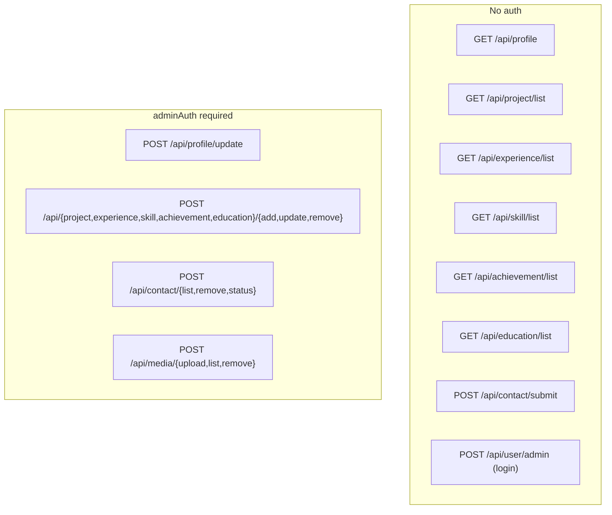
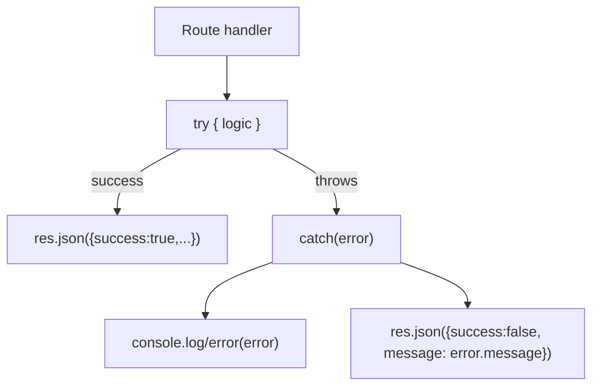

# 04 — Backend & Code Documentation

[← System Design](./03-system-design.md) · [Docs index](./README.md) · Next: [Database →](./05-database.md)

---

This is the **file‑by‑file reference** for the backend (`backend/`). It explains every module, function, contract, and error‑handling strategy, and ends with a dependency reference. Pair it with the [Database](./05-database.md) and [API Reference](./06-api-reference.md) docs.

## Table of contents

- [4.1 Backend folder structure](#41-backend-folder-structure)
- [4.2 Entry point — `server.js`](#42-entry-point--serverjs)
- [4.3 config/](#43-config)
- [4.4 middleware/](#44-middleware)
- [4.5 models/](#45-models)
- [4.6 controllers/](#46-controllers)
- [4.7 routes/](#47-routes)
- [4.8 utilities/](#48-utilities)
- [4.9 scripts & seed-data](#49-scripts--seed-data)
- [4.10 Error handling strategy](#410-error-handling-strategy)
- [4.11 Dependency reference](#411-dependency-reference)

---

## 4.1 Backend folder structure

```
backend/
├── .env.example            # template for required env vars
├── package.json            # ESM ("type":"module"); scripts: start/server/seed/cleanup
├── vercel.json             # @vercel/node serverless config
├── server.js               # app bootstrap + router mounting
├── config/
│   ├── mongodb.js          # connectDB() + connection listeners
│   └── cloudinary.js       # connectCloudinary()
├── middleware/
│   ├── adminAuth.js        # JWT verification gate for writes
│   └── multer.js           # multipart parsing (memoryStorage)
├── models/
│   ├── profileModel.js     # singleton (_id:"profile")
│   ├── projectModel.js
│   ├── experienceModel.js
│   ├── skillModel.js
│   ├── achievementModel.js
│   ├── educationModel.js
│   ├── contactModel.js
│   └── mediaModel.js
├── controllers/
│   ├── userController.js        # adminLogin
│   ├── profileController.js     # getProfile / updateProfile
│   ├── projectController.js     # add/update/list/remove (+ images, URL norm)
│   ├── experienceController.js  # add/update/list/remove (+ logo)
│   ├── skillController.js
│   ├── achievementController.js
│   ├── educationController.js
│   ├── contactController.js     # submit (public) / list / remove / status
│   └── mediaController.js       # upload / list / remove
├── routes/                 # one router per controller (9 total)
├── utils/
│   ├── cloudinaryUpload.js # buffer → Cloudinary stream
│   └── contactMail.js      # Resend notification
├── scripts/
│   ├── seed.js             # seed all collections from resume.json
│   └── remove-testimonials.js  # one-off cleanup migration
└── seed-data/
    └── resume.json         # canonical content (same shape as root portfolio-data.json)
```

**Conventions used throughout the backend:**

- **ESM modules** (`import`/`export`, `"type":"module"`). File extensions are required in relative imports (`./foo.js`).
- **Model idiom:** `mongoose.models.X || mongoose.model("X", schema)` to avoid "OverwriteModelError" when modules reload (dev/hot or serverless re‑import).
- **Controller idiom:** `async (req,res)` wrapped in `try/catch`; success → `{success:true,...}`, error → `{success:false,message}`.
- **No central error middleware:** each controller owns its own error response (see [§4.10](#410-error-handling-strategy)).

---

## 4.2 Entry point — `server.js`

```1:57:backend/server.js
import express from 'express'
import cors from 'cors'
import 'dotenv/config'
import connectDB from './config/mongodb.js'
import connectCloudinary from './config/cloudinary.js'

import userRouter from './routes/userRoute.js'
import profileRouter from './routes/profileRoute.js'
import projectRouter from './routes/projectRoute.js'
import experienceRouter from './routes/experienceRoute.js'
import skillRouter from './routes/skillRoute.js'
import achievementRouter from './routes/achievementRoute.js'
import educationRouter from './routes/educationRoute.js'
import contactRouter from './routes/contactRoute.js'
import mediaRouter from './routes/mediaRoute.js'

// App Config
const app = express()
const port = process.env.PORT || 4000
```

### Responsibilities

1. **Load env** — `import 'dotenv/config'` populates `process.env` from `.env` before anything reads it.
2. **Bootstrap services** — `connectDB()` (non‑fatal; logs a warning if it fails) and `connectCloudinary()`.
3. **Install middleware** — `express.json({ limit:'5mb' })` (parse JSON bodies up to 5 MB) and `cors()` (allow all origins).
4. **Mount routers** — each resource under `/api/<resource>`.
5. **Health route** — `GET /` returns the string `"API Working"`.
6. **Listen conditionally** — only call `app.listen()` when **not** on Vercel; otherwise export `app` so the serverless runtime invokes it per request.

### Why the conditional `listen()`

```51:57:backend/server.js
// On Vercel the app is imported and invoked per-request, so we must NOT call
// listen() there. Locally (no VERCEL env var) we start a normal HTTP server.
if (!process.env.VERCEL) {
    app.listen(port, () => console.log('Server started on PORT : ' + port))
}

export default app
```

On Vercel the platform imports `app` and handles HTTP itself; calling `listen()` there would be wrong. Locally, `listen()` starts a real server. This single file therefore works in both environments.

### Router mount table

| Mount | Router file | Doc |
|-------|-------------|-----|
| `/api/user` | `userRoute.js` | [API: Auth](./06-api-reference.md#auth) |
| `/api/profile` | `profileRoute.js` | [API: Profile](./06-api-reference.md#profile) |
| `/api/project` | `projectRoute.js` | [API: Projects](./06-api-reference.md#projects) |
| `/api/experience` | `experienceRoute.js` | [API: Experience](./06-api-reference.md#experience) |
| `/api/skill` | `skillRoute.js` | [API: Skills](./06-api-reference.md#skills) |
| `/api/achievement` | `achievementRoute.js` | [API: Achievements](./06-api-reference.md#achievements) |
| `/api/education` | `educationRoute.js` | [API: Education](./06-api-reference.md#education) |
| `/api/contact` | `contactRoute.js` | [API: Contact](./06-api-reference.md#contact) |
| `/api/media` | `mediaRoute.js` | [API: Media](./06-api-reference.md#media) |

---

## 4.3 config/

### `config/mongodb.js`

```18:35:backend/config/mongodb.js
const connectDB = async () => {
    attachConnectionListeners()

    const mongoUri = process.env.MONGODB_URI
    if (!mongoUri) {
        console.error("MONGODB_URI is not set. Skipping database connection.")
        return false
    }

    try {
        await mongoose.connect(`${mongoUri}/portfolio`)
        return true
    } catch (error) {
        console.error("MongoDB initial connection failed:", error?.message || error)
        return false
    }
}
```

Key points:

- **Database name appended in code.** `MONGODB_URI` must **not** end with a slash; the code appends `/portfolio`, so the database is always `portfolio`. (Common setup mistake — see [Maintenance → Troubleshooting](./13-maintenance-guide.md#troubleshooting-scenarios).)
- **Returns a boolean**, never throws — enabling the non‑fatal bootstrap. (See [Architecture D9](./02-architecture.md#d9--resilient-db-bootstrap).)
- **Listeners attached once** via the `listenersAttached` guard, so repeated calls (e.g. seed + server) don't stack duplicate `connected`/`error` handlers.

### `config/cloudinary.js`

```3:11:backend/config/cloudinary.js
const connectCloudinary = async () => {

    cloudinary.config({
        cloud_name: process.env.CLOUDINARY_NAME,
        api_key: process.env.CLOUDINARY_API_KEY,
        api_secret: process.env.CLOUDINARY_SECRET_KEY
    })

}
```

Configures the shared `cloudinary` v2 client with credentials from env. Note the env var name is `CLOUDINARY_SECRET_KEY` (not `CLOUDINARY_API_SECRET`). Called once at boot; the configured singleton is imported wherever uploads happen.

---

## 4.4 middleware/

### `middleware/adminAuth.js`

```3:18:backend/middleware/adminAuth.js
const adminAuth = async (req, res, next) => {
    try {
        const { token } = req.headers
        if (!token) {
            return res.json({ success: false, message: "Not Authorized Login Again" })
        }
        const token_decode = jwt.verify(token, process.env.JWT_SECRET);
        if (token_decode !== process.env.ADMIN_EMAIL + process.env.ADMIN_PASSWORD) {
            return res.json({ success: false, message: "Not Authorized Login Again" })
        }
        next()
    } catch (error) {
        console.log(error)
        res.json({ success: false, message: error.message })
    }
}
```

- Reads the JWT from the **`token`** request header (lowercased by Node).
- `jwt.verify` validates the signature against `JWT_SECRET` and **returns the decoded payload** — here a plain string.
- It asserts that the decoded string equals `ADMIN_EMAIL + ADMIN_PASSWORD`. Only then does it call `next()`.
- Any failure (missing token, bad signature, mismatch) returns an envelope error with HTTP 200; an exception (e.g. malformed token) is caught and returned similarly.

This middleware is the **only** authorization control in the system. Its security properties are analyzed in [Security §9.2–9.3](./09-security.md#92-authentication).

### `middleware/multer.js`

```1:10:backend/middleware/multer.js
import multer from "multer";

// Memory storage keeps each upload in `file.buffer` instead of writing to disk.
// Required on serverless hosts (e.g. Vercel) whose filesystem is read-only.
// The buffer is streamed straight into Cloudinary via `uploadBufferToCloudinary`.
const storage = multer.memoryStorage()

const upload = multer({ storage })

export default upload
```

- Uses **memory storage** so the parsed file is available as `file.buffer` (not written to disk). This is what makes uploads serverless‑safe.
- The exported `upload` is configured per‑route: `upload.fields([...])` for project images / experience logo, and `upload.single('file')` for the media library. See the route files in [§4.7](#47-routes).

---

## 4.5 models/

All schemas are small and use defaults so partial inputs never break reads. Field‑level detail, validation, and the ER diagram live in [Database](./05-database.md); this section summarizes the code.

### `profileModel.js` — the singleton

```6:58:backend/models/profileModel.js
const profileSchema = new mongoose.Schema({
    _id: { type: String, default: "profile" },

    name: { type: String, default: "" },
    title: { type: String, default: "" },
    tagline: { type: String, default: "" },
    bio: { type: String, default: "" },
    email: { type: String, default: "" },
    phone: { type: String, default: "" },

    brandShortName: { type: String, default: "" },
    brandMonogram: { type: String, default: "" },

    heroUi: { /* badge, introPrefix, role, primary/secondary CTA, scroll hints */ },
    media: { /* heroVideoSrc, heroPosterSrc, heroProfileSrc, aboutProfileSrc, resumePdf */ },
    links: { /* linkedin, github, leetcode, codeforces, geekforgeeks, twitter */ },
    sectionSubtitles: { /* about, projects, experience, skills, achievements, contact */ },

    coursework: { type: [String], default: [] },
}, { _id: false });
```

- `_id` is a **String** fixed to `"profile"`, and `{ _id: false }` disables Mongoose's automatic ObjectId so the fixed id sticks.
- Nested objects (`heroUi`, `media`, `links`, `sectionSubtitles`) carry sensible **string defaults**, so a freshly created singleton already renders a believable site.

### The seven regular models

| Model | Required fields | Notable defaults / constraints |
|-------|-----------------|--------------------------------|
| `projectModel` | `name` | `image:[]`, `featured:false`, `order:0`, `date:Date.now()` |
| `experienceModel` | `company`, `role` | string fields default `""`, `highlights:[]`, `order:0` |
| `skillModel` | `category`, `name` | `proficiency` default `80`, `min:0,max:100` (the only `min/max` validator) |
| `achievementModel` | `title` | `icon` default `"trophy"` (controller enforces enum) |
| `educationModel` | `degree`, `institution` | `status` default `"Completed"` (controller coerces to Completed/Pursuing) |
| `contactModel` | `name`, `email`, `message` | `status` default `"new"`, `date:Date.now()` |
| `mediaModel` | `url` | `type` default `"image"`, `bytes:0`, `uploadedAt:Date.now()` |

All use the `mongoose.models.X || mongoose.model(...)` idiom. Enum validity for `icon`/`status`/`type` is enforced in **controllers**, not schema enums (a deliberate choice to keep coercion logic in one place).

---

## 4.6 controllers/

All controllers share the envelope contract. Below are the per‑resource specifics.

### `userController.js` — `adminLogin`

```6:22:backend/controllers/userController.js
const adminLogin = async (req, res) => {
    try {

        const { email, password } = req.body

        if (email === process.env.ADMIN_EMAIL && password === process.env.ADMIN_PASSWORD) {
            const token = jwt.sign(email + password, process.env.JWT_SECRET);
            res.json({ success: true, token })
        } else {
            res.json({ success: false, message: "Invalid credentials" })
        }

    } catch (error) {
        console.log(error);
        res.json({ success: false, message: error.message })
    }
}
```

The only auth endpoint. Plaintext compare; signs the `email+password` string. No signup, no user collection. (See [Security](./09-security.md#92-authentication).)

### `profileController.js`

- **`getProfile`** (public): finds `"profile"`; if absent, creates it; returns `{success,profile}`. Guarantees the public site never gets `null`.
- **`updateProfile`** (admin): forces `payload._id = "profile"` and upserts:

```24:30:backend/controllers/profileController.js
        const profile = await profileModel.findByIdAndUpdate(
            "profile",
            payload,
            { upsert: true, new: true, setDefaultsOnInsert: true, runValidators: true }
        );
```

`new:true` returns the updated doc; `setDefaultsOnInsert` applies schema defaults on first create; `runValidators` enforces schema validation on update.

### `projectController.js`

The most feature‑rich controller. It:

1. **Normalizes & validates URLs** (`github`, `demo`) via `normalizeExternalUrl` — rejects non‑http(s) input with a helpful message ([LLD §3.5.2](./03-system-design.md#352-url-normalization-lld-shared-logic-duplicated)).
2. **Uploads up to 4 images** (`uploadProjectImages`) and stores `secure_url[]`.
3. **Parses list fields** (`technologies`, `highlights`) via `parseListField` ([LLD §3.5.3](./03-system-design.md#353-list-field-parsing-lld)).
4. **Coerces** `featured` (string `"true"`/bool) and `order` (Number).
5. `listProjects` sorts by `{ order:1, date:-1 }`; `removeProject` deletes by id.

On **update**, only provided fields are patched (spread‑conditional), and images replace the array only when new files were sent.

### `experienceController.js`

Mirror of projects but simpler: one optional `logo` upload (`uploadLogo`), list‑field parsing for `highlights`, sort `{ order:1, _id:-1 }`. No URL validation (the `link`/`certificate` are stored as given).

### `skillController.js`

Pure JSON CRUD. `addSkill` requires `category`+`name`, defaults `proficiency` to 80; `listSkills` sorts `{ category:1, order:1, _id:1 }` (so the client groups categories consistently).

### `achievementController.js`

CRUD with an **icon allow‑list**:

```3:3:backend/controllers/achievementController.js
const VALID_ICONS = new Set(["trophy", "award", "medal"]);
```

Any other icon value falls back to `"trophy"` on add/update. Sort `{ order:1, _id:1 }`.

### `educationController.js`

CRUD requiring `degree`+`institution`; coerces `status` to exactly `"Pursuing"` or `"Completed"`. Sort `{ order:1, _id:1 }`.

### `contactController.js`

```8:27:backend/controllers/contactController.js
const submitContact = async (req, res) => {
    try {
        const { name, email, subject, message } = req.body;

        if (!name || !email || !message) {
            return res.json({ success: false, message: "name, email and message are required" });
        }
        if (!validator.isEmail(email)) {
            return res.json({ success: false, message: "Please enter a valid email" });
        }

        const doc = new contactModel({
            name: String(name).slice(0, 200),
            email: String(email).slice(0, 200),
            subject: String(subject || "").slice(0, 200),
            message: String(message).slice(0, 4000),
            date: Date.now(),
            status: "new",
        });
        await doc.save();
```

- **The only public POST.** Validates required fields and email format (`validator.isEmail`), and **truncates** fields (200/200/200/4000 chars) to bound storage and limit abuse.
- After saving, sends a **best‑effort** email; a mail error is caught and logged but the API still returns success ([D8](./02-architecture.md#d8--best-effort-email-never-blocking)).
- Admin operations: `listContacts` (sort `{date:-1}`), `removeContact`, `markContactRead` (coerces status to `new`/`read`).

### `mediaController.js`

- **`uploadMedia`**: detects `resource_type` from mimetype ([LLD §3.5.5](./03-system-design.md#355-media-resource-type-detection-lld)), streams to Cloudinary, records a `mediaModel` row, returns `{url,publicId,type,media}`.
- **`listMedia`**: sort `{uploadedAt:-1}`.
- **`removeMedia`**: best‑effort `cloudinary.uploader.destroy(publicId,{resource_type})`, then delete the DB row. A Cloudinary failure is logged but the row is still removed.

---

## 4.7 routes/

Each router maps URLs to controller functions and wires middleware. They are intentionally tiny and declarative.

### Public vs admin at a glance



### Example: `projectRoute.js` (with upload middleware)

```8:18:backend/routes/projectRoute.js
const imageFields = upload.fields([
    { name: 'image1', maxCount: 1 },
    { name: 'image2', maxCount: 1 },
    { name: 'image3', maxCount: 1 },
    { name: 'image4', maxCount: 1 },
]);

projectRouter.get('/list', listProjects);
projectRouter.post('/add', adminAuth, imageFields, addProject);
projectRouter.post('/update', adminAuth, imageFields, updateProject);
projectRouter.post('/remove', adminAuth, removeProject);
```

Middleware order matters: `adminAuth` runs **before** `multer` parses the body, so an unauthorized request is rejected without doing upload work.

### Router responsibilities table

| Router | Public routes | Admin routes | Upload middleware |
|--------|---------------|--------------|-------------------|
| `userRoute` | `POST /admin` | — | — |
| `profileRoute` | `GET /` | `POST /update` | — |
| `projectRoute` | `GET /list` | `POST /add,/update,/remove` | `fields(image1..image4)` on add/update |
| `experienceRoute` | `GET /list` | `POST /add,/update,/remove` | `fields(logo)` on add/update |
| `skillRoute` | `GET /list` | `POST /add,/update,/remove` | — |
| `achievementRoute` | `GET /list` | `POST /add,/update,/remove` | — |
| `educationRoute` | `GET /list` | `POST /add,/update,/remove` | — |
| `contactRoute` | `POST /submit` | `POST /list,/remove,/status` | — |
| `mediaRoute` | — | `POST /upload,/list,/remove` | `single(file)` on upload |

Full request/response shapes are in the [API Reference](./06-api-reference.md).

---

## 4.8 utilities/

### `utils/cloudinaryUpload.js`

Wraps Cloudinary's stream upload in a promise so controllers can `await` a buffer upload. See the code and rationale in [System Design §3.4](./03-system-design.md#adapterutil-pattern-cloudinary). Returns the full Cloudinary result (`secure_url`, `public_id`, `bytes`, …).

### `utils/contactMail.js`

```38:63:backend/utils/contactMail.js
const sendContactNotification = async ({ name, email, subject, message }) => {
    const resend = getResendClient()
    if (!resend) {
        console.warn("RESEND_API_KEY not set - skipping contact email notification")
        return { sent: false, skipped: true, reason: "missing_api_key" }
    }

    const to = process.env.CONTACT_NOTIFY_TO || DEFAULT_NOTIFY_TO
    const from = process.env.CONTACT_NOTIFY_FROM || DEFAULT_FROM
    const subjectLine = `New portfolio message: ${subject || "(no subject)"}`

    const { data, error } = await resend.emails.send({
        from,
        to,
        replyTo: email,
        subject: subjectLine,
        text: buildTextBody({ name, email, subject, message }),
        html: buildHtmlBody({ name, email, subject, message }),
    })
```

- **Lazy client.** Returns `null` if `RESEND_API_KEY` is unset, so the feature degrades silently in dev.
- **Configurable recipient/sender** via `CONTACT_NOTIFY_TO` / `CONTACT_NOTIFY_FROM`, with safe defaults.
- **HTML escaping.** `escapeHtml` escapes `& < > " '` and converts newlines to `<br/>` to prevent **HTML/email injection** from the user‑supplied message — an important security control given the message is rendered as HTML in the notification email. (See [Security §9.4](./09-security.md#94-data-protection).)
- **`replyTo`** is set to the submitter's email so the owner can reply directly.

---

## 4.9 scripts & seed-data

### `scripts/seed.js`

Idempotently loads `seed-data/resume.json` into MongoDB. Behavior:

- **Profile**: `findByIdAndUpdate("profile", payload, { upsert:true })` — never destructive.
- **Projects / Experience / Skills / Achievements / Education**: `deleteMany({})` then `insertMany([...])` — these collections are **fully replaced** on each run.
- **Skills are flattened**: the `{ "Category": [ {name,proficiency} ] }` map becomes one document per skill with `category` + an `order` that increments by 1000 per category to preserve category grouping/order:

```106:121:backend/scripts/seed.js
    // ---- Skills (flatten category → many docs) ----
    await skillModel.deleteMany({})
    const skillDocs = []
    let skillCounter = 0
    Object.entries(data.skills || {}).forEach(([category, list]) => {
        ;(list || []).forEach((s, idx) => {
            skillDocs.push({
                category,
                name: s.name,
                proficiency: typeof s.proficiency === 'number' ? s.proficiency : 80,
                order: idx + skillCounter,
            })
        })
        skillCounter += 1000
    })
```

- **`contacts` and `media` are never touched** by the seed — they hold runtime data, not seed content.
- Run with `npm run seed`. Requires `MONGODB_URI`. Closes the connection on completion.

> **Seed source of truth:** `backend/seed-data/resume.json` has the same shape as the repo‑root [`portfolio-data.json`](../portfolio-data.json). Keep them in sync if you edit canonical content.

### `scripts/remove-testimonials.js`

A one‑off **migration/cleanup** that drops a legacy `testimonials` collection and unsets `sectionSubtitles.testimonials` from profile docs (the feature was removed). Run via `npm run cleanup:testimonials`. It's an example of how to write a safe, idempotent data migration against this DB — see [Database → Migration strategy](./05-database.md#55-migration-strategy).

---

## 4.10 Error handling strategy

The backend uses **localized, defensive error handling** rather than a global error middleware.



### Principles

1. **Never crash the process.** Every controller wraps logic in `try/catch`; an exception becomes a JSON error, not a 500 stack‑trace or a process exit.
2. **Validate early, return early.** Required‑field and format checks `return` an envelope error before touching the DB.
3. **Side effects are non‑fatal.** Email send and Cloudinary `destroy` are isolated so their failures don't fail the primary operation.
4. **Boot is non‑fatal.** DB connection failure logs and continues (see `mongodb.js`).
5. **Uniform shape.** Clients only need to check `success`; on failure, `message` is a human‑readable string suitable for a toast.

### Known limitations of this strategy

- **HTTP status is almost always 200**, even on errors — generic HTTP tooling/monitoring can't distinguish failures by status. (Trade‑off, [§3.6](./03-system-design.md#36-trade-offs--technical-decisions).)
- **`error.message` is returned to the client.** For internal errors this could leak implementation details; acceptable here, but a hardening step would map internal errors to generic messages. See [Security §9.6](./09-security.md#96-known-risks--recommendations).
- **Logging is `console.*`** with no levels or correlation ids. See [DevOps §10.7](./10-devops-infrastructure.md#107-monitoring--logging).

---

## 4.11 Dependency reference

From `backend/package.json`:

### Runtime dependencies

| Package | Version | Why it's here | Used in |
|---------|---------|---------------|---------|
| `express` | ^4.19.2 | HTTP server, routing, middleware | `server.js`, all routes |
| `mongoose` | ^8.5.3 | MongoDB ODM (schemas, queries, validation) | all models/controllers |
| `jsonwebtoken` | ^9.0.2 | Sign/verify the admin JWT | `userController`, `adminAuth` |
| `validator` | ^13.12.0 | Email format validation | `contactController` |
| `multer` | ^1.4.5-lts.1 | Parse `multipart/form-data` uploads | `middleware/multer.js`, project/experience/media routes |
| `cloudinary` | ^2.4.0 | Image/video/raw storage + CDN; upload & destroy | `config/cloudinary.js`, `utils/cloudinaryUpload.js`, project/experience/media controllers |
| `resend` | ^6.14.0 | Transactional email for contact notifications | `utils/contactMail.js` |
| `cors` | ^2.8.5 | Cross‑origin access for the two SPA origins | `server.js` |
| `dotenv` | ^16.4.5 | Load `.env` into `process.env` | `server.js`, scripts |
| `bcrypt` | ^5.1.1 | **Currently unused** — pinned for a future hashed‑credential upgrade | (none yet) |

> **`bcrypt` is intentionally present but unused.** The admin compare is plaintext today; `bcrypt` is reserved for the recommended upgrade to hashed credentials in a `userModel`. See [Security §9.6](./09-security.md#96-known-risks--recommendations).

### Dev dependencies

| Package | Version | Why |
|---------|---------|-----|
| `nodemon` | ^3.1.4 | Auto‑restart on file change (`npm run server`) |

### npm scripts

| Script | Command | Purpose |
|--------|---------|---------|
| `start` | `node server.js` | Production start (used by Vercel/host) |
| `server` | `nodemon server.js` | Local dev with auto‑restart |
| `seed` | `node scripts/seed.js` | (Re)seed content collections |
| `cleanup:testimonials` | `node scripts/remove-testimonials.js` | One‑off legacy cleanup |

### `vercel.json`

```1:20:backend/vercel.json
{
    "version": 2,
    "builds": [
        {
            "src": "server.js",
            "use": "@vercel/node",
            "config": {
                "includeFiles": [
                    "dist/**"
                ]
            }
        }
    ],
    "routes": [
        {
            "src": "/(.*)",
            "dest": "server.js"
        }
    ]
}
```

Routes **all** paths to `server.js` (the exported Express app) using the `@vercel/node` builder. See [DevOps → Backend deployment](./10-devops-infrastructure.md#103-backend-deployment-vercel).

---

Next: [05 — Database →](./05-database.md)
