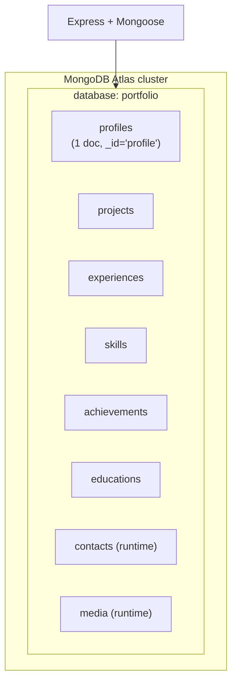
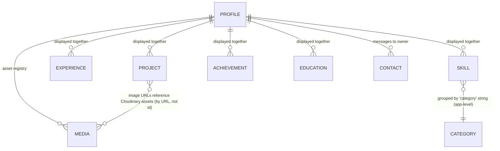
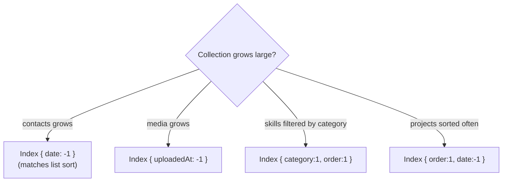
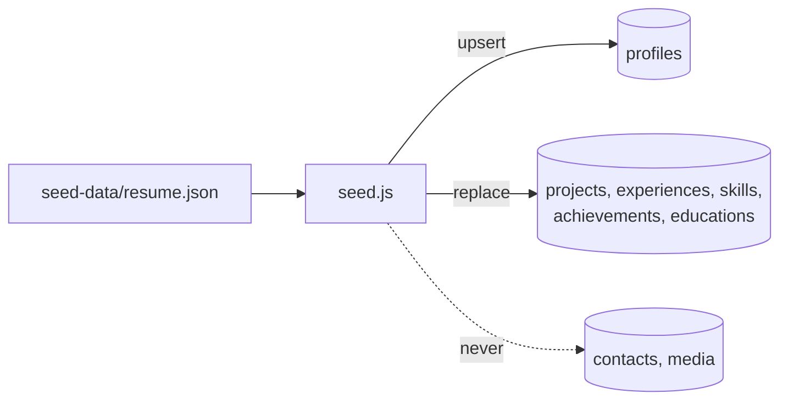

# 05 — Database

[← Backend](./04-backend.md) · [Docs index](./README.md) · Next: [API Reference →](./06-api-reference.md)

---

This document is the authoritative reference for the data layer: the database architecture, every schema, the (conceptual) entity relationships, indexing, migrations, query optimization, and the data lifecycle.

## Table of contents

- [5.1 Database architecture](#51-database-architecture)
- [5.2 Schema documentation](#52-schema-documentation)
- [5.3 Entity relationships](#53-entity-relationships)
- [5.4 Indexing strategy](#54-indexing-strategy)
- [5.5 Migration strategy](#55-migration-strategy)
- [5.6 Query optimization considerations](#56-query-optimization-considerations)
- [5.7 Data lifecycle management](#57-data-lifecycle-management)

---

## 5.1 Database architecture

- **Engine:** MongoDB (document database), hosted on **MongoDB Atlas** (managed cloud).
- **Driver/ODM:** **Mongoose 8** — provides schemas, defaults, validation, and a query builder over the native driver.
- **Database name:** **`portfolio`**. The connection code appends `/portfolio` to `MONGODB_URI`, so the database name is not configurable via env (see [`config/mongodb.js`](./04-backend.md#configmongodbjs)).
- **Collections:** eight, one per Mongoose model. Mongoose pluralizes model names, so model `project` → collection `projects`, `media` → `media`, etc.



### Collection inventory

| Model name | Collection | Seeded? | Typical size | Source of writes |
|------------|------------|---------|--------------|------------------|
| `profile` | `profiles` | upsert (preserved) | 1 | admin profile editor / seed |
| `project` | `projects` | replaced | tens | admin CRUD / seed |
| `experience` | `experiences` | replaced | a few | admin CRUD / seed |
| `skill` | `skills` | replaced | tens | admin CRUD / seed |
| `achievement` | `achievements` | replaced | a few | admin CRUD / seed |
| `education` | `educations` | replaced | a few | admin CRUD / seed |
| `contact` | `contacts` | **never** | grows with traffic | public contact form |
| `media` | `media` | **never** | tens–hundreds | admin media uploads |

> **Schema flexibility.** MongoDB is schemaless at the engine level; structure is enforced by **Mongoose schemas in application code**, not by the database. This means: defaults are applied by Mongoose, not Mongo; and legacy documents written under an older schema are not auto‑migrated (see [Migrations](#55-migration-strategy)).

---

## 5.2 Schema documentation

Each schema is defined in `backend/models/*`. Below is every field, its type, default, and meaning. (Code excerpts are in [Backend §4.5](./04-backend.md#45-models).)

### `profiles` (singleton — `_id: "profile"`)

| Field | Type | Default | Meaning |
|-------|------|---------|---------|
| `_id` | String | `"profile"` | Fixed id; `{_id:false}` disables ObjectId generation. |
| `name` | String | `""` | First/given name shown in hero & about. |
| `title` | String | `""` | Surname or professional title; composed with `name` for display. |
| `tagline` | String | `""` | Hero subtitle / footer blurb. |
| `bio` | String | `""` | About text; split into paragraphs on blank lines. |
| `email` | String | `""` | Public contact email. |
| `phone` | String | `""` | Public contact phone. |
| `brandShortName` | String | `""` | Header/footer brand text (e.g. `"Mainak."`). |
| `brandMonogram` | String | `""` | Monogram letter in the header badge. |
| `heroUi` | Object | per‑key defaults | Hero copy: `badge`, `introPrefix`, `role`, `primaryCtaLabel/Href`, `secondaryCtaLabel/Href`, `scrollHintTop/Bottom`. |
| `media` | Object | local `/public` paths | `heroVideoSrc`, `heroPosterSrc`, `heroProfileSrc`, `aboutProfileSrc`, `resumePdf`. |
| `links` | Object | `""` each | Social URLs: `linkedin`, `github`, `leetcode`, `codeforces`, `geekforgeeks`, `twitter`. |
| `sectionSubtitles` | Object | per‑key defaults | Subheading copy: `about`, `projects`, `experience`, `skills`, `achievements`, `contact`. |
| `coursework` | [String] | `[]` | List of course names. |

### `projects`

| Field | Type | Default | Meaning |
|-------|------|---------|---------|
| `_id` | ObjectId | auto | — |
| `name` | String | **required** | Project title. |
| `description` | String | `""` | Summary (supports inline `**bold**`/`*italic*` on the client). |
| `technologies` | [String] | `[]` | Tech tags. |
| `highlights` | [String] | `[]` | Bullet feature list. |
| `github` | String | `""` | Normalized repo URL (http/https only). |
| `demo` | String | `""` | Normalized live‑demo URL (http/https only). |
| `image` | [String] | `[]` | Up to 4 Cloudinary `secure_url`s. |
| `featured` | Boolean | `false` | Shows a "Featured" badge. |
| `order` | Number | `0` | Sort key (ascending). |
| `date` | Number | `Date.now()` | Epoch ms; secondary sort (descending). |

### `experiences`

| Field | Type | Default | Meaning |
|-------|------|---------|---------|
| `company` | String | **required** | Employer/organization. |
| `role` | String | **required** | Job title. |
| `period` | String | `""` | Free‑text date range. |
| `link` | String | `""` | Company website. |
| `logo` | String | `""` | Cloudinary URL of the logo. |
| `certificate` | String | `""` | Certificate URL. |
| `highlights` | [String] | `[]` | Bullet achievements. |
| `order` | Number | `0` | Sort key. |

### `skills`

| Field | Type | Default | Constraints | Meaning |
|-------|------|---------|-------------|---------|
| `category` | String | **required** | — | Group name (e.g. "ML & AI"). |
| `name` | String | **required** | — | Skill name. |
| `proficiency` | Number | `80` | `min:0, max:100` | Progress‑bar percentage. |
| `order` | Number | `0` | — | Sort within/by category. |

### `achievements`

| Field | Type | Default | Meaning |
|-------|------|---------|---------|
| `title` | String | **required** | Achievement title. |
| `description` | String | `""` | Detail. |
| `icon` | String | `"trophy"` | One of `trophy` / `award` / `medal` (enforced in controller). |
| `order` | Number | `0` | Sort key. |

### `educations`

| Field | Type | Default | Meaning |
|-------|------|---------|---------|
| `degree` | String | **required** | Degree/qualification. |
| `field` | String | `""` | Field of study. |
| `institution` | String | **required** | School/university. |
| `year` | String | `""` | Year/graduation. |
| `grade` | String | `""` | Grade (CGPA/% — normalized for display on client). |
| `status` | String | `"Completed"` | `Completed` / `Pursuing` (coerced in controller). |
| `order` | Number | `0` | Sort key. |

### `contacts` (runtime, not seeded)

| Field | Type | Default | Meaning |
|-------|------|---------|---------|
| `name` | String | **required** | Sender name (≤200 chars). |
| `email` | String | **required** | Sender email (validated; ≤200 chars). |
| `subject` | String | `""` | Subject (≤200 chars). |
| `message` | String | **required** | Body (≤4000 chars). |
| `date` | Number | `Date.now()` | Epoch ms; primary sort (descending). |
| `status` | String | `"new"` | `new` / `read`. |

### `media` (runtime, not seeded)

| Field | Type | Default | Meaning |
|-------|------|---------|---------|
| `url` | String | **required** | Cloudinary `secure_url`. |
| `publicId` | String | `""` | Cloudinary public id (needed to delete). |
| `type` | String | `"image"` | `image` / `video` / `raw`. |
| `originalName` | String | `""` | Uploaded filename. |
| `bytes` | Number | `0` | Size in bytes. |
| `uploadedAt` | Number | `Date.now()` | Epoch ms; sort (descending). |

---

## 5.3 Entity relationships

There are **no enforced relationships** (no references, no `populate`, no foreign keys). Each collection is an independent list. The only "relationship" is conceptual: every collection belongs to the same single‑owner site.



### Notable "soft" relationships

- **Skill → Category** is a string field, grouped on the client (`skillsByCategory`). There is no Category collection.
- **Project.image / Experience.logo / Profile.media.*** store Cloudinary **URLs**, which may also exist as `media` rows — but there is **no referential link**; deleting a `media` row does not update documents that embedded its URL, and vice versa. (A known limitation; see [Data lifecycle](#57-data-lifecycle-management).)

### Why no references?

For a single‑owner portfolio with tiny collections, embedding/denormalizing (storing URLs directly) is simpler and faster than normalized references with joins. The cost — possible orphaned/dangling URLs — is negligible and easily fixed manually.

---

## 5.4 Indexing strategy

### Current state

- The **only index defined** is the implicit primary key index on `_id` for every collection (created automatically by MongoDB).
- The `profiles` collection's `_id` is the string `"profile"`, so the singleton is fetched by primary key — an O(1) point lookup.
- No secondary indexes are declared in any schema.

### Why this is acceptable today

Query patterns are `find({}).sort(...)` over **small collections** (tens of documents). MongoDB performs an in‑memory sort on a full collection scan, which is trivial at this scale. Adding indexes would add write overhead and storage for no measurable read benefit.

### When to add indexes (and which)



Recommended future indexes (declare via `schema.index(...)` so they're versioned in code):

| Collection | Index | Reason |
|------------|-------|--------|
| `contacts` | `{ date: -1 }` | Matches the inbox sort; the only unbounded collection. |
| `media` | `{ uploadedAt: -1 }` | Matches the library sort. |
| `skills` | `{ category: 1, order: 1 }` | Matches the list sort/group. |
| `projects` | `{ order: 1, date: -1 }` | Matches the list sort. |

> **Action when adding:** define indexes in the schema and let Mongoose build them on connect (dev), or build them in the background on Atlas for production to avoid blocking.

---

## 5.5 Migration strategy

MongoDB + Mongoose has **no built‑in migration framework** here. The strategy is:

### 1. Seeding (greenfield / content reset)

`scripts/seed.js` (`npm run seed`) is the primary "migration" for content collections. It is **idempotent**:

- `profiles` → `upsert` (never destroyed).
- content collections → `deleteMany` + `insertMany` (full replace).
- `contacts` / `media` → untouched.



### 2. Ad‑hoc data migrations

For schema changes that need to transform existing data, write a small, idempotent Node script following the pattern of `scripts/remove-testimonials.js`:

- Connect via the shared `connectDB()`.
- Check before acting (`listCollections`, conditional updates) so re‑runs are safe.
- Use `updateMany` with `$set`/`$unset` for field‑level changes.
- Close the connection and exit with a clear code.

Example pattern (from the existing cleanup):

```19:25:backend/scripts/remove-testimonials.js
async function unsetProfileTestimonialSubtitle() {
    const result = await mongoose.connection
        .collection('profiles')
        .updateMany({}, { $unset: { 'sectionSubtitles.testimonials': '' } })

    console.log(`Unset sectionSubtitles.testimonials in ${result.modifiedCount} profile document(s).`)
}
```

### 3. Schema‑default backfill

Because defaults are applied by Mongoose only on **insert/validated update**, adding a new field to a schema does **not** retroactively populate existing documents. To backfill, either:

- run `updateProfile` / re‑save documents (triggers defaults), or
- write an `updateMany` with `$set` for the new field.

### Recommended process for a breaking schema change

1. Add the field to the schema with a safe default.
2. Write a backfill script (`scripts/migrate-XYZ.js`) using the cleanup pattern.
3. Run it against a **staging/dev database** first.
4. Take an Atlas snapshot (backup) before running in production.
5. Run, verify counts, and keep the script in `scripts/` for audit history.

---

## 5.6 Query optimization considerations

The query surface is intentionally tiny. Every read is one of:

| Endpoint | Query | Sort | Notes |
|----------|-------|------|-------|
| `GET /api/profile` | `findById("profile")` | — | Point lookup on `_id`. |
| `GET /api/project/list` | `find({})` | `{order:1, date:-1}` | Full scan + in‑memory sort. |
| `GET /api/experience/list` | `find({})` | `{order:1, _id:-1}` | — |
| `GET /api/skill/list` | `find({})` | `{category:1, order:1, _id:1}` | — |
| `GET /api/achievement/list` | `find({})` | `{order:1, _id:1}` | — |
| `GET /api/education/list` | `find({})` | `{order:1, _id:1}` | — |
| `POST /api/contact/list` | `find({})` | `{date:-1}` | Unbounded growth — first candidate for an index + pagination. |
| `POST /api/media/list` | `find({})` | `{uploadedAt:-1}` | — |

### Guidelines

- **Match indexes to sorts** once collections grow (see [§5.4](#54-indexing-strategy)). A sort backed by an index avoids in‑memory sort and a full scan.
- **Project only needed fields** if documents grow (none currently warrant `.select()`).
- **Paginate `contacts`/`media`** before they reach thousands of rows (use `.skip().limit()` or range queries on `date`/`uploadedAt`).
- **Lean reads:** for pure JSON responses, `.lean()` could skip Mongoose document hydration for a small speedup if needed; not required at current scale.
- **Connection reuse on serverless:** avoid opening a new connection per request; cache the mongoose connection across warm invocations.

---

## 5.7 Data lifecycle management

```mermaid
flowchart TD
    subgraph Content["Content data (projects, skills, ...)"]
        Create1["Created via admin add or seed"] --> Update1["Edited via admin update"]
        Update1 --> Delete1["Deleted via admin remove<br/>or wiped by re-seed"]
    end
    subgraph Contacts["Contact messages"]
        Create2["Visitor submits"] --> Status["status new → read"]
        Status --> Delete2["Admin deletes (manual)"]
    end
    subgraph Media["Media assets"]
        Create3["Admin uploads → Cloudinary + media row"] --> Use["URL embedded in profile/project/experience"]
        Use --> Delete3["Admin deletes → Cloudinary destroy + row delete"]
    end
```



### Lifecycle rules & retention

- **Content collections** are owner‑managed; the re‑seed replaces them, so treat `resume.json` as the canonical backup of content.
- **`contacts`** have **no automatic retention/expiry** — they grow until manually deleted. Recommended: add a retention policy (e.g. delete `read` messages older than N months) and/or a TTL index if privacy/storage becomes a concern.
- **`media`/Cloudinary** deletion is two‑phase (destroy asset, then delete row). If a `media` row is deleted but its URL is still embedded in a document, the embedded URL becomes a **dangling reference** (broken image). Mitigation: before deleting media, check it isn't referenced; or periodically reconcile.
- **PII consideration:** `contacts` store names/emails/messages — personal data. See [Security §9.4](./09-security.md#94-data-protection) for handling and the GDPR‑style "right to delete" path (admin delete).

### Backups & recovery

There is no in‑repo backup automation; rely on **MongoDB Atlas managed backups/snapshots**. Content can always be rebuilt from `seed-data/resume.json`. See [DevOps §10.10](./10-devops-infrastructure.md#1010-disaster-recovery).

---

Next: [06 — API Reference →](./06-api-reference.md)
