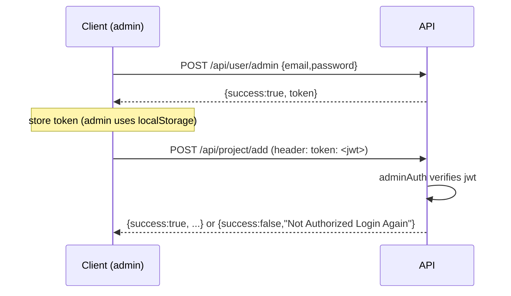
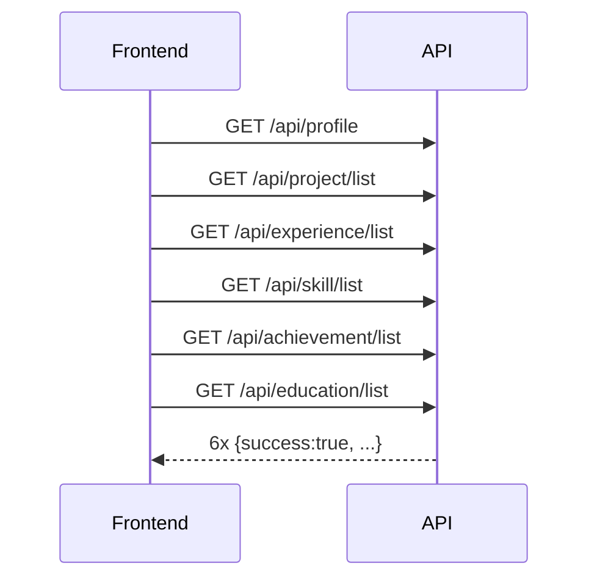
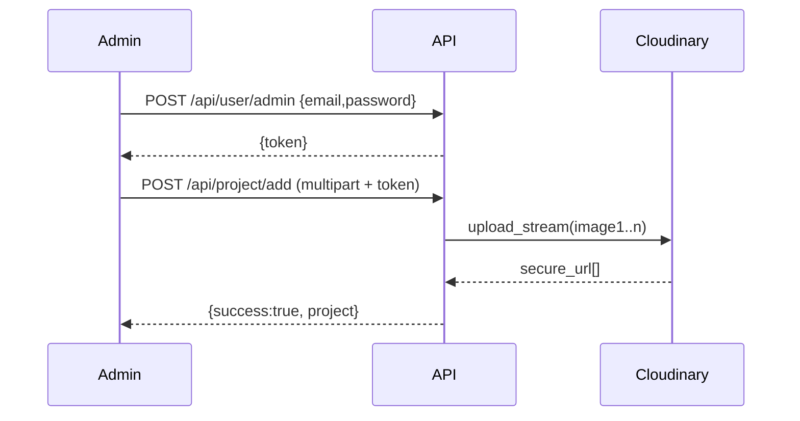
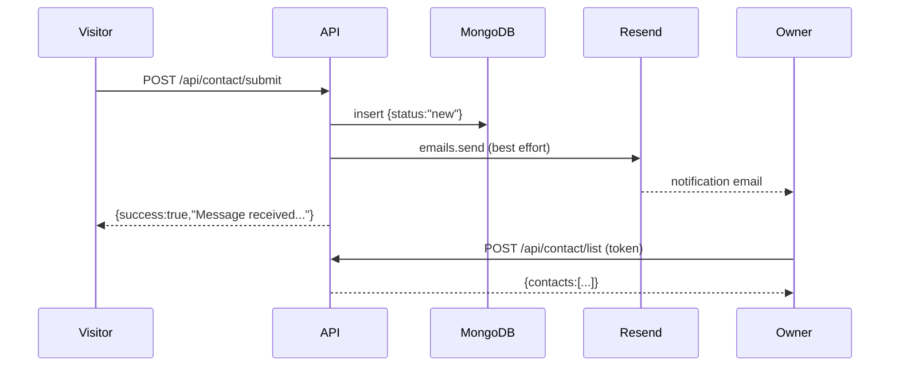

# 06 — API Reference

[← Database](./05-database.md) · [Docs index](./README.md) · Next: [Frontend →](./07-frontend.md)

---

Complete reference for the REST API exposed by `backend/`. Every endpoint, its auth requirement, request shape, response shape, validation rules, and examples are documented here.

## Table of contents

- [Conventions](#conventions)
- [Authentication](#authentication)
- [Error model](#error-model)
- [Validation rules summary](#validation-rules-summary)
- [Rate limits](#rate-limits)
- [Endpoints](#endpoints)
  - [Health](#health) · [Auth](#auth) · [Profile](#profile) · [Projects](#projects) · [Experience](#experience) · [Skills](#skills) · [Achievements](#achievements) · [Education](#education) · [Contact](#contact) · [Media](#media)
- [End-to-end flow examples](#end-to-end-flow-examples)

---

## Conventions

- **Base URL:** the value of `VITE_BACKEND_URL` (e.g. `http://localhost:4000` in dev). All paths below are relative to it.
- **Content types:**
  - JSON endpoints expect `Content-Type: application/json` (parsed up to **5 MB**).
  - Upload endpoints expect `multipart/form-data`.
- **HTTP method quirk:** list/read endpoints that require admin auth use **`POST`** (e.g. `POST /api/contact/list`) even though they read data — a Forever convention so the token can travel in headers consistently. Public reads use `GET`.
- **HTTP status:** responses are almost always **`200 OK`**; success/failure is in the JSON body. See [Error model](#error-model).
- <a id="response-envelope"></a>**Response envelope:** `{ "success": true, ... }` or `{ "success": false, "message": "..." }`. (Linked elsewhere as the *response envelope*.)

---

## Authentication



- **Header name:** `token` (lowercase). **Not** `Authorization: Bearer`.
- **Token value:** a JWT produced by `jwt.sign(ADMIN_EMAIL + ADMIN_PASSWORD, JWT_SECRET)`. The payload is a string, not an object, and there is **no expiry** claim.
- **Which routes need it:** every mutating route plus the admin read routes for `contact` and `media`. Public reads and the login + contact‑submit routes do not.
- **Failure response:** `{ "success": false, "message": "Not Authorized Login Again" }` (HTTP 200) when the header is missing or the token is invalid/mismatched.

Deeper security analysis: [Security §9.2–9.3](./09-security.md#92-authentication).

---

## Error model

| Situation | HTTP | Body |
|-----------|------|------|
| Success | 200 | `{ "success": true, ... }` |
| Validation / business error | 200 | `{ "success": false, "message": "<reason>" }` |
| Auth failure | 200 | `{ "success": false, "message": "Not Authorized Login Again" }` |
| Thrown exception (DB/Cloudinary/etc.) | 200 | `{ "success": false, "message": "<error.message>" }` |
| Unmatched route | 404 | Express default HTML |

There are **no conventional 4xx/5xx codes for business errors**. Clients must inspect `success`. This is a deliberate trade‑off ([System Design §3.6](./03-system-design.md#36-trade-offs--technical-decisions)).

### Common `message` values

| Message | Source |
|---------|--------|
| `"Invalid credentials"` | login mismatch |
| `"Not Authorized Login Again"` | missing/invalid token |
| `"name, email and message are required"` | contact missing fields |
| `"Please enter a valid email"` | contact bad email |
| `"category and name are required"` | skill add |
| `"degree and institution are required"` | education add |
| `"title is required"` | achievement add |
| `"id is required"` | update/status without id |
| `"Please provide a valid GitHub URL (http/https)."` | project URL validation |
| `"Please provide a valid Demo URL (http/https)."` | project URL validation |
| `"file is required"` | media upload without file |

---

## Validation rules summary

| Resource | Field | Rule |
|----------|-------|------|
| Contact | name, email, message | required |
| Contact | email | must pass `validator.isEmail` |
| Contact | name/email/subject | truncated to 200 chars |
| Contact | message | truncated to 4000 chars |
| Contact | status | coerced to `new`/`read` |
| Project | github/demo | must be empty or normalize to `http(s)://...`; other protocols rejected |
| Project | technologies/highlights | accepts JSON array string, real array, or comma/newline text |
| Project | featured | `"true"`/`true` → true, else false |
| Project | order | coerced to Number (`0` fallback) |
| Skill | category, name | required; `proficiency` defaults 80, clamped 0–100 by schema |
| Achievement | title | required; `icon` ∈ {trophy,award,medal} else `trophy` |
| Education | degree, institution | required; `status` coerced to `Completed`/`Pursuing` |
| Profile | (all) | upserted as‑is; `_id` forced to `"profile"`; schema validators run |

---

## Rate limits

**None.** There is no rate limiting middleware. The public `POST /api/contact/submit` is therefore floodable. Recommended mitigations (rate limiting, captcha, edge protection) are in [Security §9.6](./09-security.md#96-known-risks--recommendations). Document this clearly to any integrator: there is no throttling contract.

---

## Endpoints

### Health

#### `GET /`
- **Auth:** none.
- **Response:** plain text `API Working` (not JSON).
- **Use:** liveness check.

```bash
curl http://localhost:4000/
# API Working
```

---

### Auth

#### `POST /api/user/admin`
- **Auth:** none (this *is* the login).
- **Body:** `{ "email": string, "password": string }`
- **Success:** `{ "success": true, "token": "<jwt>" }`
- **Failure:** `{ "success": false, "message": "Invalid credentials" }`

```bash
curl -X POST http://localhost:4000/api/user/admin \
  -H "Content-Type: application/json" \
  -d '{"email":"admin@mainak.dev","password":"change_me_strong"}'
```

---

### Profile

#### `GET /api/profile`
- **Auth:** none.
- **Response:** `{ "success": true, "profile": { ...singleton } }`. Auto‑creates the doc if missing.

#### `POST /api/profile/update`
- **Auth:** admin (`token` header).
- **Body:** a full profile object (any subset of fields; `_id` is forced to `"profile"`).
- **Response:** `{ "success": true, "message": "Profile Updated", "profile": { ... } }`

```bash
curl -X POST http://localhost:4000/api/profile/update \
  -H "Content-Type: application/json" -H "token: <jwt>" \
  -d '{"name":"Mainak","title":"Dasgupta","links":{"github":"https://github.com/x"}}'
```

---

### Projects

| Method | Path | Auth | Body / form |
|--------|------|------|-------------|
| `GET` | `/api/project/list` | none | — |
| `POST` | `/api/project/add` | admin | multipart |
| `POST` | `/api/project/update` | admin | multipart + `id` |
| `POST` | `/api/project/remove` | admin | `{ "id": string }` |

**Multipart fields (add/update):** `name`, `description`, `technologies` (JSON array string), `highlights` (JSON array string), `github`, `demo`, `featured`, `order`, and optional files `image1`, `image2`, `image3`, `image4`.

- `GET /list` → `{ success, projects: [...] }` sorted by `{order:1, date:-1}`.
- `add` → `{ success, message:"Project Added", project }`.
- `update` → patches only provided fields; replaces `image[]` only if new files are sent.
- `remove` → `{ success, message:"Project Removed" }`.

```bash
curl -X POST http://localhost:4000/api/project/add \
  -H "token: <jwt>" \
  -F 'name=FOREVER' \
  -F 'description=MERN e-commerce' \
  -F 'technologies=["React","Node.js","MongoDB"]' \
  -F 'highlights=["JWT auth","Stripe checkout"]' \
  -F 'github=github.com/x/forever' \
  -F 'demo=https://forever.example.com' \
  -F 'featured=true' -F 'order=0' \
  -F 'image1=@./cover.png'
```

> URL fields are normalized server‑side: `github.com/x/forever` is stored as `https://github.com/x/forever`. Non‑http(s) values are rejected.

---

### Experience

| Method | Path | Auth | Body / form |
|--------|------|------|-------------|
| `GET` | `/api/experience/list` | none | — |
| `POST` | `/api/experience/add` | admin | multipart |
| `POST` | `/api/experience/update` | admin | multipart + `id` |
| `POST` | `/api/experience/remove` | admin | `{ "id" }` |

**Multipart fields:** `company`, `role`, `period`, `link`, `certificate`, `highlights` (JSON array string), `order`, and optional file `logo`.

- `GET /list` → `{ success, experience: [...] }` sorted by `{order:1, _id:-1}`.
- `add`/`update`/`remove` return `experience`/messages analogous to projects. `logo` replaced only if a new file is sent.

---

### Skills

| Method | Path | Auth | Body |
|--------|------|------|------|
| `GET` | `/api/skill/list` | none | — |
| `POST` | `/api/skill/add` | admin | `{ category, name, proficiency?, order? }` |
| `POST` | `/api/skill/update` | admin | `{ id, category?, name?, proficiency?, order? }` |
| `POST` | `/api/skill/remove` | admin | `{ id }` |

- `GET /list` → `{ success, skills: [...] }` sorted by `{category:1, order:1, _id:1}`.
- `proficiency` defaults to 80 and is clamped 0–100.

```bash
curl -X POST http://localhost:4000/api/skill/add \
  -H "Content-Type: application/json" -H "token: <jwt>" \
  -d '{"category":"ML & AI","name":"PyTorch","proficiency":85,"order":0}'
```

---

### Achievements

| Method | Path | Auth | Body |
|--------|------|------|------|
| `GET` | `/api/achievement/list` | none | — |
| `POST` | `/api/achievement/add` | admin | `{ title, description?, icon?, order? }` |
| `POST` | `/api/achievement/update` | admin | `{ id, title?, description?, icon?, order? }` |
| `POST` | `/api/achievement/remove` | admin | `{ id }` |

- `icon` ∈ `trophy` / `award` / `medal`; any other value becomes `trophy`.
- `GET /list` → `{ success, achievements: [...] }` sorted by `{order:1, _id:1}`.

---

### Education

| Method | Path | Auth | Body |
|--------|------|------|------|
| `GET` | `/api/education/list` | none | — |
| `POST` | `/api/education/add` | admin | `{ degree, field?, institution, year?, grade?, status?, order? }` |
| `POST` | `/api/education/update` | admin | `{ id, ... }` |
| `POST` | `/api/education/remove` | admin | `{ id }` |

- `status` coerced to `Completed`/`Pursuing`.
- `GET /list` → `{ success, education: [...] }` sorted by `{order:1, _id:1}`.

---

### Contact

| Method | Path | Auth | Body |
|--------|------|------|------|
| `POST` | `/api/contact/submit` | **public** | `{ name, email, subject?, message }` |
| `POST` | `/api/contact/list` | admin | — |
| `POST` | `/api/contact/remove` | admin | `{ id }` |
| `POST` | `/api/contact/status` | admin | `{ id, status: "new"\|"read" }` |

- **`submit`** validates required fields + email, truncates fields, saves `status:"new"`, then **best‑effort** emails the owner (failure doesn't affect the response). Returns `{ success:true, message:"Message received. Thank you!" }`.
- **`list`** → `{ success, contacts:[...] }` sorted `{date:-1}`.
- **`status`** → `{ success, contact }` with the new status.

```bash
curl -X POST http://localhost:4000/api/contact/submit \
  -H "Content-Type: application/json" \
  -d '{"name":"Jane","email":"jane@example.com","subject":"Hello","message":"Loved your work!"}'
```

---

### Media

| Method | Path | Auth | Body |
|--------|------|------|------|
| `POST` | `/api/media/upload` | admin | multipart, field `file` |
| `POST` | `/api/media/list` | admin | — |
| `POST` | `/api/media/remove` | admin | `{ id, publicId, type }` |

- **`upload`** auto‑detects `image`/`video`/`raw` from the file mimetype, streams to Cloudinary, records a `media` row. Returns `{ success, message:"Uploaded", url, publicId, type, media }`.
- **`list`** → `{ success, media:[...] }` sorted `{uploadedAt:-1}`.
- **`remove`** destroys the Cloudinary asset (best effort) and deletes the row. Returns `{ success, message:"Media Removed" }`.

```bash
curl -X POST http://localhost:4000/api/media/upload \
  -H "token: <jwt>" \
  -F 'file=@./hero.mp4'
```

---

## End-to-end flow examples

### A — Public site loads content



(These six run concurrently via `Promise.all` — see [Frontend §7.3](./07-frontend.md#73-state-management--portfoliocontext).)

### B — Admin adds a project with images



### C — Visitor message reaches the owner



---

## Quick reference (all endpoints)

| Method | Path | Auth |
|--------|------|------|
| GET | `/` | — |
| POST | `/api/user/admin` | — |
| GET | `/api/profile` | — |
| POST | `/api/profile/update` | admin |
| GET | `/api/project/list` | — |
| POST | `/api/project/add` | admin |
| POST | `/api/project/update` | admin |
| POST | `/api/project/remove` | admin |
| GET | `/api/experience/list` | — |
| POST | `/api/experience/add` | admin |
| POST | `/api/experience/update` | admin |
| POST | `/api/experience/remove` | admin |
| GET | `/api/skill/list` | — |
| POST | `/api/skill/add` | admin |
| POST | `/api/skill/update` | admin |
| POST | `/api/skill/remove` | admin |
| GET | `/api/achievement/list` | — |
| POST | `/api/achievement/add` | admin |
| POST | `/api/achievement/update` | admin |
| POST | `/api/achievement/remove` | admin |
| GET | `/api/education/list` | — |
| POST | `/api/education/add` | admin |
| POST | `/api/education/update` | admin |
| POST | `/api/education/remove` | admin |
| POST | `/api/contact/submit` | — |
| POST | `/api/contact/list` | admin |
| POST | `/api/contact/remove` | admin |
| POST | `/api/contact/status` | admin |
| POST | `/api/media/upload` | admin |
| POST | `/api/media/list` | admin |
| POST | `/api/media/remove` | admin |

---

Next: [07 — Frontend →](./07-frontend.md)
