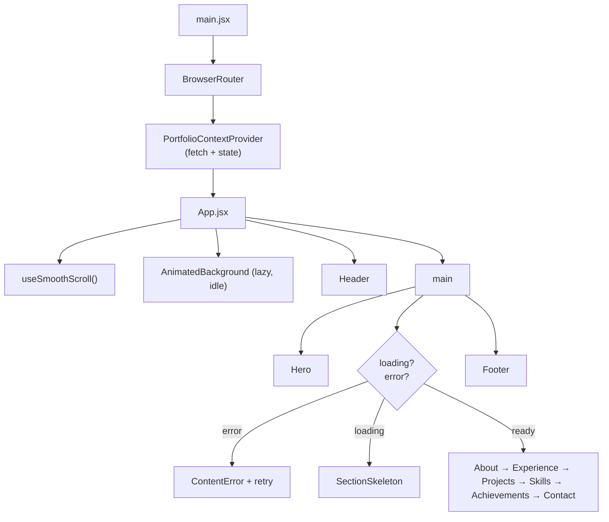
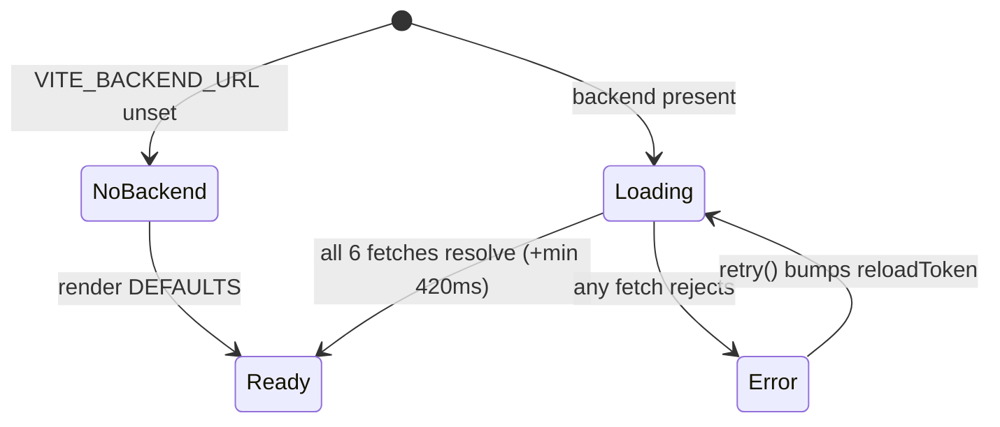
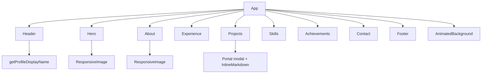
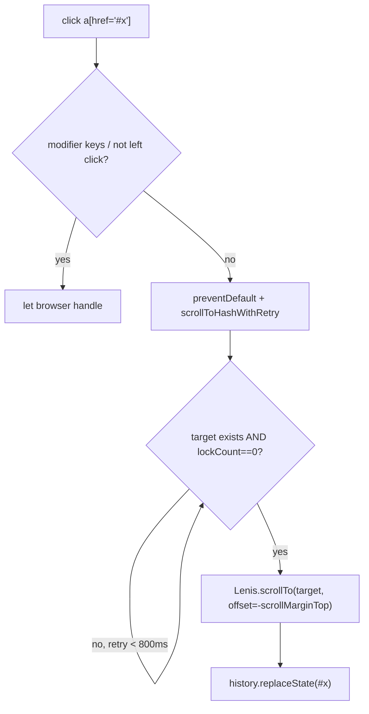
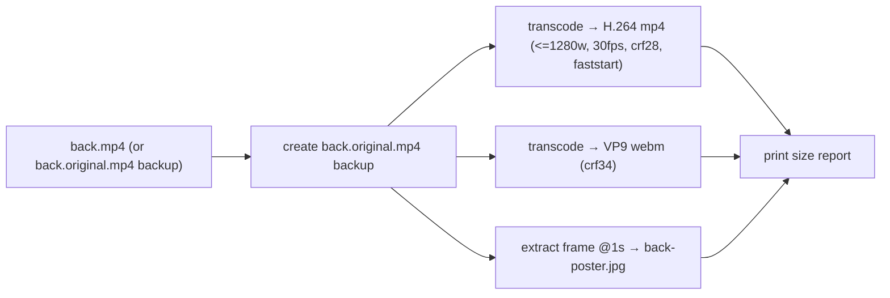
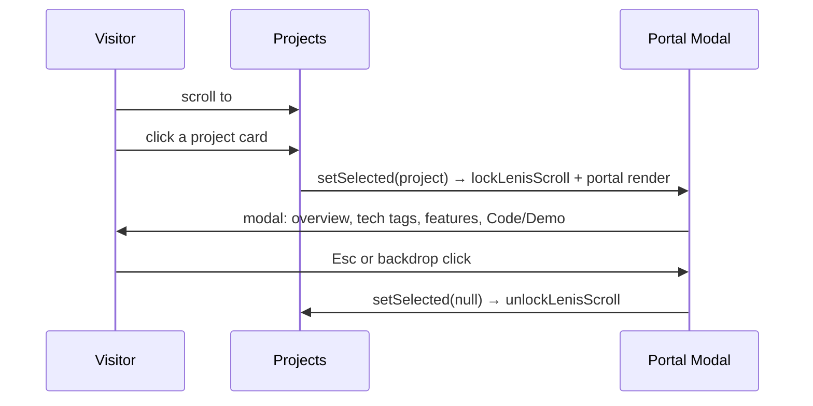
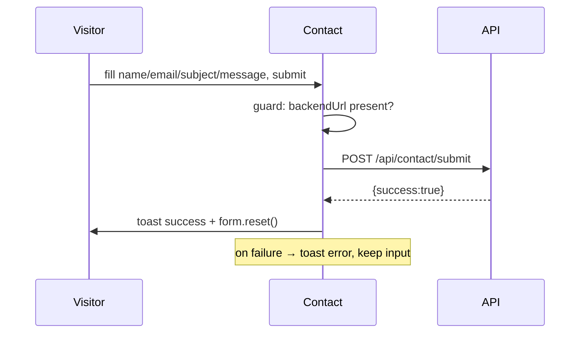

# 07 — Frontend (Public Site)

[← API Reference](./06-api-reference.md) · [Docs index](./README.md) · Next: [Admin Panel →](./08-admin-panel.md)

---

The public portfolio SPA (`frontend/`). This document covers its UI architecture, state management, routing, component hierarchy, styling system, user flows, and the cross‑cutting concerns (smooth scrolling, animations, performance).

## Table of contents

- [7.1 Frontend folder structure](#71-frontend-folder-structure)
- [7.2 UI architecture & boot sequence](#72-ui-architecture--boot-sequence)
- [7.3 State management — PortfolioContext](#73-state-management--portfoliocontext)
- [7.4 Routing structure](#74-routing-structure)
- [7.5 Component hierarchy](#75-component-hierarchy)
- [7.6 Smooth scrolling & scroll-spy](#76-smooth-scrolling--scroll-spy)
- [7.7 Styling system](#77-styling-system)
- [7.8 Utilities & helpers](#78-utilities--helpers)
- [7.9 Media optimization pipeline](#79-media-optimization-pipeline)
- [7.10 User flows](#710-user-flows)
- [7.11 Accessibility](#711-accessibility)
- [7.12 Dependencies & build](#712-dependencies--build)

---

## 7.1 Frontend folder structure

```
frontend/
├── index.html              # dark theme, LCP preloads (me.avif, poster)
├── vite.config.js          # port 5173, manualChunks code splitting
├── tailwind.config.js       # HSL token → Tailwind color mapping
├── postcss.config.js
├── vercel.json             # SPA rewrite (/(.*) → /)
├── .env.example            # VITE_BACKEND_URL
├── package.json
├── scripts/optimize-media.mjs  # ffmpeg transcode + poster
├── public/                 # back.mp4/.webm, back-poster.jpg, me.{png,avif,webp},
│                           # my-picture-informal-1.*, NIC.png, ONGC.png, favicon.svg, robots.txt
└── src/
    ├── main.jsx            # BrowserRouter + PortfolioContextProvider + App
    ├── App.jsx             # layout, lazy AnimatedBackground, loading/error gating
    ├── index.css           # Tailwind layers + design tokens + utilities/animations
    ├── assets/assets.js    # static public asset paths
    ├── context/
    │   └── PortfolioContext.jsx   # single fetch, defaults, skills grouping, loading/error
    ├── hooks/
    │   └── useSmoothScroll.js     # Lenis + scroll-lock + anchor interception
    ├── utils/
    │   ├── externalLink.js        # URL normalization
    │   ├── inlineMarkdown.jsx     # **bold**/*italic* renderer
    │   └── profileDisplay.js      # name+title composition
    └── components/
        ├── Header.jsx
        ├── Hero.jsx
        ├── About.jsx
        ├── Experience.jsx
        ├── Projects.jsx
        ├── Skills.jsx
        ├── Achievements.jsx
        ├── Contact.jsx
        ├── Footer.jsx
        ├── AnimatedBackground.jsx
        ├── ResponsiveImage.jsx
        ├── SectionSkeleton.jsx
        └── ContentError.jsx
```

> **Note:** the root `README.md` references `LazySection.jsx` / `useLazyMount.js`; those do **not** exist in the current code. The actual lazy strategy is `React.lazy` for `AnimatedBackground` plus default/skeleton gating in `App.jsx` (see [Maintenance → Documentation drift](./13-maintenance-guide.md#documentation-drift)).

---

## 7.2 UI architecture & boot sequence

The app is a **single‑page, single‑route** React 18 application. There is no client routing between "pages" — it is one long scrolling page with anchored sections.



### Boot sequence (what happens on first paint)

1. `main.jsx` mounts `BrowserRouter > PortfolioContextProvider > App`.
2. `App` calls `useSmoothScroll()` (starts Lenis) and reads `{loading, error, retry}` from context.
3. **Header + Hero render immediately** using context **defaults** (no data needed) → fast LCP.
4. Below the fold: if `loading`, render `<SectionsSkeleton/>` (layout‑matched placeholders); a top loader bar shows progress.
5. `PortfolioContext`'s effect fetches all six resources; on success it populates state and (after the min‑skeleton window) flips `loading` off.
6. Real sections cross‑fade in (`loader-content-reveal`).
7. `AnimatedBackground` mounts during `requestIdleCallback` so it never competes with the LCP image.

```22:55:frontend/src/App.jsx
const App = () => {
  useSmoothScroll()
  const { loading, error, retry } = useContext(PortfolioContext)

  const [bgReady, setBgReady] = useState(false)

  useEffect(() => {
    const w = window
    if (typeof w.requestIdleCallback === "function") {
      w.requestIdleCallback(() => setBgReady(true))
    } else {
      const t = setTimeout(() => setBgReady(true), 0)
      return () => clearTimeout(t)
    }
  }, [])

  const renderSections = () => {
    if (error) return <ContentError onRetry={retry} />
    if (loading) return <SectionsSkeleton />
    return (
      <div className="loader-content-reveal">
        <About />
        ...
```

---

## 7.3 State management — PortfolioContext

There is **one global state container**: `PortfolioContext`. It is not Redux/Zustand — just React Context plus `useState`/`useMemo`. It centralizes data fetching so each section can be a pure consumer.

### Responsibilities

1. **Hold defaults** (`DEFAULTS`) so the UI renders before/without data.
2. **Fetch all content once** in a mount effect (`Promise.all` of 6 endpoints).
3. **Deep‑merge** the fetched profile with defaults (so a missing nested key never crashes a section).
4. **Group skills by category** (`useMemo` → `skillsByCategory`).
5. **Expose loading/error + retry** with an anti‑flicker minimum skeleton time.

### Exposed context value

```185:198:frontend/src/context/PortfolioContext.jsx
  const value = {
    backendUrl,
    loading,
    isHydrated: !loading,
    error,
    retry,
    profile,
    projects,
    experience,
    skills,
    skillsByCategory,
    achievements,
    education,
  }
```

### State machine



### Key implementation details

- **`MIN_SKELETON_MS = 420`** — once a fetch starts, skeletons stay at least 420 ms so a fast/cached response doesn't flash.
- **`cancelled` flag** — prevents `setState` after unmount (avoids React warnings/leaks).
- **`reloadToken`** — incremented by `retry()` to re‑run the effect (the `<ContentError>` button calls this).
- **No‑backend path** — if `backendUrl` is empty, loading is `false` from the start and defaults render.

See the full hydration LLD in [System Design §3.5.6](./03-system-design.md#356-frontend-hydration-lld).

---

## 7.4 Routing structure

- The frontend uses `BrowserRouter` but renders a **single page**; "navigation" is **in‑page anchor scrolling** to section ids (`#home`, `#about`, `#experience`, `#projects`, `#skills`, `#achievements`, `#contact`).
- `vercel.json` rewrites every path to `/` so deep links / refreshes always serve the SPA shell:

```1:8:frontend/vercel.json
{
  "rewrites": [
    {
      "source": "/(.*)",
      "destination": "/"
    }
  ]
}
```

- Anchor clicks are intercepted by `useSmoothScroll` to animate to the target (honoring `scroll-margin-top`) instead of jumping.

---

## 7.5 Component hierarchy



### Component reference

| Component | Data consumed | What it renders | Notable behavior |
|-----------|---------------|-----------------|------------------|
| `Header` | `profile` | Sticky glass nav, brand, desktop pill nav, mobile drawer, CTA, scroll progress bar | Scroll‑spy via rAF + section metrics; active‑lock after nav click; scroll‑locks body when drawer open; Esc/backdrop close. |
| `Hero` | `profile.heroUi`, `profile.media` | Full‑screen video bg + poster, profile portrait with halo, badge, headline, CTAs, scroll hint | Pauses video off‑screen / tab hidden; `<ResponsiveImage fetchPriority=high>` for LCP. |
| `About` | `profile.bio`, `education` | Portrait + bio paragraphs + animated education timeline | Grade normalization, degree→icon mapping, status badge, IntersectionObserver reveal. |
| `Experience` | `experience`, `profile.sectionSubtitles` | Alternating timeline cards with logo, role, highlights, website/certificate links | Scroll‑progress rail; empty state. |
| `Projects` | `projects`, `profile.sectionSubtitles` | Card grid + click‑to‑open portal modal (overview, tech, features, links) | `normalizeExternalLink` on URLs; `InlineMarkdown` for description; scroll‑lock + Esc on modal. |
| `Skills` | `skillsByCategory`, `profile.sectionSubtitles` | Category tabs + animated proficiency bars | Active category state; bar scales 0→N% on view. |
| `Achievements` | `achievements`, `profile.sectionSubtitles` | 3‑up icon cards with floating particles | `iconMap`(trophy/award/medal); randomized particle field memoized. |
| `Contact` | `profile`, `backendUrl` | Form (posts to API) + contact info + social grid | Submits to `/api/contact/submit`; toasts; resets on success; renders `profile.links`. |
| `Footer` | `profile` | Brand, quick links, resume download | Resume button disabled if no `resumePdf`. |
| `AnimatedBackground` | — | Decorative gradient blobs | Pure CSS animation; reduced on small screens; memoized. |
| `ResponsiveImage` | props | `<picture>` with AVIF/WebP sources, or plain `` for remote URLs | Switches strategy based on whether `src` is remote. |
| `SectionSkeleton` | — | Layout‑matched placeholders for all sections | Shimmer + staggered reveal; `aria-busy`. |
| `ContentError` | `onRetry` | Error card with retry button | `role="alert"`. |

### Why this hierarchy

- **Flat section list under `App`** keeps the page model trivial — each section is independent and reads only what it needs from context.
- **`ResponsiveImage`** centralizes the local‑vs‑remote image logic so every image gets AVIF/WebP for bundled assets but plain `` for Cloudinary URLs (which Cloudinary can optimize itself).
- **Portal modal** in `Projects` renders into `document.body` so it escapes section stacking contexts and overlays the whole viewport.

---

## 7.6 Smooth scrolling & scroll-spy

`hooks/useSmoothScroll.js` is the most intricate piece of frontend infrastructure.

### What it provides

1. **Lenis smooth scrolling** — inertial wheel/touch scrolling via a `requestAnimationFrame` loop, unless the user prefers reduced motion (then native scroll is used).
2. **A shared scroll‑lock API** — `lockLenisScroll()` / `unlockLenisScroll()` use a module‑level counter so the mobile menu and project modal can both lock scrolling and compose correctly (nested locks).
3. **Anchor interception** — clicks on `a[href^="#"]` are caught and animated to the target, honoring each section's `scroll-margin-top` (so the sticky header never covers the heading). A retry loop waits for any active lock to release and for the target to exist.



### Lenis configuration (tuning knobs)

| Constant | Value | Effect |
|----------|-------|--------|
| `LENIS_LERP` | `0.14` | Scroll smoothing factor (lower = smoother/slower). |
| `LENIS_WHEEL_MULTIPLIER` | `1` | Wheel sensitivity. |
| `LENIS_TOUCH_MULTIPLIER` | `1.05` | Touch sensitivity. |
| `LENIS_SCROLL_DURATION` | `0.95` | Anchor‑scroll animation duration (s). |
| `ANCHOR_LOOKUP_TIMEOUT_MS` | `800` | Max wait for a target/lock before giving up. |

### Header scroll‑spy

`Header.jsx` runs its own rAF‑throttled handler that:
- caches section top offsets (`syncSectionMetrics`),
- computes the active section by comparing each section's top to a probe line (`scrollY + headerOffset + 1`),
- pins the active item for `NAV_ACTIVE_LOCK_MS` (1150 ms) after a nav click so the animated pill (`layoutId="navActivePill"`) doesn't jump mid‑scroll,
- toggles the glass background after 28 px of scroll,
- re‑observes sections via `MutationObserver`/`ResizeObserver` so it works even though sections mount lazily.

---

## 7.7 Styling system

### Tailwind + HSL design tokens

`src/index.css` defines CSS custom properties (HSL triples) for light (`:root`) and dark (`.dark`) themes; `tailwind.config.js` maps them to Tailwind color utilities (`bg-background`, `text-muted-foreground`, `border-border`, etc.). The site ships in **dark mode** (`<html class="dark">`).

```22:55:frontend/tailwind.config.js
      colors: {
        border: "hsl(var(--border))",
        input: "hsl(var(--input))",
        ring: "hsl(var(--ring))",
        background: "hsl(var(--background))",
        foreground: "hsl(var(--foreground))",
        primary: { DEFAULT: "hsl(var(--primary))", foreground: "hsl(var(--primary-foreground))" },
        ...
```

This token approach gives shadcn‑like semantic colors **without** shadcn/Radix — a deliberate dependency‑minimization choice.

### Custom utilities & animations (`@layer utilities`)

| Utility / keyframe | Purpose |
|--------------------|---------|
| `.glass-card`, `.surface-card`, `.modal-card` | Frosted/blurred card surfaces (backdrop blur disabled on mobile for perf). |
| `.hover-glow`, `.glow-button`, `.glow-button-strong` | Glow effects on CTAs (pulsing radial gradient). |
| `.cursive-brand` | Brush‑script brand font. |
| `.profile-halo`, `.animate-spin-slow` | Rotating/pulsing halo around the hero portrait. |
| `.animate-gradient-shift`, `.animate-float-slow(-reverse)`, `.animate-float-particle` | Background motion. |
| `.blink-dot` | Pulsing badge dot. |
| `.loading-shimmer`, `.skeleton-in`, `.shimmer-delay-*`, `.skeleton-delay-*` | Skeleton shimmer + staggered entrance. |
| `.loader-topbar`, `.loader-content-reveal` | Top progress bar + content cross‑fade. |
| `.modal-overlay`, `.modal-card` | Project modal styling (replaces a Radix dialog). |
| `@media (prefers-reduced-motion)` | Kills all the above animations for users who opt out. |

### Layout/typography base rules

- `html, body { overflow-x: hidden; max-width: 100vw }` prevents horizontal scroll.
- `section[id] { scroll-margin-top: 5.5rem; contain: paint }` reserves space under the sticky header and isolates paint.
- Lenis hooks (`html.lenis`, `.lenis.lenis-stopped { overflow: clip }`, `[data-lenis-prevent]`) integrate the smooth‑scroll library with scroll locking.

---

## 7.8 Utilities & helpers

### `utils/externalLink.js`
`normalizeExternalLink(value)` and `isValidExternalLink(value)` — the same URL normalization/allow‑list used server‑side, applied to `project.github`/`project.demo` before rendering links. Protocol allow‑list (`http`/`https`) prevents `javascript:`‑style injection. (See [System Design §3.5.2](./03-system-design.md#352-url-normalization-lld-shared-logic-duplicated).)

### `utils/inlineMarkdown.jsx`
`<InlineMarkdown text={...}/>` renders a minimal subset of Markdown — `**bold**` → `<strong>`, `*italic*` → `<em>` — by splitting on a token regex. Used for project descriptions so the owner can emphasize text without a full Markdown engine (and without raw HTML injection risk).

### `utils/profileDisplay.js`
`getProfileDisplayName(profile, fallback)` composes a display name from `name` + `title`, avoiding duplication if the title is already part of the name, with a sensible fallback. Used by `Header`, `Hero`, `About`, `Footer` for consistent name rendering.

### `assets/assets.js`
A single map of `/public` asset paths (hero video/poster, profile images in png/avif/webp, favicon). Components prefer the profile's media URLs and fall back to these bundled assets.

---

## 7.9 Media optimization pipeline

`scripts/optimize-media.mjs` (run via `npm run optimize:media`) uses `ffmpeg-static` to prepare the heavy hero video:



- Produces a smaller **MP4** + a **WebM** (the `Hero` `<video>` lists both `<source>`s) and a **poster** JPG.
- The first run backs up the original to `back.original.mp4` and reuses it as the source on later runs (so quality doesn't degrade with repeated transcodes).
- This directly improves **LCP** and bandwidth for the most expensive asset on the page. See [System Design → Performance](./03-system-design.md#37-performance-considerations).

---

## 7.10 User flows

### Browse → open a project



### Submit the contact form



---

## 7.11 Accessibility

- **Reduced motion:** `useReducedMotion()` + `prefers-reduced-motion` CSS disable animations/auto‑scroll; `MotionConfig reducedMotion="user"`.
- **Semantics & ARIA:** `aria-current` on active nav, `aria-expanded`/`aria-label` on the menu toggle, `role="dialog"`/`aria-modal` on the project modal, `role="alert"` on the error state, `aria-busy`/`sr-only` text on skeletons, `aria-hidden` on decorative elements.
- **Focus management:** visible focus rings (`focus-visible:ring-*`) on interactive elements.
- **Keyboard:** Esc closes the mobile drawer and project modal; anchor links remain real `<a>` elements.
- **Media:** video is `muted`, `aria-hidden`, with a poster; images carry `alt` text derived from the display name/labels.

---

## 7.12 Dependencies & build

### Dependencies (`frontend/package.json`)

| Package | Purpose |
|---------|---------|
| `react`, `react-dom` (18) | UI runtime |
| `react-router-dom` (6) | `BrowserRouter` (single page) |
| `axios` | HTTP client for the API |
| `framer-motion` | Section/entrance/hover animations (`LazyMotion`+`domMax`) |
| `lenis` | Smooth scrolling |
| `lucide-react` | Icon set |
| `react-toastify` | Toast notifications |

### Dev dependencies (highlights)

`vite`, `@vitejs/plugin-react`, `tailwindcss`, `postcss`, `autoprefixer`, `eslint` (+ React plugins), `cross-env`, `ffmpeg-static`.

### Build & scripts

| Script | Command | Purpose |
|--------|---------|---------|
| `dev` | `vite` | Dev server on `:5173` (HMR). |
| `build` | `vite build` | Production bundle → `dist/`. |
| `preview` | `vite preview` | Serve the built bundle locally. |
| `lint` | ESLint (flat config disabled) | Lint `.js/.jsx`, zero‑warning policy. |
| `optimize:media` | run `optimize-media.mjs` | Transcode hero media. |

### Vite code splitting

```11:20:frontend/vite.config.js
    rollupOptions: {
      output: {
        manualChunks: {
          react: ["react", "react-dom", "react-router-dom"],
          motion: ["framer-motion"],
          icons: ["lucide-react"],
          notifications: ["react-toastify"],
        },
      },
    },
```

This keeps the main bundle small and lets the browser cache vendor chunks independently.

---

Next: [08 — Admin Panel →](./08-admin-panel.md)
