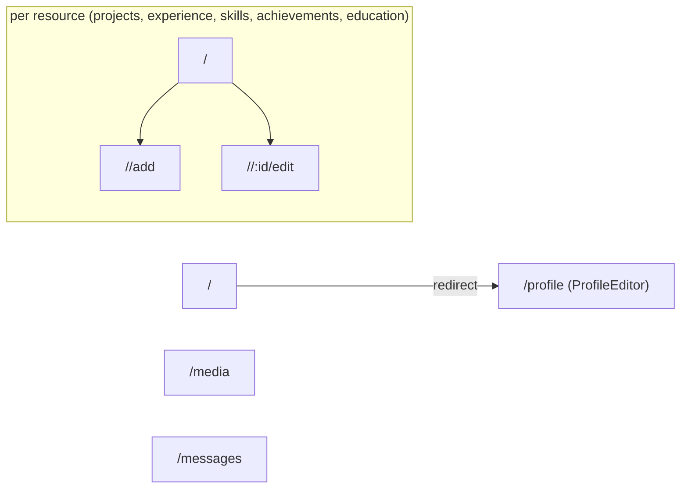
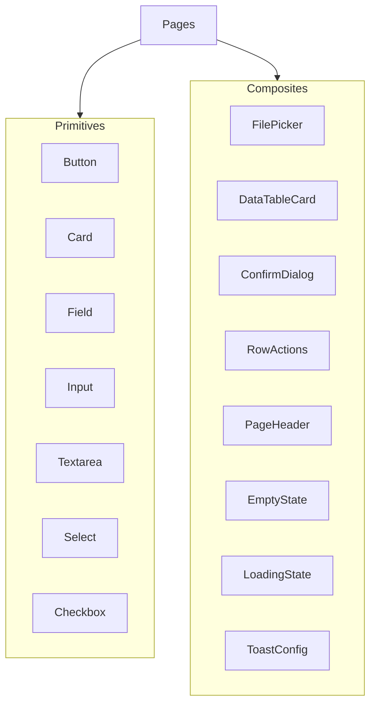
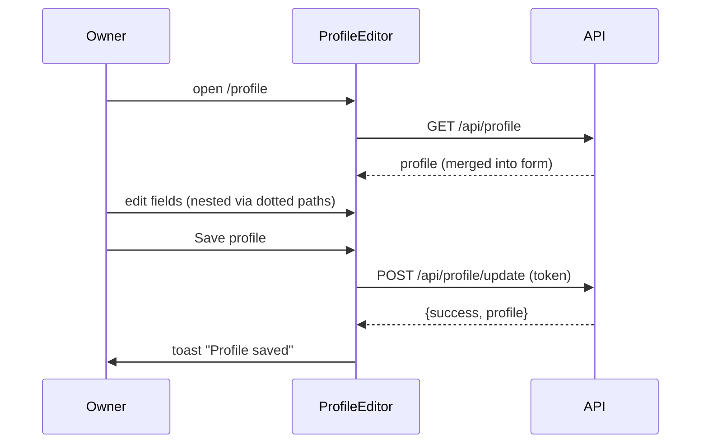
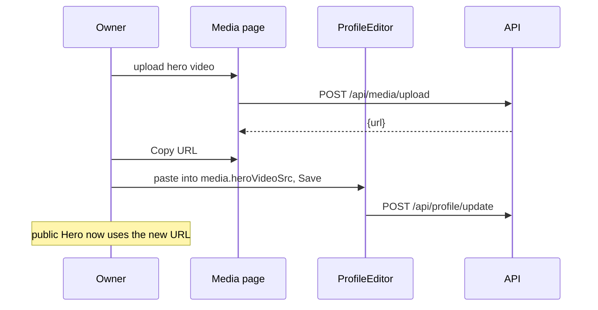
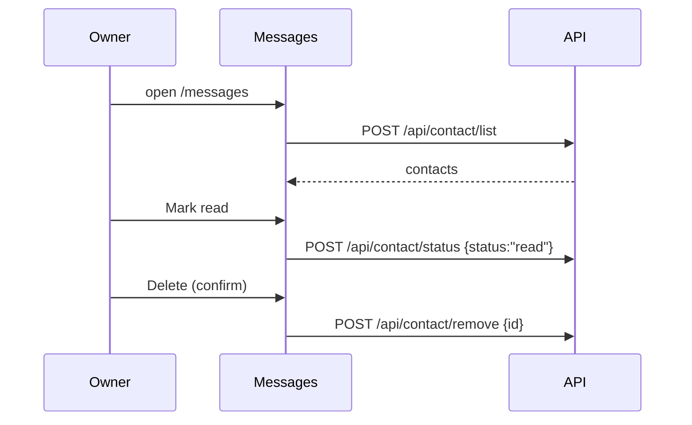

# 08 — Admin Panel (CMS)

[← Frontend](./07-frontend.md) · [Docs index](./README.md) · Next: [Security →](./09-security.md)

---

The private content‑management SPA (`admin/`). This document covers its architecture, authentication gate, routing, the reusable `ui/` design system, every page, and the content workflows.

## Table of contents

- [8.1 Admin folder structure](#81-admin-folder-structure)
- [8.2 App shell & authentication gate](#82-app-shell--authentication-gate)
- [8.3 Routing structure](#83-routing-structure)
- [8.4 The ui/ design system](#84-the-ui-design-system)
- [8.5 Pages — page-by-page guide](#85-pages--page-by-page-guide)
- [8.6 Content workflows](#86-content-workflows)
- [8.7 Styling system](#87-styling-system)
- [8.8 Dependencies & build](#88-dependencies--build)

---

## 8.1 Admin folder structure

```
admin/
├── index.html              # <title>... Admin Panel</title>
├── vite.config.js          # port 5174
├── tailwind.config.js       # light "UI" token palette
├── postcss.config.js
├── vercel.json             # SPA rewrite
├── .env.example            # VITE_BACKEND_URL
├── package.json
└── src/
    ├── main.jsx            # BrowserRouter + App
    ├── App.jsx             # token gate, route table, title, sidebar state
    ├── index.css           # Outfit font, UI tokens, .active, skip-link
    ├── assets/
    │   ├── assets.js       # svg icon map
    │   └── *.svg
    ├── components/
    │   ├── Login.jsx       # POST /api/user/admin
    │   ├── Navbar.jsx      # logo + Logout (confirm dialog)
    │   ├── Sidebar.jsx     # nav links (content + utilities)
    │   └── ui/             # design-system primitives (15 files)
    └── pages/
        ├── ProfileEditor.jsx
        ├── AddProject.jsx      ListProjects.jsx
        ├── AddExperience.jsx   ListExperience.jsx
        ├── AddSkill.jsx        ListSkills.jsx
        ├── AddAchievement.jsx  ListAchievements.jsx
        ├── AddEducation.jsx    ListEducation.jsx
        ├── Media.jsx
        └── Messages.jsx
```

---

## 8.2 App shell & authentication gate

`App.jsx` is the heart of the admin. It gates the entire UI behind a token and provides the chrome (header/sidebar) once authenticated.

```25:62:admin/src/App.jsx
const App = () => {
  const location = useLocation()
  const [token, setToken] = useState(localStorage.getItem("token") || "")
  const [sidebarOpen, setSidebarOpen] = useState(false)

  useEffect(() => {
    if (token) localStorage.setItem("token", token)
    else localStorage.removeItem("token")
  }, [token])
  ...
  if (!token) {
    return (
      <div className="min-h-screen bg-canvas">
        <ToastConfig />
        <Login setToken={setToken} />
      </div>
    )
  }
```

### Behavior

```mermaid
flowchart TD
    Start["App mounts"] --> Read["token = localStorage.getItem('token')"]
    Read --> Gate{token truthy?}
    Gate -->|no| Login["render <Login/>"]
    Login -->|"POST /api/user/admin OK"| Set["setToken(jwt)"]
    Set --> Persist["effect: localStorage.setItem('token')"]
    Persist --> Shell
    Gate -->|yes| Shell["render Navbar + Sidebar + Routes"]
    Shell -->|Logout (confirm)| Clear["setToken('') → remove from localStorage"]
    Clear --> Login
```

- **Token source of truth:** `useState` initialized from `localStorage`; an effect mirrors changes back to `localStorage` (persist on login, remove on logout).
- **Token is passed as a prop** (`token`) to every page, which forwards it as the `token` header on writes.
- **Dynamic document title:** an effect sets `document.title` to `"<Section> - Portfolio Admin"` based on the route.
- **Sidebar state** closes on navigation and is toggled by the navbar menu button (mobile).
- **Logout** is guarded by a `ConfirmDialog` in `Navbar`.

### Login (`components/Login.jsx`)
Posts `{email,password}` to `/api/user/admin`; on `success` calls `setToken(token)`. Uses the `ui/` `Card`, `Field`, `Input`, `Button` primitives and toasts on failure.

---

## 8.3 Routing structure

`App.jsx` defines a route table inside a `<Suspense>` (all pages are `React.lazy`). Each resource has a **list** route, an **add** route, and an **edit** route (`/:id/edit`) — the latter two render the *same* `Add*` component.



| Route | Component | Purpose |
|-------|-----------|---------|
| `/` | redirect → `/profile` | default landing |
| `/profile` | `ProfileEditor` | edit the singleton |
| `/projects`, `/projects/add`, `/projects/:id/edit` | `ListProjects` / `AddProject` | CRUD projects |
| `/experience`, `/experience/add`, `/experience/:id/edit` | `ListExperience` / `AddExperience` | CRUD experience |
| `/skills`, `/skills/add`, `/skills/:id/edit` | `ListSkills` / `AddSkill` | CRUD skills |
| `/achievements`, `/achievements/add`, `/achievements/:id/edit` | `ListAchievements` / `AddAchievement` | CRUD achievements |
| `/education`, `/education/add`, `/education/:id/edit` | `ListEducation` / `AddEducation` | CRUD education |
| `/media` | `Media` | upload/browse/delete assets |
| `/messages` | `Messages` | read/triage contact messages |

`Sidebar.jsx` groups links into **Content** (profile, projects, experience, skills, achievements, education) and **Inbox & assets** (media library, messages), styling the active link via the `.active` class.

---

## 8.4 The ui/ design system

`components/ui/` is a small, dependency‑free **component library** that gives every page a consistent, accessible look. Pages compose these instead of writing raw markup.



| Component | Role | Notes |
|-----------|------|-------|
| `Button` | Variant/size button | Variants: `primary`, `secondary`, `ghost`, `danger`, `danger-soft`; sizes `sm/md/lg`; `forwardRef`. |
| `Card` | Surface container | Consistent border/shadow. |
| `Field` | Label + control wrapper | Handles `label`, `htmlFor`, `required`. |
| `Input` / `Textarea` / `Select` / `Checkbox` | Form controls | Themed, focus rings. |
| `FilePicker` | Image picker with preview | Creates/revokes object URLs; shows `currentUrl` or fallback. |
| `DataTableCard` | Responsive table/grid wrapper | Header row + `gridClass` template. |
| `ConfirmDialog` | Confirmation modal | Used for all destructive actions + logout. |
| `RowActions` | Edit/delete row controls | `editTo` link + `onDelete` + `busy`. |
| `PageHeader` | Title + description + actions slot | Top of each page. |
| `EmptyState` | "No data yet" placeholder | Friendly empty UI. |
| `LoadingState` | Spinner/label | Suspense + per‑page loading. |
| `ToastConfig` | `react-toastify` container config | Mounted once. |

Example — `Button` variant map:

```5:17:admin/src/components/ui/Button.jsx
const variantClasses = {
  primary: "bg-brand text-brand-foreground border-transparent hover:bg-brand/90",
  secondary: "bg-surface text-text-main border-border hover:bg-surface-soft",
  ghost: "bg-transparent text-text-muted border-transparent hover:bg-surface-soft hover:text-text-main",
  danger: "bg-danger text-danger-foreground border-transparent hover:bg-danger/90",
  "danger-soft": "bg-transparent text-danger border-danger/35 hover:bg-danger-soft",
}

const sizeClasses = {
  sm: "h-8 px-3 text-xs",
  md: "h-9 px-3.5 text-sm",
  lg: "h-10 px-4 text-sm",
}
```

---

## 8.5 Pages — page-by-page guide

All pages share a consistent lifecycle and patterns:

- **List pages**: `useEffect` → `axios.get('/api/<r>/list')` on mount; render `LoadingState`/`EmptyState`/`DataTableCard`; delete via a `ConfirmDialog` → `axios.post('/api/<r>/remove', {id}, {headers:{token}})` → refetch.
- **Add/Edit pages**: read `useParams().id` → if present, fetch the item (from the list) and prefill; submit builds JSON or `FormData` and posts to `/add` or `/update`; navigate back on success.

### ProfileEditor (`/profile`)

The single most complex form. It loads `GET /api/profile`, merges with an `empty` template (so every nested key exists), and renders **sections** (Personal, Hero UI, Media, Social links, Section subtitles, Coursework). Helpers:

- `updatePath(source, "heroUi.badge", value)` — immutably sets a nested field by dotted path.
- `get(path)` / `set(path, value)` / `bind(path, type, placeholder, label, required)` — produce controlled‑input props for arbitrary nested fields.
- **Coursework** is edited as newline‑separated text and split into an array on submit.

```143:159:admin/src/pages/ProfileEditor.jsx
  const onSubmit = async (e) => {
    e.preventDefault()
    setSaving(true)
    try {
      const payload = {
        ...profile,
        coursework: courseworkText.split(/\r?\n/).map((line) => line.trim()).filter(Boolean),
      }
      const res = await axios.post(backendUrl + "/api/profile/update", payload, { headers: { token } })
      if (res.data.success) toast.success(res.data.message || "Profile saved")
      else toast.error(res.data.message)
```

A "Reset from server" button re‑loads the saved profile (discarding local edits).

### Projects (`AddProject` / `ListProjects`)

- **AddProject** (also edit via `/:id/edit`): manages `form` + four image slots (`image1..4`). On edit it prefills from the list and shows `existingImages`. URLs are normalized on blur and re‑validated on submit (same regex as the server). Submits as `FormData` (since files may be attached) to `/add` or `/update`.

```142:158:admin/src/pages/AddProject.jsx
      const fd = new FormData()
      if (isEditMode) fd.append("id", id)
      fd.append("name", form.name)
      fd.append("description", form.description)
      fd.append("technologies", JSON.stringify(form.technologies.split(",").map((s) => s.trim()).filter(Boolean)))
      fd.append("highlights", JSON.stringify(form.highlights.split(/\r?\n/).map((s) => s.trim()).filter(Boolean)))
      fd.append("github", normalizedGithub)
      fd.append("demo", normalizedDemo)
      fd.append("featured", form.featured)
      fd.append("order", form.order)
      if (images.image1) fd.append("image1", images.image1)
```

- **ListProjects**: a `DataTableCard` with columns Project / Technologies / Featured / Actions; thumbnail from `project.image[0]`; `RowActions` for edit/delete; `ConfirmDialog` before deletion.

### Experience / Skills / Achievements / Education

These follow the same Add/List pattern as Projects, with resource‑specific fields:

| Resource | Add form fields | List columns |
|----------|-----------------|--------------|
| Experience | company, role, period, link, certificate, highlights, order, **logo** file | company/role, period, actions |
| Skills | category, name, proficiency, order | name, category, proficiency, actions |
| Achievements | title, description, icon (trophy/award/medal), order | title, icon, actions |
| Education | degree, field, institution, year, grade, status, order | degree/institution, status, actions |

(Skills/achievements/education are pure JSON posts; experience uses `FormData` for the logo.)

### Media (`/media`)

- Upload form: pick a file → `FormData` → `POST /api/media/upload` (token). Shows an image preview via an object URL (revoked on unmount).
- Library grid: each `media` item renders by type — `` (image), `<video controls>` (video), or a "Raw file" placeholder — with the URL, original name + size, **Copy URL** (clipboard), and **Delete** (`ConfirmDialog` → `/api/media/remove`).

### Messages (`/messages`)

- Loads via `POST /api/contact/list` (token). Renders each message as a `Card` with name/email/subject/message and date.
- Actions: **Mark read / Mark new** (`POST /api/contact/status`) and **Delete** (`ConfirmDialog` → `/api/contact/remove`). Status badge reflects `new`/`read`.

---

## 8.6 Content workflows

### Edit profile / hero / links



### Add media then reference it



### Triage a message



---

## 8.7 Styling system

The admin uses a **separate, lighter design language** than the public site — a clean light "dashboard" look using the **Outfit** font.

- `index.css` defines `--ui-*` HSL tokens (canvas, surface, surface‑soft, text, text‑muted, border, brand, danger, focus).
- `tailwind.config.js` maps them to utilities (`bg-canvas`, `text-text-main`, `bg-surface`, `border-border`, `text-brand`, `bg-danger`, …) plus `shadow-panel`/`shadow-focus`.
- Global base rules theme all `input/select/textarea`, define focus rings, a `.skip-link` for accessibility, and an `.active` class for the sidebar.
- A global `prefers-reduced-motion` block neutralizes animations/transitions.

```9:26:admin/tailwind.config.js
      colors: {
        border: "hsl(var(--ui-border))",
        canvas: "hsl(var(--ui-canvas))",
        surface: "hsl(var(--ui-surface))",
        "surface-soft": "hsl(var(--ui-surface-soft))",
        "text-main": "hsl(var(--ui-text))",
        "text-muted": "hsl(var(--ui-text-muted))",
        brand: { DEFAULT: "hsl(var(--ui-brand))", foreground: "hsl(var(--ui-brand-foreground))", soft: "hsl(var(--ui-brand-soft))" },
        danger: { DEFAULT: "hsl(var(--ui-danger))", foreground: "hsl(var(--ui-danger-foreground))", soft: "hsl(var(--ui-danger-soft))" },
      },
```

---

## 8.8 Dependencies & build

### Dependencies (`admin/package.json`)

| Package | Purpose |
|---------|---------|
| `react`, `react-dom` (18) | UI runtime |
| `react-router-dom` (6) | Multi‑route navigation |
| `axios` | API calls (with `token` header) |
| `react-toastify` | Toasts |

The admin is deliberately **leaner than the frontend** — no framer‑motion, no lenis, no icon library; it builds its own minimal UI kit in `components/ui/`.

### Build & scripts

| Script | Command | Purpose |
|--------|---------|---------|
| `dev` | `vite` | Dev server on `:5174`. |
| `build` | `vite build` | Production bundle → `dist/`. |
| `preview` | `vite preview` | Serve built bundle. |
| `lint` | ESLint | Lint `.js/.jsx`. |

### Deployment note

Like the frontend, the admin deploys as a static SPA with a catch‑all rewrite. **Add `X-Robots-Tag: noindex`** (or password protection) so the admin URL isn't indexed/discovered. See [DevOps §10.5](./10-devops-infrastructure.md#105-admin-deployment-vercel) and [Security §9.6](./09-security.md#96-known-risks--recommendations).

---

Next: [09 — Security →](./09-security.md)
