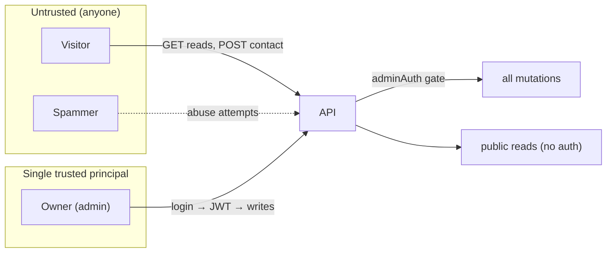
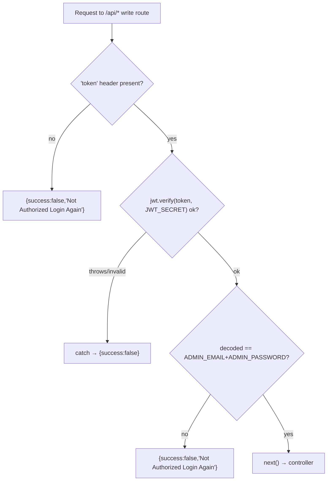
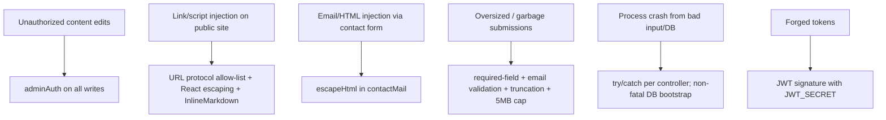
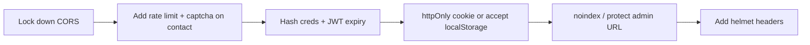

# 09 — Security

[← Admin Panel](./08-admin-panel.md) · [Docs index](./README.md) · Next: [DevOps & Infrastructure →](./10-devops-infrastructure.md)

---

This document describes the security model **as implemented today**, the controls that protect the system, the threats considered and mitigated, and — importantly — the **known risks and recommended hardening**. Security posture here is intentionally pragmatic for a **single‑owner, low‑value‑target portfolio**; this doc states that clearly so no one mistakes the trade‑offs for oversights.

## Table of contents

- [9.1 Security model overview](#91-security-model-overview)
- [9.2 Authentication](#92-authentication)
- [9.3 Authorization model](#93-authorization-model)
- [9.4 Data protection](#94-data-protection)
- [9.5 Threat model & mitigations](#95-threat-model--mitigations)
- [9.6 Known risks & recommendations](#96-known-risks--recommendations)
- [9.7 Secrets management](#97-secrets-management)

---

## 9.1 Security model overview



### Trust boundaries

| Zone | Who | Capabilities |
|------|-----|--------------|
| **Public** | anyone on the internet | read all content, submit a contact message, attempt login |
| **Admin** | the single owner, holding a valid JWT | create/update/delete all content, read/delete messages, upload/delete media |
| **Server** | the Express process | holds secrets (JWT secret, DB/Cloudinary/Resend creds), enforces the gate |
| **External SaaS** | Atlas / Cloudinary / Resend | hold data/assets/email under their own security |

The **only** authorization decision in the whole system is: *"does this request carry a valid admin token?"* Everything else is either public‑read or token‑gated‑write.

---

## 9.2 Authentication

### Mechanism (as built)

1. The owner submits `email`+`password` to `POST /api/user/admin`.
2. The server compares them **as plaintext** to `ADMIN_EMAIL`/`ADMIN_PASSWORD` env vars.
3. On match it returns `jwt.sign(ADMIN_EMAIL + ADMIN_PASSWORD, JWT_SECRET)` — the **signed payload is the concatenated credential string**.
4. The admin SPA stores the token in `localStorage` and sends it in the `token` header on every write.
5. `adminAuth` verifies the signature and checks the decoded string equals `ADMIN_EMAIL + ADMIN_PASSWORD`.

```9:13:backend/controllers/userController.js
        if (email === process.env.ADMIN_EMAIL && password === process.env.ADMIN_PASSWORD) {
            const token = jwt.sign(email + password, process.env.JWT_SECRET);
            res.json({ success: true, token })
        } else {
            res.json({ success: false, message: "Invalid credentials" })
        }
```

### Properties & implications

| Property | Detail | Implication |
|----------|--------|-------------|
| Single account | No user collection; creds are env vars | One owner; no roles, no self‑service |
| Plaintext compare | `===` against env values | No password hashing at rest in the app layer |
| Token payload | The credential string itself | Anyone who can read `JWT_SECRET` + creds could forge a token; verification is essentially "do you know the secret + creds" |
| No expiry | `jwt.sign` without `expiresIn` | Tokens are valid until `JWT_SECRET` or the credentials change |
| Revocation | Change `JWT_SECRET` or password → all tokens invalid | Coarse, but effective |

### Why this design

There is exactly **one** admin and the protected actions edit a personal portfolio (low value, no PII beyond inbound messages). The env‑var approach removes an entire surface (user table, registration, password reset, email verification). It mirrors the *Forever* reference for familiarity. The trade‑offs are accepted and documented, not accidental.

### Recommended hardening

- Set an **expiry** (`jwt.sign(payload, secret, { expiresIn: '12h' })`) and refresh on activity.
- Hash the stored password with **`bcrypt`** (already a dependency) and move credentials into a `userModel` row.
- Sign a **structured payload** (e.g. `{ sub: "admin", iat, exp }`) instead of the raw credential string.
- Consider moving the token to an **httpOnly, Secure, SameSite cookie** to remove XSS exfiltration risk (see [9.6](#96-known-risks--recommendations)).

---

## 9.3 Authorization model

Authorization is **binary**: public vs admin. It is enforced by a single middleware, `adminAuth`, attached to every mutating route (and the admin read routes for contacts/media).



### Route protection map

| Class | Routes | Protection |
|-------|--------|------------|
| Public reads | `GET /`, `GET /api/{profile,project/list,experience/list,skill/list,achievement/list,education/list}` | none |
| Public write | `POST /api/contact/submit` | none (validated + truncated) |
| Login | `POST /api/user/admin` | none (the auth itself) |
| Admin writes | all `add/update/remove`, `profile/update` | `adminAuth` |
| Admin reads | `POST /api/contact/list`, `POST /api/media/list` | `adminAuth` |

**Defense‑in‑depth note:** `adminAuth` runs **before** `multer` on upload routes, so unauthorized requests are rejected before any file is parsed/streamed.

There is **no per‑resource or per‑record authorization** because there is a single owner — every authenticated request may touch everything. If multi‑user is ever added, this is the layer that must grow (ownership checks, roles).

---

## 9.4 Data protection

### Input validation & sanitization

| Control | Where | Protects against |
|---------|-------|------------------|
| Email format check (`validator.isEmail`) | `contactController` | malformed/garbage emails |
| Length truncation (200/200/200/4000) | `contactController` | oversized payload / storage abuse |
| URL protocol allow‑list (`http`/`https` only) | `projectController` + `externalLink` (client) | `javascript:`/`data:` link injection on the public site |
| Icon/status enum coercion | achievement/education controllers | invalid enum values |
| HTML escaping in emails (`escapeHtml`) | `contactMail` | HTML/email injection via message body |
| JSON body size cap (5 MB) | `server.js` | large‑body DoS via JSON |

### XSS posture

- React escapes interpolated text by default, so rendering user‑influenced content (project descriptions, messages) is safe from script injection **as long as no `dangerouslySetInnerHTML` is used** — and it is not.
- `InlineMarkdown` only emits `<strong>`/`<em>` from `**`/`*` tokens; it never injects raw HTML.
- Link `href`s are normalized through the protocol allow‑list, blocking `javascript:` URIs.

### Data at rest / in transit

- **In transit:** in production all three apps and the SaaS endpoints are HTTPS (Vercel/Atlas/Cloudinary/Resend terminate TLS). Locally, dev is HTTP.
- **At rest:** MongoDB Atlas encrypts data at rest (managed). Cloudinary stores assets. The app does not add field‑level encryption.
- **PII:** the only PII is **inbound contact messages** (name, email, message). They are stored in `contacts` and emailed to the owner. The owner can delete them from the Messages page. There is no automated retention — see [Database §5.7](./05-database.md#57-data-lifecycle-management).

---

## 9.5 Threat model & mitigations



| # | Threat | Mitigation in place | Residual risk |
|---|--------|---------------------|---------------|
| T1 | Anonymous user mutates content | `adminAuth` JWT gate on every write | Token theft (see T7) |
| T2 | Malicious link/script rendered to visitors | Protocol allow‑list + React auto‑escaping | none significant |
| T3 | Injected HTML in notification email | `escapeHtml` of all fields | none significant |
| T4 | Spam/garbage in `contacts` | validation + truncation | **no rate limiting** → flooding possible (T8) |
| T5 | DoS via malformed request crashing server | per‑handler try/catch; non‑fatal boot | unhandled edge cases possible |
| T6 | Forged admin token | HMAC signature via `JWT_SECRET` | weak if secret leaks |
| T7 | Token exfiltration via XSS | React escaping limits XSS; `localStorage` token still reachable if XSS occurs | **localStorage token is XSS‑exfiltratable** |
| T8 | Contact‑form flooding | none | **open; recommend rate limit/captcha** |
| T9 | CORS abuse | writes still need token | **CORS is wide open**; tighten in prod |

---

## 9.6 Known risks & recommendations

These are **deliberate trade‑offs** for a single‑owner portfolio, listed so they can be fixed before any higher‑stakes use. Priority is the suggested order of remediation.

| Risk | Why it exists | Recommendation | Priority |
|------|---------------|----------------|----------|
| **Wide‑open CORS** (`app.use(cors())`) | Avoids per‑env origin config | Restrict to the deployed frontend/admin origins: `cors({ origin: [FRONTEND_URL, ADMIN_URL] })` | High |
| **No rate limiting** on `POST /api/contact/submit` | Simplicity | Add `express-rate-limit` and/or a captcha (hCaptcha/Turnstile); or Cloudflare in front | High |
| **JWT in `localStorage`** | Survives reloads, simple | Move to `httpOnly`+`Secure`+`SameSite` cookie; or accept for single admin | Medium |
| **Plaintext credential compare & token payload** | No user table | Hash with `bcrypt`, store in `userModel`, sign a structured payload with `expiresIn` | Medium |
| **No token expiry** | Simplicity | Add `expiresIn`; rotate `JWT_SECRET` periodically | Medium |
| **`error.message` returned to clients** | Uniform envelopes | Map internal errors to generic messages; log details server‑side | Medium |
| **Admin URL discoverable/indexable** | Static SPA on a public URL | Add `X-Robots-Tag: noindex`, IP allow‑list, or basic auth at the edge | Medium |
| **Custom `token` header** | Forever compatibility | Optionally migrate to `Authorization: Bearer` | Low |
| **No security headers** (Helmet) | Minimal deps | Add `helmet` for CSP/HSTS/frameguard/etc. | Low |

### Suggested production checklist



---

## 9.7 Secrets management

### Where secrets live

| Secret | Var | Used by | Storage |
|--------|-----|---------|---------|
| Mongo connection | `MONGODB_URI` | backend | `.env` locally; Vercel env in prod |
| JWT signing key | `JWT_SECRET` | backend | `.env` / Vercel env |
| Admin email/password | `ADMIN_EMAIL`, `ADMIN_PASSWORD` | backend | `.env` / Vercel env |
| Cloudinary creds | `CLOUDINARY_NAME`, `CLOUDINARY_API_KEY`, `CLOUDINARY_SECRET_KEY` | backend | `.env` / Vercel env |
| Resend key | `RESEND_API_KEY` (+ `CONTACT_NOTIFY_TO/FROM`) | backend | `.env` / Vercel env |
| Backend URL | `VITE_BACKEND_URL` | frontend/admin | `.env` / Vercel env (build‑time, **public** in bundle) |

### Handling rules

- **`.env` files are git‑ignored** (`.gitignore` excludes `.env`, `*.env`, `.env.*` except `.env.example`). Never commit real secrets.
- **`.env.example`** files document required keys with placeholder values — these are safe to commit and are the template for onboarding.
- **`VITE_*` vars are NOT secret** — Vite inlines them into the client bundle at build time, so they are visible to anyone. Only put non‑sensitive config (the backend URL) there. Never put a real secret behind a `VITE_` prefix.
- **Rotation:** changing `JWT_SECRET` or `ADMIN_PASSWORD` immediately invalidates existing admin tokens (a built‑in kill switch).
- **In production**, set all backend secrets in the host's environment settings (e.g. Vercel Project → Environment Variables), never in source. See [DevOps §10.6](./10-devops-infrastructure.md#106-environment-configuration).

---

Next: [10 — DevOps & Infrastructure →](./10-devops-infrastructure.md)
