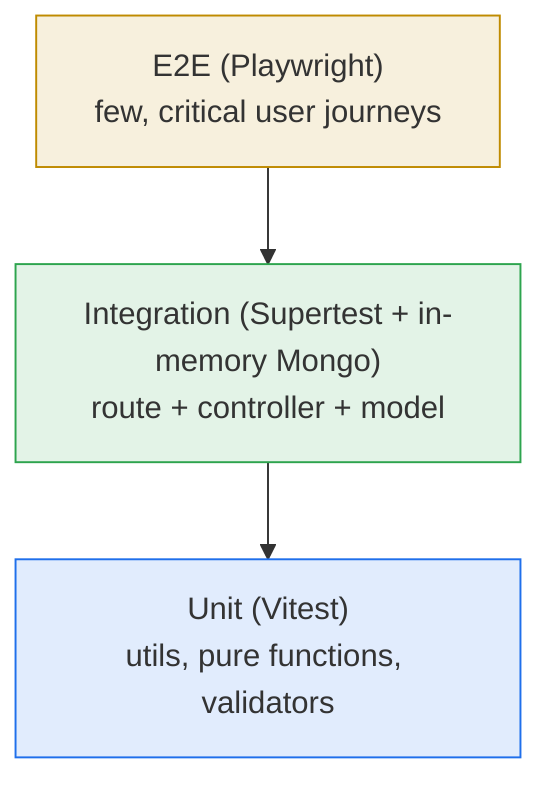
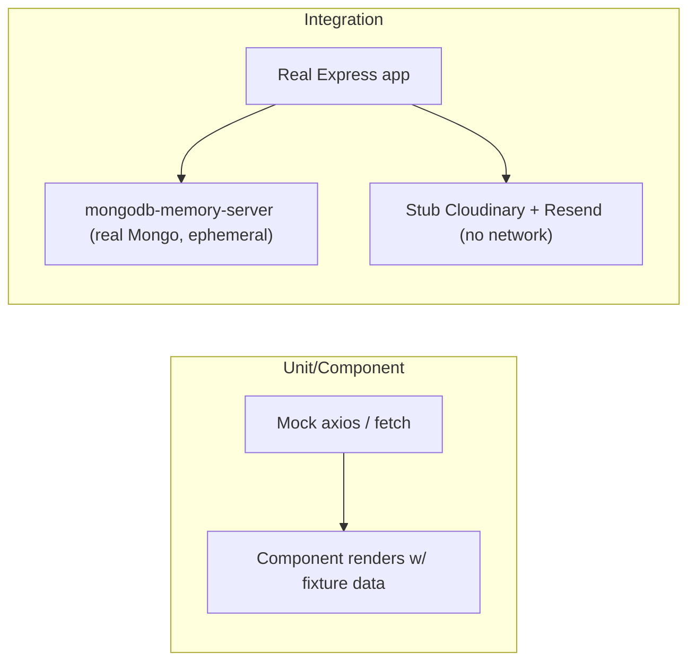
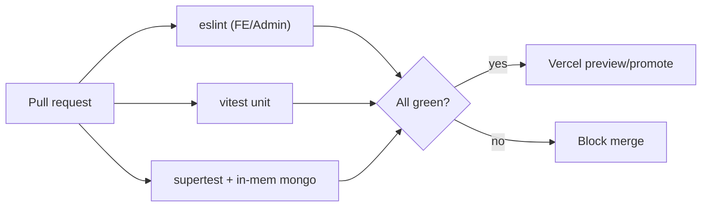

# 11 — Testing

[← DevOps & Infrastructure](./10-devops-infrastructure.md) · [Docs index](./README.md) · Next: [Development Guide →](./12-development-guide.md)

---

> **Honest status:** the repository currently ships **no automated tests** — there is no test runner, no test files, and no `test` npm script in any of the three apps. This document therefore serves two purposes:
> 1. Document the **manual test plans** the project relies on today (the de‑facto QA process).
> 2. Provide a concrete, recommended **automated testing strategy** (tools, structure, examples, coverage targets) so a QA engineer or developer can stand testing up without guessing.
>
> Everything under "Recommended" is a proposal, not a description of existing code.

## Table of contents

- [11.1 Current state](#111-current-state)
- [11.2 Testing strategy (the pyramid)](#112-testing-strategy-the-pyramid)
- [11.3 Manual test plans (today's QA)](#113-manual-test-plans-todays-qa)
- [11.4 Recommended: backend unit & integration tests](#114-recommended-backend-unit--integration-tests)
- [11.5 Recommended: frontend & admin tests](#115-recommended-frontend--admin-tests)
- [11.6 Recommended: end-to-end tests](#116-recommended-end-to-end-tests)
- [11.7 Mocking strategy](#117-mocking-strategy)
- [11.8 Coverage expectations](#118-coverage-expectations)
- [11.9 Wiring tests into CI](#119-wiring-tests-into-ci)

---

## 11.1 Current state

| App | Test runner | Test files | `npm test` | Lint |
|-----|-------------|------------|-----------|------|
| backend | none | none | absent | none |
| frontend | none | none | absent | `eslint` (`npm run lint`) |
| admin | none | none | absent | `eslint` (`npm run lint`) |

So quality today rests on: **ESLint** (frontend/admin), **manual smoke testing**, and the fact that the API contract is small and uniform (the [envelope response](./06-api-reference.md#response-envelope)). The sections below are the path forward.

---

## 11.2 Testing strategy (the pyramid)



| Layer | What it proves | Where | Suggested tool |
|-------|----------------|-------|----------------|
| **Unit** | pure logic in isolation (string normalizers, list parsers, validators) | `utils/`, helpers | **Vitest** |
| **Integration** | an endpoint behaves end‑to‑end through Express + Mongoose | `backend/` routes | **Supertest** + **mongodb-memory-server** |
| **Component** | a React component renders & reacts to props/events | FE/Admin components | **Vitest** + **@testing-library/react** |
| **E2E** | real browser journeys across FE/Admin/API | whole system | **Playwright** |

Rationale for the shape: most defects in this app are in **data transformation** (list‑field parsing, URL normalization, envelope shaping) and **endpoint wiring** (auth on the right routes, correct status/body). Those are cheap to cover with unit + integration tests, so the pyramid is wide at the bottom. E2E is kept thin (it's slow and needs the full stack + external services mocked).

---

## 11.3 Manual test plans (today's QA)

Until automation exists, run these checklists before shipping. They map to the real [user flows](./07-frontend.md#710-user-flows) and [admin workflows](./08-admin-panel.md#86-content-workflows).

### A. Public site smoke test

| # | Step | Expected |
|---|------|----------|
| 1 | Load the site cold | Hero/LCP content paints; no console errors |
| 2 | Scroll through all sections | Header scroll‑spy highlights the active section; smooth scroll works |
| 3 | Open a project's external link | Opens in new tab, normalized URL (`https://…`) |
| 4 | Resize to mobile width | Layout is responsive; nav collapses |
| 5 | Submit the contact form (valid) | Success toast; row appears in admin **Messages**; owner email arrives (if Resend configured) |
| 6 | Submit contact form (bad email) | Inline/error feedback; no row created |
| 7 | Throttle network / stop backend | Loading skeletons show; graceful empty/error state, not a blank crash |

### B. Admin CMS smoke test

| # | Step | Expected |
|---|------|----------|
| 1 | Visit admin, log in with correct creds | Redirects into dashboard; token stored |
| 2 | Log in with wrong creds | Error toast; stays on login |
| 3 | Edit profile, save | Success toast; change reflected on public site after reload |
| 4 | Add a project with image | Upload succeeds; appears in list and on public site |
| 5 | Edit then delete that project | Update/delete succeed; removed from list and site |
| 6 | Upload media (image/video/pdf) | Correct resource type; appears in Media grid |
| 7 | Reload admin after idle | Still authenticated (token persists in `localStorage`; JWTs carry **no expiry**). A cleared or invalid token (e.g. after `JWT_SECRET` changes) forces re‑login |
| 8 | Triage a message | Mark read / delete works |

### C. Cross‑cutting

- **Auth boundary:** call an admin endpoint (e.g. `POST /api/project/add`) **without** a token → expect failure (see [Security §9.3](./09-security.md#93-authorization-model)).
- **Public read:** all `GET /api/*/list` endpoints return `{ success: true, … }` without a token.

---

## 11.4 Recommended: backend unit & integration tests

### Setup

```bash
cd backend
npm i -D vitest supertest mongodb-memory-server
```

Add to `backend/package.json`:

```json
{
  "scripts": {
    "test": "vitest run",
    "test:watch": "vitest"
  }
}
```

To make the app testable without a live DB, the integration tests boot the **exported Express app** (recall `server.js` already exports `app` and only calls `listen()` outside Vercel) against an **in‑memory MongoDB**.

### Example: integration test for projects

```js
// backend/tests/project.test.js (recommended)
import { describe, it, expect, beforeAll, afterAll } from 'vitest'
import request from 'supertest'
import mongoose from 'mongoose'
import { MongoMemoryServer } from 'mongodb-memory-server'
import app from '../server.js' // exports the Express app

let mongod
beforeAll(async () => {
  mongod = await MongoMemoryServer.create()
  await mongoose.connect(mongod.getUri())
})
afterAll(async () => {
  await mongoose.disconnect()
  await mongod.stop()
})

describe('GET /api/project/list', () => {
  it('returns an envelope with an array', async () => {
    const res = await request(app).get('/api/project/list')
    expect(res.status).toBe(200)
    expect(res.body.success).toBe(true)
    expect(Array.isArray(res.body.projects)).toBe(true)
  })
})

describe('admin auth boundary', () => {
  it('rejects add without a token', async () => {
    const res = await request(app).post('/api/project/add').send({ title: 'x' })
    expect(res.body.success).toBe(false) // adminAuth blocks it
  })
})
```

### Example: unit test for a utility

```js
// frontend/src/utils/externalLink.test.js (recommended)
import { describe, it, expect } from 'vitest'
import { normalizeExternalUrl } from './externalLink' // adjust to actual export

describe('normalizeExternalUrl', () => {
  it('adds https:// when missing', () => {
    expect(normalizeExternalUrl('github.com/x')).toBe('https://github.com/x')
  })
  it('leaves absolute urls intact', () => {
    expect(normalizeExternalUrl('https://a.com')).toBe('https://a.com')
  })
})
```

### Priority targets (highest value first)

1. **Auth boundary** — every admin route rejects missing/invalid tokens; `adminLogin` accepts correct creds and rejects wrong ones.
2. **List‑field parsing** — controllers that split comma/newline strings into arrays.
3. **URL normalization** (`externalLink`) and **inline markdown** rendering.
4. **Envelope shape** — every endpoint returns `{ success, … }`.
5. **Media resource‑type detection** — image vs video vs raw routing.

---

## 11.5 Recommended: frontend & admin tests

### Setup (per SPA)

```bash
cd frontend   # or: cd admin
npm i -D vitest @testing-library/react @testing-library/jest-dom jsdom
```

`vite.config.js` test block:

```js
// add to defineConfig({...})
test: {
  environment: 'jsdom',
  setupFiles: ['./src/test/setup.js'], // imports @testing-library/jest-dom
  globals: true,
}
```

### Example: component test

```jsx
// frontend/src/components/Contact.test.jsx (recommended)
import { render, screen, fireEvent } from '@testing-library/react'
import { describe, it, expect, vi } from 'vitest'
import Contact from './Contact'

describe('Contact form', () => {
  it('shows validation when email is invalid', async () => {
    render(<Contact />)
    fireEvent.change(screen.getByLabelText(/email/i), { target: { value: 'not-an-email' } })
    fireEvent.click(screen.getByRole('button', { name: /send/i }))
    expect(await screen.findByText(/valid email/i)).toBeInTheDocument()
  })
})
```

For components that call the API via `axios`/context, **mock the network** (see next section) and assert on rendered output, not on implementation details.

---

## 11.6 Recommended: end-to-end tests

### Setup

```bash
npm i -D @playwright/test
npx playwright install
```

### Example: critical journey

```js
// e2e/contact.spec.js (recommended)
import { test, expect } from '@playwright/test'

test('visitor submits the contact form', async ({ page }) => {
  await page.goto(process.env.E2E_FRONTEND_URL) // points at a running frontend
  await page.fill('input[name="name"]', 'Test User')
  await page.fill('input[name="email"]', 'test@example.com')
  await page.fill('textarea[name="message"]', 'Hello!')
  await page.click('button:has-text("Send")')
  await expect(page.getByText(/thank you|message sent/i)).toBeVisible()
})
```

```js
// e2e/admin-login.spec.js (recommended)
import { test, expect } from '@playwright/test'

test('admin logs in and reaches the dashboard', async ({ page }) => {
  await page.goto(process.env.E2E_ADMIN_URL)
  await page.fill('input[type="email"]', process.env.E2E_ADMIN_EMAIL)
  await page.fill('input[type="password"]', process.env.E2E_ADMIN_PASSWORD)
  await page.click('button[type="submit"]')
  await expect(page).toHaveURL(/.*\/(dashboard|profile|list)/)
})
```

Keep E2E to a handful of journeys (contact submit, admin login, add+publish a project, delete a project). Run them against a deployed **preview** or a locally composed stack with external services mocked/stubbed.

---

## 11.7 Mocking strategy



| Dependency | In unit/component tests | In integration tests | In E2E |
|------------|------------------------|----------------------|--------|
| **HTTP/axios** | mock module (`vi.mock`) with fixtures | real (Supertest hits the app) | real (browser) |
| **MongoDB** | n/a | `mongodb-memory-server` (ephemeral) | seeded test DB |
| **Cloudinary** | n/a | stub `cloudinaryUpload` to return a fake URL | use a test/sandbox cloud or stub |
| **Resend** | n/a | stub `sendContactNotification` (it already no‑ops without `RESEND_API_KEY`) | leave `RESEND_API_KEY` unset to skip sends |
| **JWT/auth** | n/a | sign a real token with a test `JWT_SECRET` | real login flow |

Two facts make mocking easy here:
- `sendContactNotification` **already returns a skip result** when `RESEND_API_KEY` is unset — so contact tests need no email mock.
- Cloudinary uploads go through the single `utils/cloudinaryUpload.js` module — mock that one module to avoid network/binary handling.

---

## 11.8 Coverage expectations

Targets to adopt once tests exist (not enforced today):

| Area | Target | Why |
|------|--------|-----|
| Backend controllers/utilities | **80%+ lines** | core business logic & contracts |
| Auth (`adminAuth`, `adminLogin`) | **100% branches** | the only real security boundary |
| Shared utilities (`externalLink`, `inlineMarkdown`, list parsing) | **90%+** | pure, high‑reuse, bug‑prone |
| React components | **60–70%** | focus on logic‑bearing components & forms |
| E2E journeys | **count‑based** (≥4 critical paths) | coverage % is the wrong metric for E2E |

Use Vitest's `--coverage` (`@vitest/coverage-v8`) and fail CI below the backend/auth thresholds.

---

## 11.9 Wiring tests into CI

Extend the recommended CI from [DevOps §10.8](./10-devops-infrastructure.md#108-cicd-pipeline):

```yaml
# add a job to .github/workflows/ci.yml (recommended)
  backend-test:
    runs-on: ubuntu-latest
    steps:
      - uses: actions/checkout@v4
      - uses: actions/setup-node@v4
        with: { node-version: 20, cache: npm, cache-dependency-path: backend/package-lock.json }
      - run: npm ci
        working-directory: backend
      - run: npm test -- --coverage
        working-directory: backend
```



E2E (Playwright) is best run on a **schedule** or against **preview deployments** rather than on every PR, because it needs the full stack running.

---

Next: [12 — Development Guide →](./12-development-guide.md)
