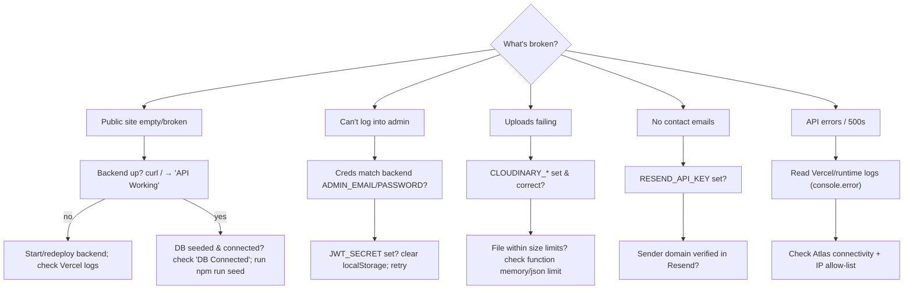
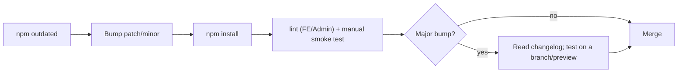
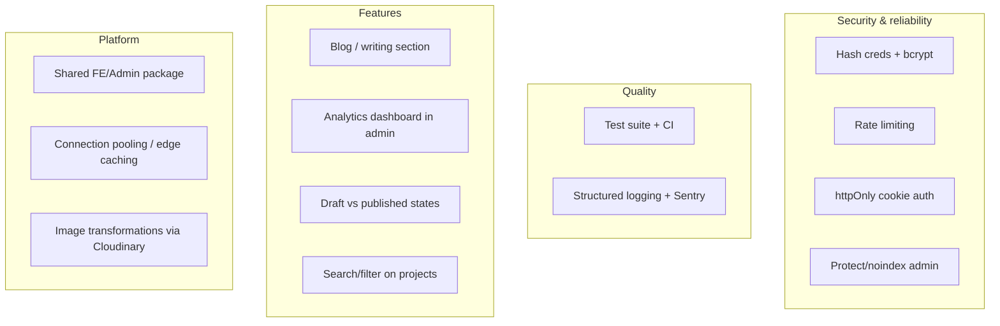

# 13 — Maintenance Guide

[← Development Guide](./12-development-guide.md) · [Docs index](./README.md) · Next: [Glossary →](./14-glossary.md)

---

For whoever keeps this running over time: troubleshooting playbooks, known limitations, upgrade procedures, the catalogued technical debt, and a prioritized improvement roadmap. Pairs with [Development Guide §12.7](./12-development-guide.md#127-debugging-workflows) (debugging) and [DevOps §10](./10-devops-infrastructure.md) (operations).

## Table of contents

- [13.1 Troubleshooting playbook](#131-troubleshooting-playbook)
- [13.2 Routine maintenance tasks](#132-routine-maintenance-tasks)
- [13.3 Known limitations](#133-known-limitations)
- [13.4 Technical debt register](#134-technical-debt-register)
- [13.5 Upgrade procedures](#135-upgrade-procedures)
- [13.6 Future improvement roadmap](#136-future-improvement-roadmap)

---

## 13.1 Troubleshooting playbook



### Scenario reference

| Symptom | Diagnosis | Resolution |
|---------|-----------|------------|
| Public site shows empty sections | DB unseeded, or backend can't reach Atlas | `npm run seed`; verify `DB Connected`; check Atlas IP allow‑list |
| All API calls fail from browser | Wrong `VITE_BACKEND_URL` or backend down | fix SPA `.env` + rebuild/redeploy; start backend |
| `//portfolio` / connection string error | Trailing slash on `MONGODB_URI` | remove trailing slash (code appends `/portfolio`) |
| Admin login rejects correct creds | `ADMIN_*` mismatch, or `JWT_SECRET` unset/changed | reconcile backend env; note: changing `JWT_SECRET` invalidates all existing tokens |
| Logged out unexpectedly / "invalid token" | `JWT_SECRET` (or admin creds) changed, or token cleared — note JWTs have **no expiry**, so they don't time out | re‑login; tokens are stored in `localStorage` |
| Image/video/pdf upload fails | Cloudinary creds wrong, or file too large | set `CLOUDINARY_*`; check payload vs `express.json({limit:'5mb'})` and function memory |
| Contact form succeeds but no email | `RESEND_API_KEY` unset (by design) or unverified sender | set key + verify sending domain; until then `sendContactNotification` returns `skipped` |
| Backend "running without database connection" warning | Atlas unreachable at boot; server intentionally stays up | restore connectivity; routes recover on next successful connect |
| Serverless cold‑start latency / connection spikes | New DB connection per cold invocation | reuse mongoose connection across warm invocations; watch Atlas connection limit |
| CORS error in browser | Almost always backend down / wrong URL (CORS is wide open) | confirm backend reachable at `VITE_BACKEND_URL` |

### Where to look

- **Backend logs:** Vercel function runtime logs (or Terminal 1 locally). All errors go through `console.error`.
- **DB health:** Atlas metrics (connections, ops, storage) + the `DB Connected` / connection‑error log lines.
- **Frontend/admin:** browser DevTools console + Network tab.
- **Email delivery:** Resend dashboard (sends, bounces, domain status).
- **Media:** Cloudinary dashboard (asset list, usage).

---

## 13.2 Routine maintenance tasks

| Cadence | Task |
|---------|------|
| Weekly | Skim contact **Messages** in admin; reply/triage; delete spam |
| Weekly | Check Vercel deploy status & function error rate |
| Monthly | Review Atlas storage/usage and Cloudinary usage vs free‑tier limits |
| Monthly | Verify Atlas **backups** are running and a test restore is feasible |
| Quarterly | `npm outdated` per app; apply safe dependency updates (see §13.5) |
| Quarterly | Rotate `JWT_SECRET` and admin password; re‑enter in Vercel env |
| As needed | Re‑seed content (`npm run seed`) after editing `seed-data/resume.json` |
| As needed | Back up Cloudinary originals & `seed-data/resume.json` |

---

## 13.3 Known limitations

These are **intentional trade‑offs** for a single‑owner portfolio (cross‑referenced with [Security §9.6](./09-security.md#96-known-risks--recommendations) and [System Design §3.6](./03-system-design.md#36-trade-offs--technical-decisions)):

| # | Limitation | Impact | Mitigation / note |
|---|------------|--------|-------------------|
| 1 | **No automated tests** | regressions caught only by manual QA | see [Testing](./11-testing.md) for the plan |
| 2 | **Single admin via env vars** | no multi‑user, no roles, no password reset UI | fine for one owner; rotate creds manually |
| 3 | **Plaintext credential compare** at login | weaker than hashed creds (though over HTTPS + env‑stored) | hash with bcrypt (already a dependency) |
| 4 | **API returns HTTP 200 on logical errors** | clients must read `success`, not status code | documented contract; consistent across endpoints |
| 5 | **Wide‑open CORS** | any origin can call the API | acceptable (public read API); lock down for admin routes if desired |
| 6 | **JWT in `localStorage`** | vulnerable to XSS token theft | React escaping mitigates XSS; httpOnly cookies are the hardening path |
| 7 | **No rate limiting** | contact form / login can be abused | add `express-rate-limit` (see [API §6.5](./06-api-reference.md)) |
| 8 | **Whole‑document profile writes** (singleton) | last write wins; no field‑level concurrency | single editor, so low risk |
| 9 | **No indexes beyond `_id`** | full scans on small collections | acceptable at this scale; add indexes if data grows ([DB §5.4](./05-database.md#54-indexing-strategy)) |
| 10 | **Serverless cold starts** open new DB connections | latency spikes; Atlas connection pressure | connection reuse / pooling for scale |
| 11 | **Best‑effort email** (skips silently if unconfigured) | a submission may save without notifying | message is still persisted in `contacts`; check admin inbox |
| 12 | **Duplicated code across the two SPAs** (axios setup, Tailwind config, UI patterns) | changes must be made twice | acceptable for two small apps; a shared package would reduce it |
| 13 | **Docs vs root `README.md` drift** | README mentions `diskStorage`/EmailJS; code uses `memoryStorage`/Resend | trust the code + these docs; README is stale |

---

## 13.4 Technical debt register

Ordered roughly by risk‑adjusted priority.

```mermaid
flowchart LR
    subgraph High["High priority"]
        D1["Hash admin creds (bcrypt)"]
        D2["Add rate limiting (login + contact)"]
        D3["Add automated tests + CI gate"]
    end
    subgraph Medium["Medium"]
        D4["noindex/protect admin app"]
        D5["DB connection reuse for serverless"]
        D6["Structured logging + error tracking"]
    end
    subgraph Low["Low / nice-to-have"]
        D7["Extract shared FE/Admin package"]
        D8["Add indexes if collections grow"]
        D9["Reconcile/replace root README"]
    end
    High --> Medium --> Low
```



| Item | Area | Effort | Payoff |
|------|------|--------|--------|
| Hash admin password (`bcrypt` already installed) | Security | S | removes plaintext‑compare risk |
| Rate limit login + contact | Security | S | abuse/brute‑force protection |
| Automated tests (unit/integration) + CI | Quality | M | regression safety net |
| `noindex` + protect admin | Security/Ops | S | keeps CMS out of search results |
| Reuse mongoose connection on Vercel | Perf/Reliability | M | fewer cold‑start connections |
| Structured logs + Sentry | Observability | M | faster incident diagnosis |
| Shared package for FE/Admin (axios, Tailwind preset, UI) | DX | M | kills duplication |
| Add targeted indexes | DB | S | only when data grows |
| Replace stale root README with a pointer to `docs/` | Docs | S | removes confusion |

---

## 13.5 Upgrade procedures

### Dependency updates (per app — they're independent)



```bash
cd <app>            # backend | frontend | admin
npm outdated
npm update          # safe (respects semver ranges)
# for a major bump:
npm install <pkg>@latest
npm run lint        # FE/Admin
# then run the relevant manual test plan
```

### Watch‑items for major upgrades

| Dependency | Risk on major bump |
|------------|--------------------|
| **Vite 5 → 6+** | config/plugin API changes; rebuild both SPAs and verify code splitting |
| **React 18 → 19** | behavioral changes; test animations (framer‑motion) & effects |
| **Express 4 → 5** | middleware/router changes; re‑test all routes + `adminAuth` |
| **Mongoose 8 → next** | query/connection API changes; re‑test all models & seed |
| **multer 1.x → 2.x** | API changes; re‑test upload pipeline (memory storage) |
| **react-router 6 → 7** | route API changes; re‑test admin routing & FE anchor scrolling |

Bump **one app at a time**, verify its preview deployment, then proceed. Keep lockfiles committed.

### Node runtime upgrade

Set the Node version consistently in Vercel project settings and locally (`.nvmrc` recommended, not yet present). The code targets Node 18+; 20 LTS is the safe default.

### Content/schema migration

Use the seeder and one‑off scripts (e.g. `scripts/remove-testimonials.js`) as the model for migrations. See [Database §5.5](./05-database.md#55-migration-strategy). For breaking schema changes: write a script under `backend/scripts/`, test against a copy/preview, then run against production with a backup in hand.

---

## 13.6 Future improvement roadmap

Grouped by theme; no committed timeline.



| Theme | Idea | Notes |
|-------|------|-------|
| Security | Hash credentials, rate limiting, httpOnly cookies, protect admin | see [Security §9.6](./09-security.md#96-known-risks--recommendations) |
| Quality | Add the [Testing](./11-testing.md) suite + CI gate; observability | biggest long‑term ROI |
| Features | Blog, content draft/publish states, analytics view, project search/filter | extend the existing CRUD pattern |
| Performance | DB connection reuse, response caching/CDN for read endpoints, Cloudinary transforms | see [System Design §3.7](./03-system-design.md#37-performance-considerations) |
| DX | Shared package to remove FE/Admin duplication; `.nvmrc`; `CONTRIBUTING.md` | reduces maintenance cost |

---

[← Development Guide](./12-development-guide.md) · Next: [14 — Glossary →](./14-glossary.md)
