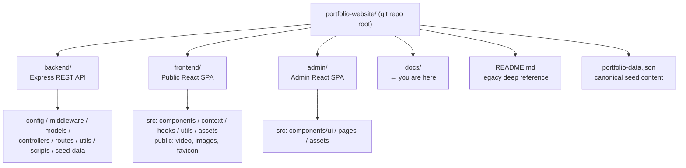
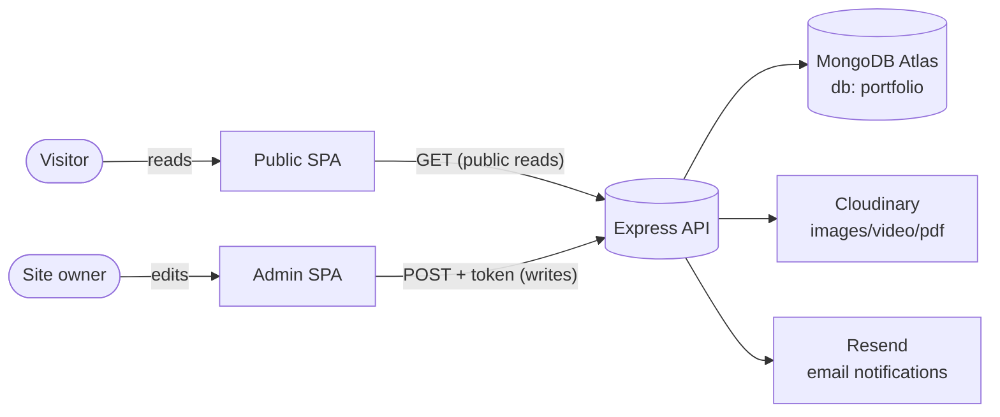

# Portfolio Platform — Documentation

> **Audience:** new developers, architects, DevOps/SRE engineers, QA engineers, and non‑technical stakeholders.
>
> **Goal:** this documentation set is exhaustive enough that you can understand, run, maintain, extend, and deploy the entire system **without any prior knowledge of the project and without external guidance.**

---

## What is this project?

This repository is a **content‑managed personal portfolio platform** built on the **MERN stack** (MongoDB, Express, React, Node.js). Instead of a static, hand‑edited site, it is split into **three independent applications** that talk to each other over HTTP:

| App | Folder | Audience | Runtime | Default port |
|-----|--------|----------|---------|--------------|
| **Backend API** | [`backend/`](../backend) | both SPAs | Node.js + Express (ESM) | `4000` |
| **Public frontend** | [`frontend/`](../frontend) | visitors | React 18 + Vite SPA | `5173` |
| **Admin panel (CMS)** | [`admin/`](../admin) | the site owner | React 18 + Vite SPA | `5174` |

The owner edits content (profile, projects, experience, skills, achievements, education, media, and reads contact messages) in the **admin panel**. The **frontend** renders that content for the public. The **backend** persists everything to **MongoDB Atlas**, stores binary assets in **Cloudinary**, and emails contact submissions via **Resend**.

---

## How to read these docs

The documents are numbered in a recommended reading order, but each is self‑contained and cross‑links to the others. Mermaid diagrams are embedded throughout (GitHub, VS Code with a Mermaid plugin, and most Markdown viewers render them automatically).

| # | Document | What it covers | Primary audience |
|---|----------|----------------|------------------|
| 01 | [Project Overview](./01-project-overview.md) | Purpose, business goals, use cases, core features, high‑level view | Everyone / stakeholders |
| 02 | [Architecture](./02-architecture.md) | System architecture, patterns, component & data‑flow diagrams, sequence diagrams, scalability, reliability | Architects, senior devs |
| 03 | [System Design (HLD & LLD)](./03-system-design.md) | High/low‑level design, module decomposition, domain model, design patterns, trade‑offs, performance | Architects, devs |
| 04 | [Backend & Code Documentation](./04-backend.md) | File‑by‑file backend walkthrough, controllers, middleware, utilities, error handling, dependencies | Backend devs |
| 05 | [Database](./05-database.md) | DB architecture, schemas, ER model, indexing, migrations, query optimization, data lifecycle | Backend devs, DBAs |
| 06 | [API Reference](./06-api-reference.md) | Every endpoint, request/response shapes, auth, error codes, validation, rate limits, examples | All devs, integrators |
| 07 | [Frontend (Public Site)](./07-frontend.md) | UI architecture, state, routing, component hierarchy, styling, user flows | Frontend devs |
| 08 | [Admin Panel](./08-admin-panel.md) | CMS architecture, UI component library, page‑by‑page guide, content workflows | Frontend devs, owner |
| 09 | [Security](./09-security.md) | Auth/authz model, data protection, threat model & mitigations, known risks | Security, DevOps, devs |
| 10 | [DevOps & Infrastructure](./10-devops-infrastructure.md) | Deployment architecture, CI/CD, environments, containerization, monitoring, DR | DevOps/SRE |
| 11 | [Testing](./11-testing.md) | Testing strategy, unit/integration/E2E, coverage expectations, mocking, manual test plans | QA, devs |
| 12 | [Development Guide](./12-development-guide.md) | Prerequisites, local setup, env vars, running, debugging, contribution guidelines | New devs |
| 13 | [Maintenance Guide](./13-maintenance-guide.md) | Troubleshooting, known limitations, upgrades, technical debt, roadmap | Maintainers |
| 14 | [Glossary](./14-glossary.md) | Definitions of every concept, library, and term used | Everyone |

---

## Repository map (top level)



> **Note on the root `README.md`:** the repository already contains a long `README.md` that was the original deep reference. These `docs/` supersede it and reflect the **current** running code. Where the two disagree (e.g. the root README mentions `multer.diskStorage` and EmailJS, both of which are no longer used), **the `docs/` and the running code win**. See [Maintenance Guide → Known limitations](./13-maintenance-guide.md#133-known-limitations) (row "Docs vs root README drift") for specifics.

---

## The 60‑second mental model



- **Public reads, admin writes.** Every `GET .../list` is public. Every mutating `POST` requires a JWT in a custom `token` HTTP header.
- **Singleton profile.** One MongoDB document (`_id: "profile"`) holds all hero/about/contact/branding/link content.
- **Stateless auth.** There is no session store; the JWT itself is the proof of identity for the single admin account.
- **Three deploys.** The three apps are deployed independently (Vercel), wired together only by the `VITE_BACKEND_URL` environment variable.

---

## Quick start (TL;DR)

```bash
# 1. Backend
cd backend && cp .env.example .env   # fill in real values
npm install && npm run seed && npm run server   # http://localhost:4000

# 2. Frontend (new terminal)
cd frontend && cp .env.example .env
npm install && npm run dev           # http://localhost:5173

# 3. Admin (new terminal)
cd admin && cp .env.example .env
npm install && npm run dev           # http://localhost:5174
```

Full, annotated instructions live in the [Development Guide](./12-development-guide.md).

---

## Document conventions

- **Code references** use `relative/paths` so you can jump straight to the file.
- **Mermaid** diagrams are used for architecture, sequence, ER, and flow diagrams.
- Each doc explains **not just *what* the code does but *why*** it was designed that way, and records the trade‑offs.
- "**Forever convention**" appears repeatedly — it means a pattern intentionally copied from the *Forever* MERN e‑commerce reference project this codebase was modeled on, to keep the architecture familiar and battle‑tested.
